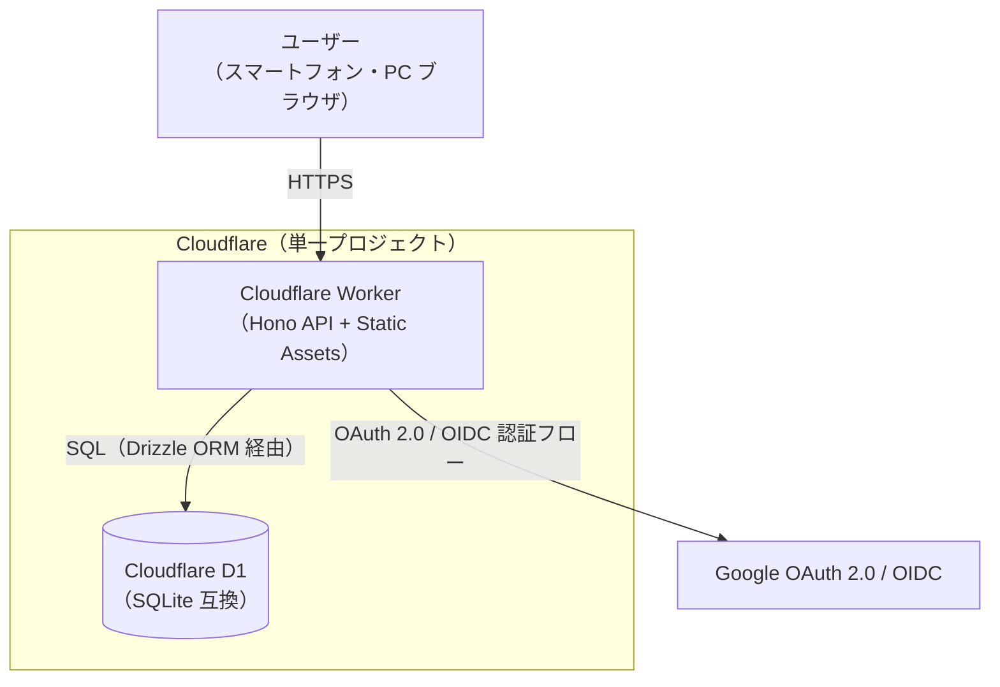
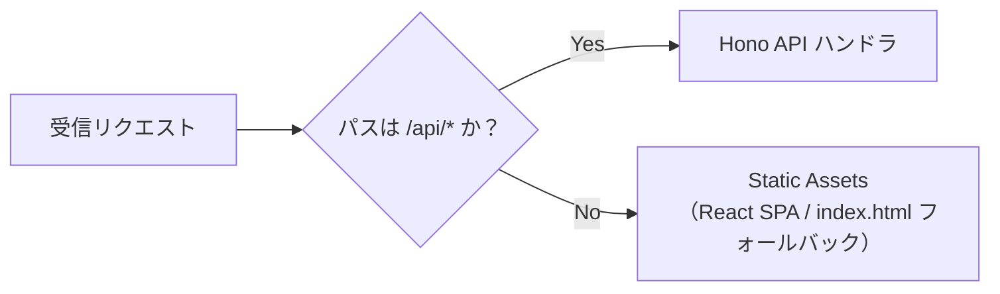
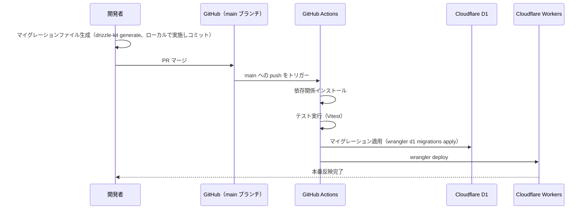

# GainLog システム構成・アーキテクチャ設計書

## 1. 概要

GainLog は、Cloudflare Workers 上にフロントエンド（React SPA）・バックエンド API（Hono）・DB（D1）を単一の Cloudflare プロジェクトとして同梱するモノリシック構成をとる。実質 1 ユーザー・低トラフィックの個人利用アプリであり、複雑な分散構成は取らない。

対象は本番環境のみとし、ローカル開発は `wrangler dev` によって本番相当の構成を再現する（ステージング環境は設計対象外）。

## 2. システム構成図

## 3. リクエストルーティング

単一の Worker 内で、パスベースにより API リクエストと静的アセット配信を振り分ける。

| パス | 振り分け先 | 備考 |
|---|---|---|
| `/api/*` | Hono API | JSON API。認証・記録・種目等の全エンドポイント |
| 上記以外 | Static Assets（React SPA） | SPA のため、存在しないパスは `index.html` にフォールバック |

この振り分けを Wrangler（Static Assets）設定で実現するための方針は以下の通り。

- `assets.not_found_handling = "single-page-application"` を設定し、静的アセットに一致しないパス（React Router のクライアントサイドルート等）は `404` ではなく `index.html`（200）へフォールバックさせる。これがないと、React ルートへの直接アクセス・リロードが `404` になる。
- `run_worker_first` に `/api/*` を指定し、`/api/*` へのリクエストは静的アセットの有無に関わらず必ず Worker（Hono API）で先に処理する。これがないと、将来 `/api/` 配下と同名の静的アセットが生成された場合に API がバイパスされうる。
- 上記に相当する挙動を Worker 実装（`env.ASSETS.fetch()` の明示呼び出し等）で担保してもよい。具体的な設定ファイル（`wrangler.jsonc` 等）の記述は詳細設計フェーズで定める。

## 4. 環境構成

- 本番環境（production）のみを設計対象とする。ステージング環境は用意しない。
- ローカル開発時は `wrangler dev` を用いて、本番同様の Worker + D1（ローカル SQLite）構成で動作確認する。
- ローカル D1 の運用は以下のコマンドで行う。
  - 初期化・マイグレーション適用: `wrangler d1 migrations apply <DB_NAME> --local`
  - リセット: ローカル DB ファイル（`.wrangler/state` 配下）を削除し、再度マイグレーションを適用する
  - シード投入: `wrangler d1 execute <DB_NAME> --local --file=./seed.sql`（シードデータの内容は実装時に定める）

## 5. ドメイン構成

- 初期リリース時は Cloudflare が自動発行する `*.workers.dev` のデフォルトサブドメインを使用する。
- 将来的に独自ドメインへ切り替える場合は、Cloudflare の Custom Domains 機能で Worker にルートを追加する。アプリケーションコード自体の変更は不要だが、Google OAuth 側の Authorized redirect URI をホスト名を含めて新しいドメインに更新する必要がある（redirect URI は完全一致が要求されるため）。
- 独自ドメインの取得・設定手順の詳細、および OAuth 設定変更の具体的な手順は、必要になった時点で別途検討する（本設計書のスコープ外）。

## 6. デプロイ・CI/CD

GitHub Actions により、`main` ブランチへのマージをトリガーとして自動デプロイを行う。

- テスト（Vitest）が失敗した場合はデプロイを中断する。
- ローカルからの手動デプロイ（`wrangler deploy`）は開発時の動作確認用途として許容するが、正規のリリース経路は上記の CI/CD フローとする。ローカルからのデプロイは `wrangler login`（開発者個人の Cloudflare アカウントによる OAuth 認証）で行い、本番環境へのデプロイ権限を持つ Cloudflare API token は GitHub Actions（GitHub Secrets）にのみ保持し、開発者のローカル環境には API token を配布しない。ステージング環境がないためローカル `wrangler deploy` も本番環境（`*.workers.dev`）を対象とする点に留意し、常用しない。

## 7. データベース（D1）とマイグレーション

- DB エンジンは Cloudflare D1（SQLite 互換）。
- ORM 兼マイグレーションツールとして Drizzle ORM / drizzle-kit を採用する（要件定義書 6 章 技術スタックに追記済み）。
- マイグレーションファイルは開発者がローカルで `drizzle-kit generate` により生成し、リポジトリにコミットする。CI/CD 側では生成済みのマイグレーションファイルを `wrangler d1 migrations apply` で適用するのみとし、CI 上でのファイル生成は行わない（手動適用は行わない）。
- マイグレーションは CI/CD のデプロイフロー内で `wrangler deploy` に先立って自動適用する。この順序上、マイグレーション適用後に `wrangler deploy` が失敗すると、旧バージョンの Worker が新しいスキーマに接続する状態が生じ得る。そのため、スキーマ変更は旧 Worker からも問題なくアクセスできる後方互換な変更（カラム追加など）に限定し、破壊的変更（カラム削除・型変更等）が必要な場合は複数回のデプロイに分割する。
- `wrangler deploy` が失敗した場合、マイグレーション自体は成功しているため DB のロールバックは行わず、CI を再実行して `wrangler deploy` のみを再試行する。
- テーブルスキーマは `db.md` で定める。

## 8. シークレット管理

- Google OAuth の Client ID / Secret など機密情報は、Cloudflare のシークレットとして管理し、リポジトリにはコミットしない。
- Cloudflare Workers のシークレットはコード（Worker バージョン）とは別に保持され、以降のデプロイ・バージョンへ引き継がれる。そのため CI/CD の通常デプロイ（`wrangler deploy`。7章）はシークレットを再設定しない。
- OAuth の Client ID / Secret は頻繁に変わらないため、シークレットの初期設定・変更はデプロイフローと切り離して開発者が個別に行う。
  - 単発の設定・変更： `wrangler secret put <NAME>`（実行時に最新バージョンを複製してシークレットを追加し、即座に本番へ反映される）。
  - 即時反映を避けたい場合： `wrangler versions secret put <NAME>` で新バージョンにシークレットを登録し、任意のタイミングで `wrangler versions deploy` により反映する。
- GitHub Actions には Cloudflare API token（デプロイ用）のみを GitHub Secrets として保持し、アプリのシークレット（OAuth Client Secret 等）は CI に渡さない。
- allowlist の具体的な保持形式や、認証フローの詳細は `auth.md` で定める（本設計書では触れない）。

## 9. スコープ外

以下は本設計書の対象外とする。

- 監視・アラート設計（個人アプリのため、稼働監視やアラート通知の仕組みは導入しない）
- ログの構造化方針（ログレベルの定義・使い分け・出力フォーマットは `common-spec.md` で定める）
- ステージング環境の構成（本番環境のみの運用のため）
- 独自ドメインの取得・具体的な設定手順（将来必要になった時点で別途検討）
- 認証フローの詳細（OAuth/OIDC のシーケンス、allowlist・`sub` の扱い等は `auth.md` で定める）
- テーブルスキーマの詳細（`db.md` で定める）
