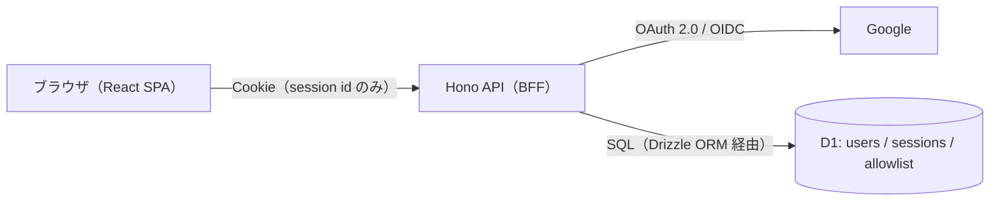
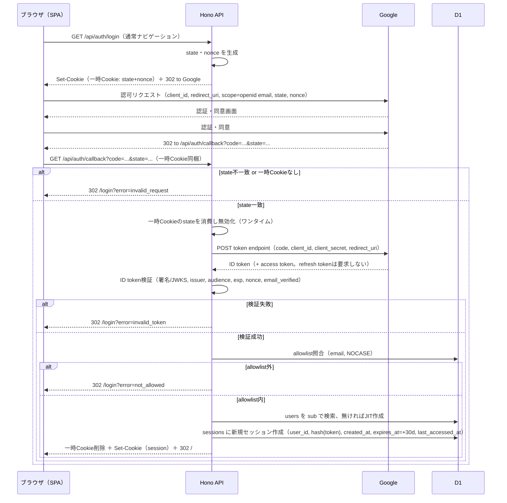

# GainLog 認証設計書

## 1. 概要

本書は、要件定義書（`docs/Requirements/requirement.md`）5.6 章で定義された Google OAuth 2.0 / OIDC 認証・allowlist 方式の詳細設計を定めるものである。また、システム構成・アーキテクチャ設計書（`docs/Design/architecture.md`）8 章「シークレット管理」・9 章「スコープ外」から、認証フローの詳細および allowlist の保持形式を定める文書として参照されている。

対象読者は開発者本人（実装者）であり、実装時にそのまま参照できる粒度で記述する。

以下を前提の確定事項とする。

- フロントエンド（React SPA）とバックエンド（Hono API）は同一 Cloudflare プロジェクト・同一オリジンで動作する（`architecture.md` 3 章参照）。
- 認証方式は BFF（Backend For Frontend）＋ Cookie セッション方式とし、フロントエンドは Google のクライアント ID・トークンを一切扱わない。
- セッションは D1 上のサーバーサイドセッションテーブルで管理し、署名付き JWT 等の自己完結型トークンは用いない。
- allowlist は D1 テーブルで管理する。
- Google の refresh token は保持せず、長期ログイン維持は自前セッションのみで行う。

## 2. 認証方式の全体像（BFF方式）

GainLog では、Hono API が OAuth クライアントの役割を一手に担い、SPA は Cookie の存在だけを意識する BFF（Backend For Frontend）方式を採用する。SPA は Google のクライアント ID・アクセストークン・ID トークンのいずれも直接扱わない。

採用理由は以下の通り。

- SPA が Google のトークン類を保持しないため、XSS が発生した場合の被害範囲を「HttpOnly セッション Cookie が有効な間のなりすまし」に限定できる。
- フロントエンド・バックエンドが同一オリジン構成のため、Cookie ベースの認証で CORS の複雑さ（`Access-Control-Allow-Credentials` 等の設定）を回避できる。
- サーバーサイドセッションのため、ログアウトや強制失効を即座に反映できる（自己完結型 JWT のような失効の難しさがない）。

| 方式 | 概要 | 採用可否 |
|---|---|---|
| BFF ＋ Cookie セッション（採用） | Hono が OAuth をすべて仲介し、SPA は Cookie のみ意識する | 採用。同一オリジン構成・XSS 被害限定・即時失効の観点で優位 |
| SPA が直接トークンを扱う方式 | Google Identity Services 等で SPA が ID トークンを取得し API に渡す | 不採用。トークンの保管場所（localStorage 等）が XSS に対して脆弱になりやすいため |

## 3. OAuth 2.0 / OIDC 認証フロー

### エンドポイント一覧

| エンドポイント | 用途 |
|---|---|
| `GET /api/auth/login` | Google 認可画面へのリダイレクト開始（ブラウザの通常ナビゲーション） |
| `GET /api/auth/callback` | Google からのコールバック受信、検証、セッション発行 |
| `POST /api/auth/logout` | セッション破棄 |
| `GET /api/auth/me` | ログイン状態・ユーザー情報の取得（SPA 起動時に利用） |

### シーケンス図

- state 値は検証に使用した時点で D1 または一時 Cookie 上から消費・無効化し、同一 state を使ったリプレイ攻撃を防ぐ（ワンタイム利用）。
- ID トークン検証は署名（JWKS）・issuer・audience・有効期限（exp）・nonce に加え、`email_verified` クレームが `true` であることも必須条件とする。未検証のメールアドレスでの登録を防ぐため。
- ID トークン検証に用いるライブラリ（JWKS 取得・キャッシュ方式含む）の選定は実装時に定めるものとし、本書のスコープ外とする。

## 4. allowlistの設計

| 列 | 概要 |
|---|---|
| `id` | 主キー |
| `email` | 許可対象のメールアドレス（大文字小文字を区別しない一意制約） |
| `created_at` | 登録日時（運用時の記録用） |
| `note` | 任意メモ（例：本人アカウントである旨。運用補助用） |

- 照合タイミング：ID トークン検証成功後、`email` と `email_verified=true` を用いて、コールバック処理内で毎回照合する（キャッシュしない）。allowlist から削除されたアカウントは次回ログイン以降で確実に拒否されるようにするため。
- **subが未確定な時点の扱い**：allowlist はメールアドレスのみで管理し、`sub` の事前登録は行わない（`sub` は Google 側で払い出されるものであり、事前に人間が知ることはできないため）。allowlist は「ログイン可否のゲート」、`sub` は「ログイン後の内部識別」という役割分担とする。
- Google アカウントのメールアドレスが変更された場合、`users` テーブル上の識別（`sub`）は影響を受けないが、allowlist は新しいメールアドレスで再登録が必要になる。
- Phase 1 の運用は手動 SQL（`wrangler d1 execute`）とし、Phase 2 での GUI 化は「本設計書のスコープ外、要件定義書 5.12 参照」とする。

### メールアドレスの保存形式について

- allowlist の `email` および `users` の `email` は平文で D1 に保存する。SQL インジェクションによる漏洩リスクへの対策は「保存形式（平文かハッシュか）」ではなく「クエリの組み立て方」を主眼とし、Drizzle ORM によるパラメータ化クエリを徹底することで対応する（詳細は 11 章参照）。
- 実質的に数名規模（開発者本人および将来の少数の許可対象者）のみを扱う個人アプリという規模を踏まえ、pepper 付きハッシュ化等の追加防御は本書スコープでは必須としない。将来的に利用者数が増える場合は、pepper 付きハッシュ化によるメールアドレスの秘匿を再検討する。

### allowlist からの削除時の運用手順

- allowlist からメールアドレスを削除しても、既に発行済みのセッション（無操作 24 時間・絶対有効期限 30 日）は自動的には失効しない。緊急に特定アカウントのアクセスを遮断したい場合は、allowlist からの削除に加えて、該当 `user_id` に紐づく `sessions` テーブルの行も手動で削除する（`wrangler d1 execute` 等）。この 2 手順をセットで行うことを運用手順として明記する。

## 5. ユーザー（User）テーブルとの関係

| 列 | 概要 |
|---|---|
| `id` | 主キー（内部ユーザーID。WorkoutRecord等の外部キーとして使用） |
| `google_sub` | Googleの`sub`（一意・不変。ログイン時の照合キー） |
| `email` | 直近ログイン時点のメールアドレス（表示・運用参考用。認可判定には使わない） |
| `created_at` | 初回ログイン日時 |
| `updated_at` | 直近ログイン時に更新（emailのキャッシュ更新等） |

- JIT（Just-In-Time）プロビジョニング：allowlist 照合成功後、`google_sub` で既存ユーザーを検索し、存在しなければその場で INSERT する。既存であれば `email` 等を UPDATE するのみで新規作成しない。
- `sub` をキーとする理由：メールアドレスの変更に強く、Google アカウント側でメールアドレスが変わってもユーザーの記録との紐付けが切れないため（要件定義書 5.6 参照）。

## 6. セッション設計

| 列 | 概要 |
|---|---|
| `id` | セッショントークンのハッシュ値（SHA-256等）。Cookie自体には生トークンのみを持たせ、DBには生トークンを保存しない |
| `user_id` | `users.id` への外部キー |
| `created_at` | セッション作成日時（絶対有効期限の起点） |
| `expires_at` | 絶対有効期限（作成時に `created_at + 30日` で固定し、以降更新しない） |
| `last_accessed_at` | 直近アクセス日時（無操作タイムアウト24時間の判定に使用。認証済みリクエストのたびに更新） |

- **生トークンをハッシュ化して保存する理由**：D1 のバックアップ流出や SQL インジェクション等でテーブル内容が漏洩しても、Cookie（ブラウザ側）を盗まない限りなりすましができないようにするため。
- **タイムアウトの実装方法**：
  - 無操作24時間：リクエストごとに `now - last_accessed_at > 24h` を判定し、超過していれば401＋セッション削除。
  - 絶対30日：`now > expires_at` を判定し、超過していれば401＋セッション削除。`expires_at` は作成時に固定し、`last_accessed_at` の更新に連動して延長しない（無操作していなくても30日で必ず再ログインが必要という仕様）。
  - `last_accessed_at` の更新はリクエストごとに毎回D1へ書き込むとコスト・レイテンシが増えるため、一定間隔（例：5分に1回程度）に間引いて更新する（無操作タイムアウトの判定精度には影響しない粒度）。
  - 期限切れセッション行の物理削除は、検出時の遅延削除（lazy deletion）で十分とし、Cron Triggerによる定期クリーンアップはPhase 2以降の検討事項とする。

### Cookie属性

| 属性 | 推奨値 | 理由 |
|---|---|---|
| Cookie名 | `__Host-session`（`__Host-`プレフィックス） | Secure・Path=/・Domain属性なしを強制でき、サブドメイン差し替え攻撃等への耐性が上がるため |
| HttpOnly | 有効 | JavaScriptからの読み取りを防ぎ、XSS発生時のトークン窃取を防ぐため |
| Secure | 有効 | HTTPS以外での送信を防ぐため（Cloudflare Workersは常時HTTPSのため実質デメリットなし） |
| SameSite | `Lax` | 同一オリジン構成のためAPI呼び出しは常にsame-site。Laxはクロスサイトの単純POST（フォームベースCSRF）を防ぎつつ、通常利用に支障がない |
| Path | `/` | API・SPAとも同一オリジン内の広い範囲で必要なため |
| Max-Age | 30日相当 | 絶対有効期限と合わせる。ただし実際の失効判定は常にサーバー側（D1の`expires_at`）で行い、Cookieの有効期限はUX上のヒントに過ぎない |

### OAuth一時Cookie（state・nonce保持用）

| 属性 | 推奨値 | 理由 |
|---|---|---|
| Cookie名 | `__Host-oauth_txn` | 同上の理由 |
| 値 | stateとnonceをまとめた値 | ログイン開始からコールバックまでの往復にのみ使用する一時データのため |
| HttpOnly / Secure | 有効 | 同上 |
| SameSite | `Lax`（`Strict`不可） | GoogleからのコールバックはクロスサイトのトップレベルGETナビゲーションであり、`Strict`だとCookieが送信されずstate検証ができなくなるため。`Lax`はトップレベルGETナビゲーションでのクロスサイト送信を許容する仕様であり、本用途に合致する |
| Max-Age | 短時間（例：10分） | ログインフロー完了までの短命データであるため |

セッションCookieは`Lax`で足りる（`Strict`にする実益がない）一方、一時Cookieは`Lax`が必須である点が、両者でCookie属性の意図が異なる理由である。

## 7. ログアウト設計

- `POST /api/auth/logout` の処理内容：Cookieからトークンを読み取りハッシュ化、該当する`sessions`行をDELETE、Cookieを失効させるSet-Cookie（Max-Age=0、他の属性は発行時と同一）を返す。
- 冪等性：既にセッションが存在しない・期限切れの場合でも成功（204等）として扱い、エラーにしない（情報漏洩防止・UX上の理由）。
- ログアウト後、SPA側はローカルの状態をクリアしログイン画面へ遷移する（詳細はフロントエンド実装のスコープ）。

## 8. 認可（所有者チェック）

- 全APIエンドポイントで、セッションから得た`user_id`をもとに、`WorkoutRecord`・`WorkoutSet`・ユーザー追加`Exercise`等のリソースアクセスを「自分が所有するリソースのみ」に制限する（要件定義書8章の受入条件に対応）。
- 実装方針として、Honoミドルウェアでセッション検証・`user_id`のコンテキスト格納を一元化し、各ハンドラで`WHERE user_id = ctx.user.id`相当のフィルタを必須とする。
- 他ユーザー所有リソースへのアクセス時のレスポンスは、存在有無を漏らさないため`404 Not Found`とする（`403 Forbidden`だと「存在はするが権限がない」ことを露呈してしまうため）。
- 事前定義データ（種目の初期データ等、`owner_user_id`がnull）は全ユーザー閲覧可・編集不可という要件定義書5.5の制約もこの章の例外ケースとして扱う。

## 9. CSRF対策

追加のCSRFトークンは導入せず、以下の組み合わせによる多層防御で対策する。

1. セッションCookieの`SameSite=Lax`により、クロスサイトの単純フォームPOST等ではCookieが送信されない。
2. 状態変更API（POST/PUT/DELETE）は`Content-Type: application/json`を必須とし、HTMLの`<form>`タグでは`application/json`を送信できない（送信可能なContent-TypeはHTML仕様上限定されている）ため、クロスサイトの単純フォーム攻撃が成立しない。
3. 同一オリジン構成のためCORSを許可しておらず（`Access-Control-Allow-Origin`を設定しない）、他オリジンの`fetch`/`XHR`からのクロスオリジンリクエストはブラウザのCORSポリシーによりレスポンスを読めない。書き込み系はプリフライトが発生し、サーバー側がプリフライトを許可しなければリクエスト自体が成立しない。

上記1〜3は「多層防御」であり、単一の仕組みに依存しない。

**この対策が成立するための設計制約**として、状態変更を行うエンドポイントは必ずPOST/PUT/DELETE＋JSONで実装し、GETリクエストでは一切データを変更しないことを明記する。GETベースの削除リンク等を実装すると本対策が無効化されるため、将来の実装・機能追加時にも遵守する。

追加の堅牢化オプションとして、`Sec-Fetch-Site`ヘッダ（`same-origin`以外を拒否）のチェックを任意強化として触れる。

CSRFトークン（Synchronizer Token等）を導入しない理由：BFF構成でSPA・APIが同一オリジンであり、上記の対策で実質的な攻撃面が小さいため。将来的にサードパーティ埋め込み（iframe等）や別オリジン展開を行う場合は再検討が必要。

## 10. エラーハンドリング

| ケース | エンドポイント種別 | レスポンス |
|---|---|---|
| state不一致・一時Cookie欠落 | ログインフロー（ナビゲーション） | 302でフロントエンドのログイン画面へ（例：`/login?error=invalid_request`） |
| ID token検証失敗 | ログインフロー（ナビゲーション） | 302で`/login?error=invalid_token` |
| allowlist外 | ログインフロー（ナビゲーション） | 302で`/login?error=not_allowed`（具体的な理由はレスポンスに含めない） |
| 未認証（Cookieなし・期限切れ） | JSON API | `401 Unauthorized` |
| 他ユーザー所有リソースへのアクセス | JSON API | `404 Not Found`（8章参照） |
| バリデーションエラー等 | JSON API | 認証・認可起因以外は本書のスコープ外 |

- SPA側は`401`をグローバルに検知してログイン画面へ誘導する想定である（フロントエンド実装の詳細は別スコープ）。
- ログイン失敗時のエラー理由は、URLクエリパラメータに詳細な理由（例：具体的なメールアドレス）を含めない（ブラウザ履歴・リファラ等への漏洩防止）。
- **ログ出力方針**：詳細なエラーログはCloudflare Workersのログに出力するが、IDトークン・セッショントークン（生値・ハッシュ値問わず）・メールアドレス等のPIIは平文でログに出力しない。必要な場合はマスキングした値（例：メールアドレスの一部伏字）や、突合用の内部ID等の非PII値のみを出力する。

## 11. セキュリティ考慮事項のまとめ

| 脅威 | 対策 | 該当章 |
|---|---|---|
| XSSによるセッション窃取 | HttpOnly Cookie | 6章 |
| セッション固定化・リプレイ | ランダムトークン＋DBハッシュ保存＋有効期限 | 6章 |
| CSRF | SameSite＋Content-Type制約＋CORS非許可 | 9章 |
| オープンリダイレクト（コールバック悪用） | redirect_uriの完全一致・stateによる紐付け・stateのワンタイム化 | 3章 |
| allowlist外アクセス | ログイン時点でのメールアドレス照合 | 4章 |
| 他ユーザーデータへの不正アクセス | 所有者チェック（404返却） | 8章 |
| SQLインジェクションによるPII漏洩 | Drizzle ORMによるパラメータ化クエリの徹底（生SQL文字列結合を行わない） | 4章 |
| ログ経由のPII・トークン漏洩 | Workersログにトークン・メールアドレス等のPIIを平文出力しない | 10章 |
| allowlist除外後の既存セッション残存 | allowlist削除時に該当ユーザーのsessionsも手動削除 | 4章 |

### 意図的に採用しなかった対策とその理由

- **Google refresh tokenの保持**：長期ログイン維持は自前セッション（D1）のみで行い、refresh tokenは保持しない。実装・運用がシンプルになる一方、Googleアカウント側の失効を即座に検知できないトレードオフがあるが、本アプリの規模では自前セッションの絶対有効期限（30日）で十分カバーできると判断した。
- **CSRFトークン（Synchronizer Token）**：BFF構成・同一オリジンのため、SameSite＋Content-Type制約＋CORS非許可の多層防御で十分と判断し、実装コストの高いCSRFトークン方式は採用しなかった。
- **allowlistメールアドレスのpepper付きハッシュ化**：実質数名規模の個人アプリであり、DBダンプ漏洩時の実害（少数のメールアドレス漏洩）とハッシュ化・pepper管理の実装コストを比較し、Phase 1では平文保存＋パラメータ化クエリ徹底で十分と判断した。将来的に利用者数が増える場合は再検討する。

## 12. スコープ外

- 画面設計・エラー画面のUI詳細は `screens.md`（未作成）で定める。
- `users`・`sessions`・`allowlist`テーブルの詳細スキーマ（型・インデックス・マイグレーション）は `db.md`（未作成）で定める。
- Google Cloud Console側でのOAuthクライアント設定手順（Authorized redirect URI登録等）は運用手順書スコープとし、本書では触れない。
- allowlistのGUI管理機能（Phase 2）は要件定義書5.12で管理し、本書はPhase 1の手動運用のみを対象とする。
- 複数ユーザー化を見据えた権限モデル（管理者ロール等）の詳細設計は本書のスコープ外とする。
- 将来ログイン後の遷移先を指定する`?next=`等のパラメータを追加する場合、任意URLへのリダイレクトを許してしまうオープンリダイレクト脆弱性への対策（許可されたパスのみ受け付ける等）が別途必要になる。現時点ではそのような機能は設計に含まれないため、本書では扱わない。

## 13. 詳細設計（内部設計）で確定する項目

本章は、8章「認可（所有者チェック）」の実装をコードレベルでどのように強制するかについて、詳細設計（内部設計）フェーズで確定すべき項目を整理したものである。

D1（SQLiteベース）にはPostgreSQLのようなDBエンジン側のRow Level Security（RLS）機構が存在せず、DBユーザー（ロール）ごとに適用範囲を切り替える仕組みもない。そのため8章の所有者チェックは、DBエンジンによる強制ではなく**アプリケーションコードの規律**に依存する。この「規律への依存」をできる限り機械的な強制に置き換える方針を、本章で示す。

### 8章所有者チェックの実装方針（提案）

| 方針 | 内容 | 効果 |
|---|---|---|
| データアクセス層への集約 | `WorkoutRecord`・`WorkoutSet`等への読み書きを、Honoハンドラから直接Drizzleクエリを書くのではなく、`repositories/`配下の関数（例：`getWorkoutRecordById(userId, id)`）経由でのみ行う | クエリ記述箇所を1箇所に限定し、WHERE句の書き忘れが発生し得る箇所自体を減らす |
| TypeScript型による必須化 | 上記リポジトリ関数のシグネチャで`userId`を必須引数とする（省略不可・オプショナル化しない） | 呼び出し忘れを実行時ではなくコンパイルエラーとして検出できる |
| 所有者フィルタの単体化 | `eq(table.userId, userId)`等のフィルタ条件をリポジトリ関数内に閉じ込め、ハンドラ側では条件を意識させない | 「WHERE user_id を書き忘れる」という事象自体をハンドラの実装対象から排除する |
| 統合テストでのカバー | 所有者チェック対象の各エンドポイントについて、他ユーザーのリソースIDでアクセスした際に404が返ることを確認するテストを用意する | 実装ミスを検知する最終防御線とする |
| Lint（補助的・任意） | ハンドラ内から直接Drizzle操作（`db.select`/`db.update`等）を呼び出すことを禁止するESLintカスタムルールの導入を検討する | リポジトリ層を迂回する実装を機械的に検出する。ただし「WHERE句の有無」は検出できても「条件の中身が正しいか」までは静的解析では保証できない点に留意する |

なお、Zod等の入力バリデーションライブラリは、リクエストボディの形状チェックが主目的であり、Drizzleが発行するSQLクエリの構造（WHERE句の有無・内容）を検証する用途には適さないため、本チェックの手段としては採用しない。

### 詳細設計で確定すべき項目一覧

- [ ] リポジトリ層のディレクトリ構成・命名規則（例：`src/repositories/*.ts`）
- [ ] リポジトリ関数のシグネチャ規約（`userId`を第一引数に固定する等）
- [ ] ハンドラから直接Drizzleクエリを呼び出すことを禁止するLintルールの要否・具体的な実装方法
- [ ] 所有者チェック対象リソース一覧（`WorkoutRecord`・`WorkoutSet`・ユーザー追加`Exercise`等）の網羅的な洗い出し
- [ ] 事前定義データ（`owner_user_id`がnull、8章の例外ケース）に対する分岐処理をリポジトリ層でどう表現するか
- [ ] 統合テストの配置・命名規約、およびCIでの実行必須化の要否
