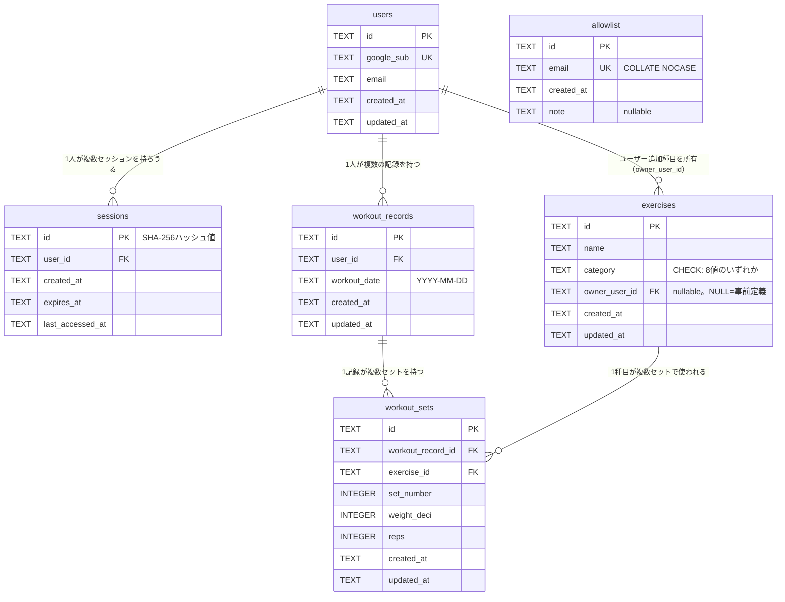

# GainLog データベース設計書

## 1. 概要

本書は、要件定義書（`docs/Requirements/requirement.md`）7章「データモデル概要」で示されたエンティティ、および認証設計書（`docs/Design/Basic/auth.md`）4〜6章・12章で概要のみ定義された `users`・`sessions`・`allowlist` のスキーマを、実装可能な粒度まで具体化するものである。アーキテクチャ設計書（`docs/Design/Basic/architecture.md`）7章・9章、および認証設計書12章においても「テーブルスキーマは本書（db.md）で定める」と参照されている。

対象読者は開発者本人（実装者）であり、Drizzle ORM でのスキーマ実装時にそのまま参照できる粒度で記述する。

以下を前提とする。

- DBエンジンは Cloudflare D1（SQLite 互換）であり、ORM・マイグレーションツールとして Drizzle ORM / drizzle-kit を用いる（architecture.md 7章）。
- 本書のスコープは要件定義書4章で定義された Phase 1 の範囲、すなわち `users` / `sessions` / `allowlist` / `exercises` / `workout_records` / `workout_sets` の6テーブルとする。Phase 2 で追加予定の `menus` 等は本書のスコープ外とする（9章参照）。
- 外部キー制約は D1（SQLite）上で `PRAGMA foreign_keys = ON` を前提として設計する。有効化のタイミング・方法の実装時検証は10章の未解決事項とする。
- 本書は基本設計（外部設計）レベルのドキュメントであり、リポジトリ層のディレクトリ構成・migrationファイルの具体的配置・Drizzle ORMの実装コードは対象外とする（9章参照）。

## 2. 命名規則・型設計方針

### テーブル名・カラム名

| 対象 | 規則 |
|---|---|
| テーブル名 | 複数形スネークケース（例：`workout_records`、`workout_sets`） |
| カラム名 | スネークケース（例：`owner_user_id`、`workout_date`） |
| 外部キーカラム名 | 参照先テーブルの単数形 + `_id`（例：`user_id`、`exercise_id`、`workout_record_id`） |

### ID戦略

- `sessions` を除く全テーブルの主キーは UUID（v4想定）を `TEXT` 型で格納する。
- `sessions.id` のみ例外とし、auth.md 6章の記載通りセッショントークンを SHA-256 でハッシュ化した値（16進数文字列、64文字）を `TEXT` 型で格納する。生トークンはDBに保存しない。
- SQLite / D1 には PostgreSQL の `gen_random_uuid()` に相当する組み込み関数が存在しないため、UUID の生成はアプリケーション層（Drizzle 経由で INSERT する前）で行う方針とする。

### 日時型

- `created_at` / `updated_at` / `expires_at` / `last_accessed_at` は全て `TEXT` 型とし、ISO 8601形式（例：`2026-08-16T12:00:00.000Z`）の UTC 時刻文字列で格納する。
- **`workout_date` との違いに注意**：`workout_records.workout_date` は要件定義書「日付・タイムゾーン」の定義に従い `YYYY-MM-DD` 形式（JST基準の暦日）の日付文字列であり、上記の日時（timestamp）カラムとは異なる意味・フォーマットを持つ。本書では「日時（timestamp）」と「日付（date）」を明確に書き分ける。
- SQLite には専用の DATE/DATETIME 型が存在しないため、いずれも実体は `TEXT` 型カラムである（Drizzle 上は `text()` として定義する）。

### 数値型（重量）

- 重量に相当するカラムは `INTEGER` 型とし、0.1kg単位の整数値として格納する（例：100.5kg → `1005`）。
- カラム名は `weight_deci`（deci = 1/10 の意）とし、単位が0.1kg刻みであることを名前から読み取れるようにする。
- 有効範囲は要件定義書5.1章の「0以上999.9以下」に対応し、`0〜9999`（0.1kg単位）とする。SQLite の `REAL` 型（浮動小数点）は演算誤差のリスクがあるため採用しない。

### 削除方針

- 物理削除（論理削除は行わない）を採用する。
- 外部キー制約に `ON DELETE CASCADE` / `ON DELETE RESTRICT` を使い分け、参照整合性をDBエンジンレベルで強制する。詳細は6章「制約・整合性一覧」を参照。
- 「セットが0件になった際のWorkoutRecord自動削除」（要件定義書5.1）や `updated_at` の自動更新は、FK制約では表現できない／実装漏れが起きやすいため、DBトリガーで実現する。詳細は7章「トリガー定義」を参照。
- D1（SQLite）は接続ごとに `PRAGMA foreign_keys = ON` を明示的に有効化しない限り外部キー制約が無視される点に注意する（10章の未解決事項を参照）。

## 3. ER図



- `allowlist` は他テーブルとの外部キー関係を持たない（ログイン時に `email` で突合するのみ。auth.md 4章）。そのため上記ER図では孤立したエンティティとして表現している。

## 4. テーブル一覧

| テーブル名 | 概要 | 主な参照元設計書 |
|---|---|---|
| `users` | Googleアカウントに紐づく内部ユーザー情報 | auth.md 5章 |
| `sessions` | サーバーサイドセッション | auth.md 6章 |
| `allowlist` | ログイン許可対象メールアドレス | auth.md 4章 |
| `exercises` | 種目（事前定義／ユーザー追加） | requirement.md 5.5、7章 |
| `workout_records` | 1日分の記録 | requirement.md 5.1 |
| `workout_sets` | セット単位の記録（重量・回数） | requirement.md 5.1 |

## 5. 各テーブル定義

### 5.1 users

Googleアカウントに紐づく内部ユーザー情報。JITプロビジョニングでレコードが作成される（auth.md 5章）。

| カラム名 | 型 | NULL | 制約 | 説明 |
|---|---|---|---|---|
| `id` | TEXT | NOT NULL | PRIMARY KEY | 内部ユーザーID（UUID）。他テーブルからの外部キー参照に使用 |
| `google_sub` | TEXT | NOT NULL | UNIQUE | Googleの`sub`（一意・不変）。ログイン時の照合キー |
| `email` | TEXT | NOT NULL | – | 直近ログイン時点のメールアドレス（表示・運用参考用のキャッシュ。認可判定には使わない） |
| `created_at` | TEXT | NOT NULL | – | 初回ログイン日時（ISO 8601） |
| `updated_at` | TEXT | NOT NULL | – | 直近ログイン時に更新（emailキャッシュ更新等。ISO 8601。7章のトリガーによりUPDATE時に自動更新） |

- `email` には一意制約を設けない。`allowlist.email`（一意・NOCASE）とは役割が異なり、`users.email` はあくまで「最後にログインした時点のメールアドレスのキャッシュ」であり、認可判定や検索キーには使用しないため（auth.md 5章）。

### 5.2 sessions

サーバーサイドセッション。auth.md 6章の設計をそのままスキーマ化したもの。

| カラム名 | 型 | NULL | 制約 | 説明 |
|---|---|---|---|---|
| `id` | TEXT | NOT NULL | PRIMARY KEY | セッショントークンのSHA-256ハッシュ値（16進数文字列）。生トークンはDBに保存しない |
| `user_id` | TEXT | NOT NULL | FOREIGN KEY → `users.id` ON DELETE CASCADE | セッションの所有ユーザー |
| `created_at` | TEXT | NOT NULL | – | セッション作成日時（絶対有効期限の起点） |
| `expires_at` | TEXT | NOT NULL | – | 絶対有効期限（作成時に`created_at + 30日`で固定） |
| `last_accessed_at` | TEXT | NOT NULL | – | 直近アクセス日時（無操作24時間タイムアウト判定に使用） |

- `id` はUUIDではなく、auth.md 6章の記載通りトークンのハッシュ値である点に注意（本書2章「ID戦略」の例外）。
- `sessions` には `updated_at` カラムを持たないため、7章の自動更新トリガーの対象外とする。
- **`user_id` に一意制約は設けない**：1ユーザーが複数のセッション行を同時に持つことを意図的に許容する設計である。auth.md 3章のログインフローは、ログイン成功のたびに既存セッションを更新・削除せず常に新規セッション行をINSERTするため（既存セッションの失効はログアウト時の明示的なDELETEのみ）、同一ユーザーが複数デバイス・複数ブラウザから同時にログインした場合、`user_id` が同じ複数の行が並行して存在しうる。各行は固有のトークンハッシュ値を主キーとするため、DBレベルでの一意性の衝突は発生しない。

### 5.3 allowlist

ログインを許可するメールアドレスの一覧。auth.md 4章の設計をスキーマ化したもの。

| カラム名 | 型 | NULL | 制約 | 説明 |
|---|---|---|---|---|
| `id` | TEXT | NOT NULL | PRIMARY KEY | 内部ID（UUID） |
| `email` | TEXT | NOT NULL | UNIQUE（`COLLATE NOCASE`） | 許可対象のメールアドレス。大文字小文字を区別しない一意制約 |
| `created_at` | TEXT | NOT NULL | – | 登録日時（運用記録用） |
| `note` | TEXT | NULL可 | – | 任意メモ（運用補助用） |

- `email` の一意制約に `COLLATE NOCASE` を指定し、大文字小文字表記ゆれによる重複登録・照合漏れを防ぐ（auth.md 4章）。
- Phase 1 では allowlist の追加・削除は開発者による手動SQL実行（`wrangler d1 execute`）で行う（要件定義書5.12）。

### 5.4 exercises

種目マスタ。事前定義種目とユーザー追加種目を同一テーブルで管理し、`owner_user_id` で区分する。

| カラム名 | 型 | NULL | 制約 | 説明 |
|---|---|---|---|---|
| `id` | TEXT | NOT NULL | PRIMARY KEY | 種目ID（UUID） |
| `name` | TEXT | NOT NULL | UNIQUE（`owner_user_id`, `name`） | 種目名（例：ベンチプレス） |
| `category` | TEXT | NOT NULL | CHECK（下記8値のいずれか） | 種目カテゴリ |
| `owner_user_id` | TEXT | NULL可 | FOREIGN KEY → `users.id` ON DELETE CASCADE | NULL＝事前定義種目、NOT NULL＝ユーザー追加種目の所有者 |
| `created_at` | TEXT | NOT NULL | – | 作成日時 |
| `updated_at` | TEXT | NOT NULL | – | 更新日時（7章のトリガーによりUPDATE時に自動更新） |

`category` のCHECK制約値一覧：

| 値 | 意味 |
|---|---|
| `chest` | 胸 |
| `back` | 背中 |
| `legs` | 脚 |
| `shoulders` | 肩 |
| `arms` | 腕 |
| `core` | 腹筋・体幹 |
| `cardio` | 有酸素 |
| `other` | その他 |

- `owner_user_id` がNULLの行（事前定義データ）は全ユーザーが閲覧可能・編集不可、`NOT NULL`の行はその`owner_user_id`が所有者本人のみ編集・削除可能とする（auth.md 8章、requirement.md 5.5）。
- `UNIQUE(owner_user_id, name)` により、同一ユーザー内での種目名重複を防止する。ただし SQLite の UNIQUE 制約は NULL 同士を区別する（`NULL != NULL` として扱われる）ため、**事前定義種目（`owner_user_id` が NULL）同士の名前重複はこの制約では防げない**。事前定義種目の重複防止はシードデータ投入時の運用で担保する。
- 事前定義種目の初期データ投入は、architecture.md 記載のシード投入手順（`wrangler d1 execute --file=./seed.sql`）で行う想定（具体的なシードデータ内容は9章のスコープ外）。

### 5.5 workout_records

1日分の記録。ユーザー・日付の組で一意。

| カラム名 | 型 | NULL | 制約 | 説明 |
|---|---|---|---|---|
| `id` | TEXT | NOT NULL | PRIMARY KEY | 記録ID（UUID） |
| `user_id` | TEXT | NOT NULL | FOREIGN KEY → `users.id` ON DELETE CASCADE | 記録の所有ユーザー |
| `workout_date` | TEXT | NOT NULL | – | 記録日（`YYYY-MM-DD`形式。JST基準の暦日） |
| `created_at` | TEXT | NOT NULL | – | 作成日時 |
| `updated_at` | TEXT | NOT NULL | – | 更新日時（7章のトリガーによりUPDATE時に自動更新） |

- `UNIQUE(user_id, workout_date)` により、ユーザーごとに1日1件の制約をDBレベルで強制する（requirement.md 5.1）。
- セットが0件になった場合の自動削除は7章のトリガー `trg_workout_records_auto_delete` を参照。

### 5.6 workout_sets

セット単位の記録（重量・回数）。

| カラム名 | 型 | NULL | 制約 | 説明 |
|---|---|---|---|---|
| `id` | TEXT | NOT NULL | PRIMARY KEY | セットID（UUID） |
| `workout_record_id` | TEXT | NOT NULL | FOREIGN KEY → `workout_records.id` ON DELETE CASCADE | 所属する記録 |
| `exercise_id` | TEXT | NOT NULL | FOREIGN KEY → `exercises.id` ON DELETE RESTRICT | 実施種目 |
| `set_number` | INTEGER | NOT NULL | CHECK（`set_number >= 1`） | セット番号（1以上の正整数） |
| `weight_deci` | INTEGER | NOT NULL | CHECK（`0 <= weight_deci <= 9999`） | 重量（0.1kg単位の整数。0〜999.9kgに対応） |
| `reps` | INTEGER | NOT NULL | CHECK（`reps >= 1`） | 回数（1以上の正整数、上限なし） |
| `created_at` | TEXT | NOT NULL | – | 作成日時 |
| `updated_at` | TEXT | NOT NULL | – | 更新日時（7章のトリガーによりUPDATE時に自動更新） |

- `UNIQUE(workout_record_id, exercise_id, set_number)` により、同一記録・同一種目内でのセット番号重複をDBレベルで防ぐ（requirement.md 5.1）。
- `exercise_id` は `ON DELETE RESTRICT` とし、使用中の種目は削除できないというrequirement.md 5.5の制約をDBレベルで強制する。
- 「種目単位・セット単位の削除によりWorkoutRecordに含まれるセットが0件になった場合、そのWorkoutRecord自体も自動的に削除する」（requirement.md 5.1）というルールは、FK制約（子→親方向の逆連鎖はFKの対象外）では表現できないため、**DBトリガー（7章 `trg_workout_records_auto_delete`）で実現する**。

## 6. 制約・整合性一覧

| テーブル | 制約種別 | 内容 | 根拠 |
|---|---|---|---|
| `users` | UNIQUE | `google_sub` | auth.md 5章 |
| `sessions` | FK（CASCADE） | `user_id` → `users.id` | ユーザー削除時にセッションも削除 |
| `allowlist` | UNIQUE（`COLLATE NOCASE`） | `email` | auth.md 4章 |
| `exercises` | CHECK | `category` は8値のいずれか | 本書2章・5.4節 |
| `exercises` | UNIQUE | `(owner_user_id, name)`（NULL同士は区別される） | 5.4節 |
| `exercises` | FK（CASCADE） | `owner_user_id` → `users.id`（nullable） | ユーザー削除時に自作種目も削除 |
| `workout_records` | UNIQUE | `(user_id, workout_date)` | requirement.md 5.1 |
| `workout_records` | FK（CASCADE） | `user_id` → `users.id` | ユーザー削除時に記録も削除 |
| `workout_sets` | UNIQUE | `(workout_record_id, exercise_id, set_number)` | requirement.md 5.1 |
| `workout_sets` | FK（CASCADE） | `workout_record_id` → `workout_records.id` | 記録削除（日単位削除）時に配下セットも削除 |
| `workout_sets` | FK（RESTRICT） | `exercise_id` → `exercises.id` | requirement.md 5.5（使用中種目は削除不可） |
| `workout_sets` | CHECK | `weight_deci BETWEEN 0 AND 9999` | requirement.md 5.1（0〜999.9kg、0.1kg刻み） |
| `workout_sets` | CHECK | `reps >= 1` | requirement.md 5.1 |
| `workout_sets` | CHECK | `set_number >= 1` | requirement.md 5.1 |
| （DBトリガー） | ビジネスルール | セット0件時のWorkoutRecord自動削除 | requirement.md 5.1（FK制約では表現不可。7章参照） |
| （DBトリガー） | 運用ルール | `updated_at` の自動更新 | 7章参照 |

D1（SQLite）でこれらのFK制約を有効にするには、接続時に `PRAGMA foreign_keys = ON` を設定する必要がある（本書1章の前提。10章の未解決事項も参照）。

## 7. トリガー定義

DBトリガーで実現する2種類の整合性ルールのDDLを以下に示す。drizzle-kit はスキーマファイル（`schema.ts`）からトリガーDDLを自動生成しないため、マイグレーションファイルへ生SQLとして手動追記する運用になる（architecture.md 7章の運用フローへの補足。詳細な組み込み方法は10章の未解決事項）。

```sql
-- updated_at 自動更新トリガー（users / exercises / workout_records / workout_sets）
CREATE TRIGGER trg_users_updated_at
AFTER UPDATE ON users
FOR EACH ROW WHEN NEW.updated_at = OLD.updated_at
BEGIN
  UPDATE users SET updated_at = strftime('%Y-%m-%dT%H:%M:%fZ', 'now') WHERE id = NEW.id;
END;

CREATE TRIGGER trg_exercises_updated_at
AFTER UPDATE ON exercises
FOR EACH ROW WHEN NEW.updated_at = OLD.updated_at
BEGIN
  UPDATE exercises SET updated_at = strftime('%Y-%m-%dT%H:%M:%fZ', 'now') WHERE id = NEW.id;
END;

CREATE TRIGGER trg_workout_records_updated_at
AFTER UPDATE ON workout_records
FOR EACH ROW WHEN NEW.updated_at = OLD.updated_at
BEGIN
  UPDATE workout_records SET updated_at = strftime('%Y-%m-%dT%H:%M:%fZ', 'now') WHERE id = NEW.id;
END;

CREATE TRIGGER trg_workout_sets_updated_at
AFTER UPDATE ON workout_sets
FOR EACH ROW WHEN NEW.updated_at = OLD.updated_at
BEGIN
  UPDATE workout_sets SET updated_at = strftime('%Y-%m-%dT%H:%M:%fZ', 'now') WHERE id = NEW.id;
END;

-- セットが0件になった際のWorkoutRecord自動削除（要件定義書5.1）
CREATE TRIGGER trg_workout_records_auto_delete
AFTER DELETE ON workout_sets
FOR EACH ROW
WHEN (SELECT COUNT(*) FROM workout_sets WHERE workout_record_id = OLD.workout_record_id) = 0
BEGIN
  DELETE FROM workout_records WHERE id = OLD.workout_record_id;
END;
```

- `updated_at` 自動更新トリガーは `WHEN NEW.updated_at = OLD.updated_at` により、アプリケーション側が明示的に別の値を渡した場合は上書きしない（無限ループ防止・意図的な値指定を許容する）設計である。
- `trg_workout_records_auto_delete` は、日単位削除（`workout_records` の直接DELETE）によりFKのCASCADEで `workout_sets` が削除された際にも誘発され、既に削除処理中の親行に対して冗長なDELETEを試みる（実害はないが、10章の検証事項として明記する）。
- セット単位・種目単位の削除（一部の `workout_sets` のみ削除）の場合は、削除後に残存セットが0件であることを検知して `workout_records` を削除する、本来の意図通りの動作となる。

## 8. インデックス方針

SQLite（D1）は `PRIMARY KEY` / `UNIQUE` 制約には自動的にインデックスを作成するが、通常の外部キー（子テーブル側のカラム）には自動でインデックスを作成しない点に注意する。以下は明示的なインデックス作成が必要な箇所を含めた方針である。

| テーブル | インデックス対象 | 種別 | 根拠 |
|---|---|---|---|
| `users` | `google_sub` | UNIQUE（制約により自動） | ログイン時の`sub`検索（auth.md 5章） |
| `sessions` | `user_id` | 通常インデックス（明示的に作成） | ログアウト・ユーザー単位の一括セッション無効化時の`user_id`検索 |
| `allowlist` | `email`（`COLLATE NOCASE`） | UNIQUE（制約により自動） | ログイン時のallowlist照合（auth.md 4章） |
| `exercises` | `(owner_user_id, name)` | UNIQUE（制約により自動） | 種目一覧取得（`owner_user_id IS NULL OR owner_user_id = ?`）の高速化を兼ねる |
| `workout_records` | `(user_id, workout_date)` | UNIQUE（制約により自動） | 日付指定取得・月間カレンダー/週間一覧の期間検索（`WHERE user_id=? AND workout_date BETWEEN ? AND ?`）を兼ねる |
| `workout_sets` | `(workout_record_id, exercise_id, set_number)` | UNIQUE（制約により自動） | 記録内のセット一覧取得（`workout_record_id`が先頭列のため単独検索にも有効） |
| `workout_sets` | `exercise_id` | 通常インデックス（明示的に作成） | ①種目削除時のRESTRICT判定（使用中チェック）、②「前回記録重量」検索（同一種目・同一セット番号の直近記録）のJOIN高速化に必要。上記UNIQUEインデックスは`workout_record_id`が先頭列のため`exercise_id`単独検索には効かない |

「前回記録重量」（requirement.md 5.2）の検索は `workout_sets.exercise_id` と `workout_records.(user_id, workout_date)` の2つのインデックスを跨いだJOINになる想定であり、両方の整備が性能上重要となる。

## 9. スコープ外

以下は本設計書の対象外とする。

- リポジトリ層（`repositories/`）のディレクトリ構成・命名規則、関数シグネチャ規約（auth.md 13章「詳細設計で確定すべき項目」を参照。詳細設計フェーズで定める）
- マイグレーションファイルの具体的な配置パス・命名規則（運用フロー自体はarchitecture.md 7章で確定済み）
- 実際のDrizzle ORMスキーマコード（TypeScript）による実装
- Phase 2機能（`menus`等）の詳細スキーマ。Phase 2着手時に別途本書を拡張する
- allowlistのGUI管理機能（Phase 2）のスキーマ変更（要件定義書5.12参照）
- シードデータ（事前定義種目一覧等）の具体的な内容

## 10. 整合性チェック結果・未解決事項

### 既存設計書との整合性チェック結果

| 項目 | 既存記載 | 本書での扱い | 判定 |
|---|---|---|---|
| `users`テーブルの列構成 | auth.md 5章（id/google_sub/email/created_at/updated_at） | 同一列構成を維持し、`id`の型をUUID(TEXT)として補完 | 整合（auth.mdは型を明記していないため矛盾ではなく補完） |
| `sessions.id` | auth.md 6章「セッショントークンのハッシュ値」 | UUID戦略の例外としてそのまま採用 | 整合 |
| `allowlist.email`の一意制約 | auth.md 4章「大文字小文字を区別しない一意制約」 | `UNIQUE(email COLLATE NOCASE)` | 整合 |
| `exercises.owner_user_id` | auth.md 8章「事前定義データ（owner_user_idがnull）は全ユーザー閲覧可・編集不可」 | nullable FKとして設計、NULL=事前定義 | 整合 |
| `workout_records`の一意制約 | requirement.md 5.1「UNIQUE(user_id, workout_date)」 | そのまま採用 | 整合 |
| `workout_sets`の一意制約 | requirement.md 5.1「UNIQUE(workout_record_id, exercise_id, set_number)」 | そのまま採用 | 整合 |
| 重量の範囲・刻み | requirement.md 5.1「0〜999.9、0.1kg刻み」 | `weight_deci INTEGER CHECK(0〜9999)` | 整合 |
| 種目削除の参照整合性 | requirement.md 5.5「使用中の種目は削除できない」 | `exercise_id`をON DELETE RESTRICTに設定 | 整合 |
| セット0件時のWorkoutRecord自動削除 | requirement.md 5.1 | DBトリガー（7章）で実現 | 整合 |
| 日付の形式 | requirement.md 非機能要件「日付はISO 8601（YYYY-MM-DD）、JST基準」 | `workout_date TEXT`（YYYY-MM-DD） | 整合（datetime系カラムとの意味の違いに注意。2章参照） |

### 未解決事項

1. **D1における`PRAGMA foreign_keys`の有効化方法**：本書はD1上でFK制約が有効であることを前提とするが、D1のデフォルト設定およびDrizzle経由での接続ごとの有効化要否（Workerのリクエストごとに設定が必要か等）は実装時に確認・検証が必要。
2. **削除順序・トリガー多重発火の実際の挙動**：ユーザー削除時、`workout_records`（CASCADE）→配下の`workout_sets`（CASCADE）が削除される一方、同じユーザーの`exercises`（`owner_user_id`のCASCADE）も削除対象となる。SQLite（D1）が単一の親DELETE文から複数の子テーブルへのCASCADEをどの順序で処理するかは仕様上厳密に規定されていないため、`workout_sets.exercise_id`のON DELETE RESTRICTとの理論上の競合可能性、および7章のトリガーの多重発火・冗長DELETEの実際の挙動を、実装時にD1上で検証する必要がある（想定通り動作しない場合、ユーザー削除処理をアプリケーション層で明示的な削除順序（sets→records、sets参照解消後にexercises）で組む代替案を検討する）。
3. **トリガーDDLのマイグレーション統合方法**：drizzle-kit生成のマイグレーションファイルへトリガーDDLをどう組み込むか（生SQL手動追記の運用ルール、drizzle-kitの再生成時に上書きされないようにする方法等）は詳細設計フェーズで確定する。
