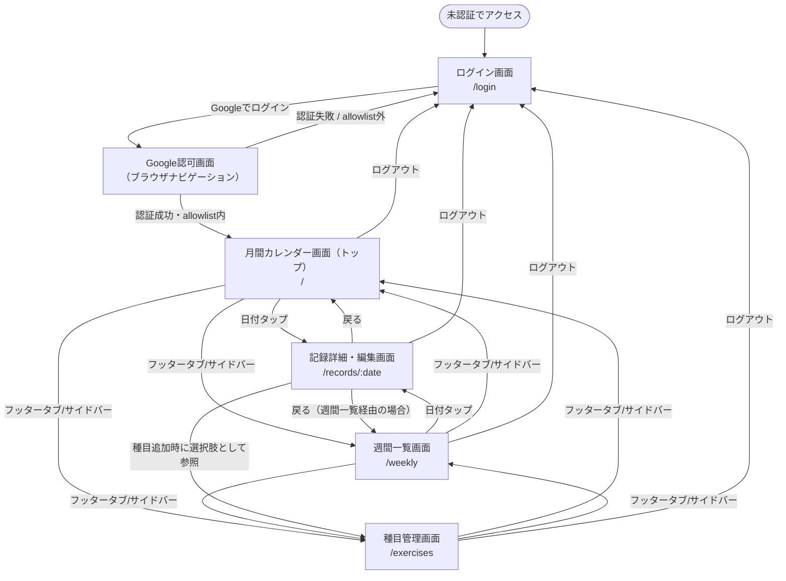

# GainLog 画面設計書

## 1. 概要

本書は、要件定義書（`docs/Requirements/requirement.md`）5章「機能要件」で定義された Phase 1 の機能を対象に、画面一覧・画面遷移・ナビゲーション構成・各画面の項目定義および入力制約を定めるものである。

対象読者は開発者本人（実装者）であり、React SPA 実装時にそのまま参照できる粒度で記述する。詳細なワイヤーフレーム（ピクセル単位のレイアウト）は作成せず、Markdown テキストベースで画面の構成要素・振る舞いを定義する。

以下を前提とする。

- 対象範囲は要件定義書 4 章の Phase 1（記録 CRUD・前回記録表示・月間カレンダー・週間一覧・種目管理・Google 認証）のみとし、Phase 2 機能（成長グラフ・目標設定・メニュー・allowlist 管理画面）は対象外とする（8 章参照）。
- 認証フロー自体の詳細（OAuth シーケンス、Cookie、セッション管理）は認証設計書（`docs/Design/Basic/auth.md`）のスコープであり、本書ではエラー時の画面表示のみを扱う。
- テーブルスキーマ・入力制約の型定義はデータベース設計書（`docs/Design/Basic/db.md`）を根拠とする。
- フロントエンドとバックエンドは同一オリジン構成（`docs/Design/Basic/architecture.md` 3 章）であり、画面遷移は React SPA 内のクライアントサイドルーティングを基本とする（ログイン関連のみ通常のブラウザナビゲーション。auth.md 3 章参照）。

## 2. 画面一覧

| 画面名 | URL | 概要 |
|---|---|---|
| ログイン画面 | `/login` | 未認証ユーザーの入口。Google ログインボタンを表示し、認証エラー時のメッセージもこの画面内で出し分ける |
| 月間カレンダー画面（トップ） | `/` | ログイン後の初期画面。月単位カレンダーで記録の有無を識別できる |
| 週間一覧画面 | `/weekly` | 直近 1 週間（当日を含む過去 7 日間）の記録一覧 |
| 記録詳細・編集画面（作成兼用） | `/records/:date` | 指定日の記録の表示・編集を行う。該当日に記録が存在しない場合は新規作成用の空フォームとして機能する |
| 種目管理画面 | `/exercises` | 種目の一覧表示・追加・編集・削除 |

- 「記録の作成」「詳細表示」「編集」は同一画面（`/records/:date`）で状態を切り替える方式とする（表示モード⇄編集モード）。画面数・遷移パターンを抑えるための方針である。
- ログイン画面は、認証エラー時もクエリパラメータ（`error=invalid_request` 等）による同一 URL 上の表示切り替えとし、専用のエラー画面 URL は設けない（auth.md 10 章のリダイレクト先と一致させる）。

## 3. ナビゲーション構成

未認証状態（ログイン画面）ではナビゲーションを表示しない。認証後の画面（`/`・`/weekly`・`/records/:date`・`/exercises`）は、画面幅に応じて以下のようにナビゲーション形式を切り替える。

| 画面幅 | ナビゲーション形式 | 主要導線 |
|---|---|---|
| モバイル（〜767px 想定） | フッタータブ（画面下部固定） | カレンダー／週間一覧／種目管理 の 3 項目 |
| タブレット・PC（768px〜想定） | サイドバー（画面左側常時表示） | 同上 3 項目 |

- 具体的なブレークポイント数値は TailwindCSS の標準値（`md: 768px`）に暫定的に従うものとし、実装時に確定する（8 章参照）。
- モバイルはフッタータブ、PC・タブレットはサイドバーとする理由：モバイルは片手操作が中心となるため画面下部の操作領域（フッタータブ）が親指で届きやすく、頻繁に行き来する 3 画面間の遷移に適する。PC・タブレットは横幅に余裕があるため、常時表示のサイドバーの方がクリック数・画面利用効率の観点で優れる。
- 全画面共通のヘッダーに、ユーザーメニュー（ログアウトボタンを含む）を配置する。ログアウト処理は `POST /api/auth/logout` を呼び出し、成功後はログイン画面へ遷移する（auth.md 7 章）。

## 4. 画面遷移図

- 「戻る」遷移は、記録詳細・編集画面への遷移元（カレンダー経由／週間一覧経由）に応じてブラウザ履歴で自然に戻る想定であり、遷移元を問わず固定の戻り先を設けるものではない。
- ログイン成功後の遷移先は常にトップ（月間カレンダー画面）とする。

## 5. 各画面詳細

### 5.1 ログイン画面（`/login`）

| 項目 | 内容 |
|---|---|
| 表示要素 | アプリ名（ロゴ）、「Google でログイン」ボタン |
| 操作 | ボタン押下で `GET /api/auth/login` へ通常ナビゲーション（auth.md 3 章）。SPA 内の `fetch` 等では実装しない（ブラウザの遷移そのものが OAuth フローの起点となるため） |
| 遷移 | ログイン成功時：トップ（`/`）へリダイレクト。失敗時：本画面へ `error` クエリパラメータ付きでリダイレクト |

### 5.2 認証エラー表示（ログイン画面内の状態）

auth.md 10 章で定義された `error` クエリパラメータの値に応じ、ログイン画面内にエラーメッセージを表示する。具体的な失敗理由（対象のメールアドレス等）は表示しない（auth.md 10 章のログ・URL 漏洩防止方針に準拠）。

| `error` の値 | 表示メッセージ（例） |
|---|---|
| `invalid_request` | 「ログイン処理でエラーが発生しました。もう一度お試しください。」 |
| `invalid_token` | 「ログイン処理でエラーが発生しました。もう一度お試しください。」 |
| `not_allowed` | 「このGoogleアカウントではログインできません。」 |
| （なし） | エラーメッセージ非表示（通常のログイン画面） |

- `invalid_request` と `invalid_token` を同一メッセージとするのは、ユーザーにとって区別する意味がなく、詳細な失敗理由を露出させないためである。

### 5.3 月間カレンダー画面（トップ、`/`）

| 項目 | 内容 |
|---|---|
| 表示要素 | 対象年月の表示、前月／翌月への月送りボタン、カレンダーグリッド（日付セル） |
| 記録有無の識別 | 該当日に記録が存在する場合、日付セルにマーカー（ドット等）を表示する。対象月内の `workout_records.workout_date` 一覧を取得して判定する |
| 当日のハイライト | 当日のセルを視覚的に強調する |
| 操作 | 日付タップで記録詳細・編集画面（`/records/:date`）へ遷移。記録の有無に関わらず全ての日付セルがタップ可能（記録がない日は新規作成として機能） |

### 5.4 週間一覧画面（`/weekly`）

| 項目 | 内容 |
|---|---|
| 表示要素 | 直近 7 日間（当日を含む過去 7 日間のローリングウィンドウ、requirement.md 5.4）の日付リスト。各日付行に、その日の記録概要（実施種目数等）を表示する |
| 記録がない日の表示 | 「記録なし」等、記録が存在しないことが分かる表示とする |
| 操作 | 行タップで記録詳細・編集画面（`/records/:date`）へ遷移 |

### 5.5 記録詳細・編集画面（作成兼用、`/records/:date`）

| 項目 | 内容 |
|---|---|
| モード | 表示モード（初期表示）と編集モードを画面内で切り替える。記録が存在しない日にアクセスした場合は、空の編集モードとして開始する（新規作成） |
| 前回記録重量の自動表示 | 画面上部に、同一種目・同一セット番号の直近記録（重量・回数）を表示する（requirement.md 5.2）。該当する過去記録が存在しない場合は「前回の記録はありません」等のプレースホルダーを表示する |
| 種目・セットの構成 | 1 日の記録は複数の種目を含み、各種目は複数のセットを含む。種目ごとにセット一覧（重量・回数）をブロック表示する |
| 種目の追加 | 記録済み・事前定義を問わず、既存の種目一覧（種目管理画面で追加した種目を含む）から選択する。種目自体の新規登録はこの画面では行わず、種目管理画面（`/exercises`）で行う |
| 入力制約 | 重量：0〜999.9kg、0.1kg 刻み（`weight_deci` 相当）。回数：1 以上の整数（上限なし）。セット番号：1 以上の整数。同一種目内でのセット番号重複不可（db.md 5.6 の `UNIQUE` 制約に対応）。API・UI 双方で同一制約を適用し、UI 側では入力欄でのフォーマット制御およびエラー表示を行う |
| 削除操作 | 以下 3 粒度いずれも実行可能。全て確認ダイアログ必須（6 章参照） - 日単位：画面全体（この日の記録全体）の削除ボタン - 種目単位：種目ブロックごとの削除ボタン - セット単位：各セット行の削除ボタン |
| 保存後の挙動 | 種目・セット単位の削除によりセットが 0 件になった場合、`WorkoutRecord` 自体も自動的に削除される（db.md 7 章のトリガーによりサーバー側で処理される）。UI 側は削除後のレスポンスに応じて画面を新規作成状態（空フォーム）へ戻す |

### 5.6 種目管理画面（`/exercises`）

| 項目 | 内容 |
|---|---|
| 表示要素 | 種目一覧（事前定義種目・ユーザー追加種目を含む）。カテゴリ（`chest`/`back`/`legs`/`shoulders`/`arms`/`core`/`cardio`/`other`。db.md 5.4 節）ごとにグルーピング表示する |
| 事前定義種目の扱い | 編集・削除ボタンを表示しない（`owner_user_id` が NULL の行。requirement.md 5.5） |
| ユーザー追加種目の扱い | 編集・削除ボタンを表示する |
| 追加 | 種目名・カテゴリ（8 値から選択）を入力するフォーム（モーダル等）を提供する |
| 削除 | 確認ダイアログ必須（6 章参照）。使用中（`workout_sets` から参照されている）の種目を削除しようとした場合、API からのエラー応答（`ON DELETE RESTRICT` 制約違反、db.md 5.6 節）を受けて「この種目は使用中のため削除できません」等のエラーメッセージを表示する |

## 6. 共通UI要素

### 削除確認ダイアログ

日単位・種目単位・セット単位いずれの削除操作も、物理削除であり復元不可（db.md 2 章「削除方針」）であるため、粒度を問わず確認ダイアログを必須とする。

| 削除粒度 | 確認メッセージ（例） |
|---|---|
| 日単位 | 「この日の記録をすべて削除しますか？この操作は取り消せません。」 |
| 種目単位 | 「（種目名）の記録をすべて削除しますか？この操作は取り消せません。」 |
| セット単位 | 「このセットを削除しますか？この操作は取り消せません。」 |

ダイアログは「削除する」「キャンセル」の 2 択とし、既定フォーカスは「キャンセル」側に置く（誤操作防止）。

### 前回記録表示のプレースホルダー

5.5 節参照。該当する過去記録が存在しない場合、空欄ではなく「前回の記録はありません」等の明示的な文言を表示し、データ取得の失敗と区別できるようにする。

### ローディング・エラー表示

API 通信中のローディング表示、通信エラー時の表示方針（トースト等の具体的な UI コンポーネント）は、共通エラーレスポンス形式と合わせて `non-functional.md`（未作成）で定める。本書では画面固有の表示内容（本章・5 章に記載のメッセージ文言）のみを対象とする。

## 7. 項目定義・入力制約まとめ

db.md の型定義・制約を、UI 上の項目として整理したものである。

| 項目 | 対応カラム | 型・形式 | 制約 | 対応画面 |
|---|---|---|---|---|
| 日付 | `workout_records.workout_date` | `YYYY-MM-DD`（JST 基準の暦日） | 必須。ユーザーごとに 1 日 1 件（`UNIQUE(user_id, workout_date)`） | カレンダー／週間一覧／記録詳細・編集 |
| 種目名 | `exercises.name` | 文字列 | 必須。同一所有者内で一意（`UNIQUE(owner_user_id, name)`） | 種目管理 |
| カテゴリ | `exercises.category` | enum（8 値：`chest`/`back`/`legs`/`shoulders`/`arms`/`core`/`cardio`/`other`） | 必須 | 種目管理 |
| 重量 | `workout_sets.weight_deci` | 数値（UI表示は kg、0.1kg 単位） | 0〜999.9kg（DB上は 0〜9999 の整数） | 記録詳細・編集 |
| 回数 | `workout_sets.reps` | 整数 | 1 以上（上限なし） | 記録詳細・編集 |
| セット番号 | `workout_sets.set_number` | 整数 | 1 以上。同一記録・同一種目内で一意（`UNIQUE(workout_record_id, exercise_id, set_number)`） | 記録詳細・編集 |

## 8. スコープ外

以下は本設計書の対象外とする。

- Phase 2 の画面（成長グラフ、重量アップ促進表示、目標設定、データエクスポート、メニュー機能、allowlist 管理画面）
- ピクセル単位の詳細ワイヤーフレーム・ビジュアルデザイン（配色・フォント・具体的なコンポーネントスタイル）
- ナビゲーション切り替えのブレークポイント数値の最終決定（実装時に確定する）
- 共通エラーレスポンス形式・ローディング表示の具体的な UI コンポーネント仕様（`non-functional.md` で定める）
- OpenAPI（リクエスト・レスポンスの具体的なスキーマ）は `openapi.yaml`（未作成）で定める
- コンポーネント設計・状態管理（React の実装詳細）
