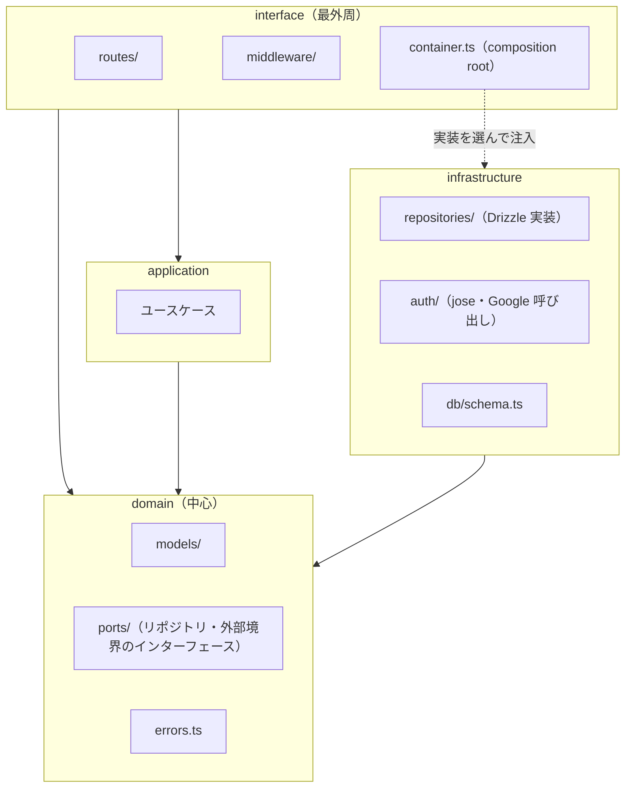
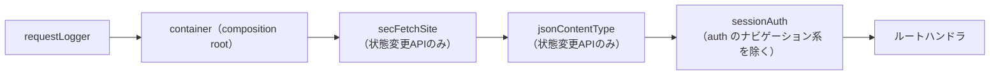
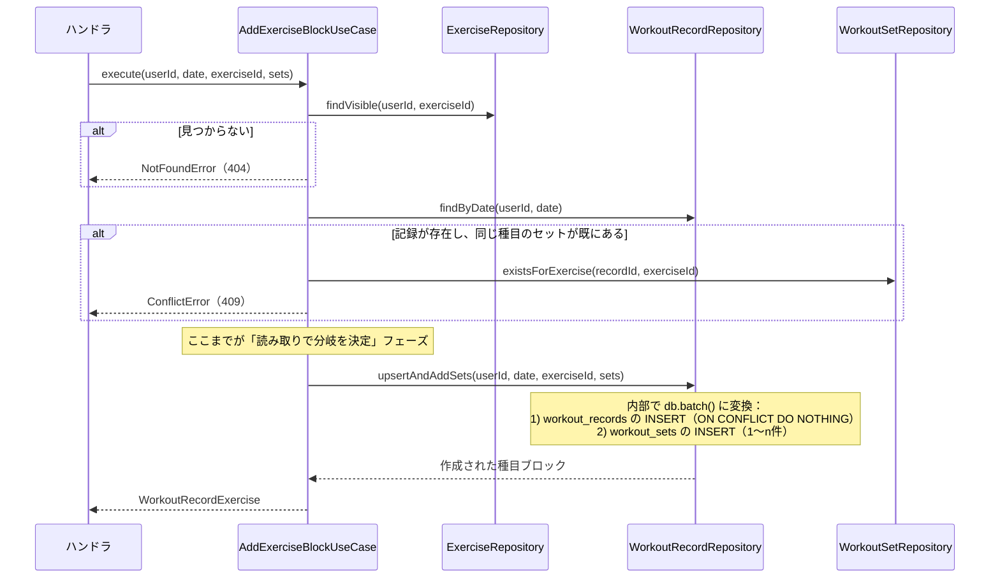

# GainLog バックエンド詳細設計書

## 1. 概要・前提

本書は、詳細設計フェーズの第2文書として、`src/api`（Hono アプリケーション）の内部構成・規約・主要フローを、実装に着手できる粒度で定める。基本設計・`project-structure.md` で「詳細設計（backend.md）で定める」とされた次の項目を回収する。

- `auth.md` 13章「詳細設計（内部設計）で確定する項目」の残り5項目（リポジトリ関数のシグネチャ規約、Lint 禁止対象パスの具体化、所有者チェック対象リソースの網羅、事前定義データの分岐表現、統合テスト配置は `test.md` へ）
- `db.md` 9章「シードデータの具体的な内容」
- `common-spec.md` 4章「本番でのログレベル制御の具体的な実装方法」
- `project-structure.md` 未解決事項5・7・12・14（redirect URI の導出、`compatibility_flags`、Hono RPC の chain 要否、リポジトリ層の内部構成・種目シード・OpenAPI 生成経路・RPC ラッパ）

対象読者は開発者本人（実装者）である。粒度は「ディレクトリと責務・規約・主要フロー・選定理由」までとし、関数の中身は実装（TDD）で詰める。対象は Phase 1 のみ。

### 前提（引き継ぐ確定事項）

| 項目 | 内容 | 出所 |
|---|---|---|
| バリデーション | Zod に統一。スキーマは `src/shared` が正本 | ADR-0008 |
| フロントへの型 | Hono RPC（`hc<AppType>`）。`shared` は入力検証・エラー文言・制約値の出所として併用 | `project-structure.md` 4.5 |
| 依存方向の強制 | tsconfig 3分割 ＋ ESLint `no-restricted-imports` | `project-structure.md` 3章 |
| Worker エントリ | `wrangler.jsonc` の `main` は `./src/api/index.ts` 固定 | `project-structure.md` 5.1 |
| マイグレーション | `drizzle-kit generate`。シード・トリガーは `--custom` の追記型 migration | `project-structure.md` 8章、ADR-0011 |

### 本書で新たに確定する事項

- `src/api` 内部は**オニオンアーキテクチャ**を採用する（2章、ADR-0013）。
- ID トークン検証には `jose` を採用する（5章、ADR-0014）。
- Hono RPC の chain 要否（`project-structure.md` 未解決12 の一部）：**chain は必須**であることを一次情報で確認した（3章）。
- 事前定義種目のシードリスト案（12章）。

## 2. アーキテクチャとディレクトリ構成

### 2.1 オニオンアーキテクチャの採用（ADR-0013）

`src/api` 配下を、外側が内側に依存する4層に分ける。



| 層 | 責務 | 依存してよい先 |
|---|---|---|
| `domain` | エンティティ・値オブジェクトの型、ドメインエラー、ポート（リポジトリ・外部境界のインターフェース）。**外部ライブラリに依存しない**（`shared` の型・定数と素の TypeScript のみ） | なし（`shared` のみ） |
| `application` | ユースケース。複数のリポジトリ・ポートにまたがる処理のみをここに置く（2.2） | `domain` |
| `infrastructure` | ポートの実装。Drizzle スキーマ・リポジトリ実装、`jose` による ID トークン検証、Google との通信 | `domain` |
| `interface` | Hono のルート定義・ミドルウェア・composition root（`container.ts`）。HTTP の入出力を domain/application の型に変換する | `domain`・`application`・（`container.ts` のみ）`infrastructure` |

- **依存性逆転**：`interface`・`infrastructure` はいずれも `domain` の抽象（`ports/`）を参照する。具象の結線（「どの実装を使うか」）は `interface/container.ts` の composition root だけが知っている。
- **`drizzle-orm` の import は `infrastructure/**` に限定する**（`jose` も同様）。`domain`・`application` はこれらを import しない。`project-structure.md` 3.2 の表を本書 2.3 のとおり具体化する。

### 2.2 ユースケース（`application/`）を置く・置かない基準

| 基準 | 置く例 | 置かない例（`interface/routes` から `domain/ports` のリポジトリを直接呼ぶ） |
|---|---|---|
| 複数のリポジトリ／ポートにまたがり、失敗時の巻き戻し・分岐が絡む | ログイン完了処理（allowlist 照合 → users の JIT upsert → sessions 作成）、種目ブロックの追加（workout_records の存在確認・作成 → workout_sets の一括追加、7章） | 単一リソースの単純な CRUD（種目一覧取得、セットの追加・編集・削除、日単位の記録削除 等） |

Phase 1 で `application/` に置くユースケースは次の2つのみとする（8章で詳細）。

- `CompleteLoginUseCase`：`UserRepository`・`SessionRepository`・`AllowlistRepository`・`IdTokenVerifier` ポートを使う。
- `AddExerciseBlockUseCase`：`WorkoutRecordRepository`・`ExerciseRepository`・`WorkoutSetRepository` ポートを使う。

それ以外のエンドポイントは `interface/routes` のハンドラが `domain/ports` のリポジトリ型（`container.ts` が注入した実装）を直接呼ぶ。「単純な CRUD かどうか」の判断に迷った場合は、実装時にリポジトリ呼び出しが2つ以上に増えた時点でユースケースへ抽出することとし、事前の網羅的な分類はしない。

### 2.3 ディレクトリ構成（確定）

```
src/api/
├── index.ts                        # Worker エントリ。app の組み立て・export default・export type AppType（3章）
├── domain/
│   ├── models/                     # エンティティ・値オブジェクトの型（例：exercise.ts, workout-record.ts）
│   ├── errors.ts                   # ドメインエラー（NotFoundError/ConflictError/ForbiddenError 等。HTTPを知らない）
│   └── ports/
│       ├── repositories/           # UserRepository, SessionRepository, AllowlistRepository,
│       │                           # ExerciseRepository, WorkoutRecordRepository, WorkoutSetRepository（1ファイル1インターフェース）
│       ├── clock.ts                # 現在時刻取得のポート（テストで固定時刻に差し替える）
│       ├── id-generator.ts         # UUID v4 生成のポート
│       └── id-token-verifier.ts    # Google ID トークン検証のポート
├── application/
│   ├── complete-login.usecase.ts
│   └── add-exercise-block.usecase.ts
├── infrastructure/
│   ├── db/
│   │   └── schema.ts               # Drizzle スキーマ（旧 src/api/db/schema.ts から移設。3.3 参照）
│   ├── repositories/                # 上記インターフェースの Drizzle 実装（1ファイル1実装、命名は `<name>.d1.ts`）
│   ├── clock.ts / id-generator.ts   # `Date`・`crypto.randomUUID()` を使う実装
│   └── auth/
│       ├── google-id-token-verifier.ts   # jose 実装
│       └── google-oauth-client.ts        # 認可URL組み立て・token endpoint 呼び出し
└── interface/
    ├── routes/
    │   ├── auth.routes.ts           # /api/auth/login, /callback, /logout, /me
    │   ├── exercises.routes.ts      # /api/exercises, /api/exercises/{id}, /api/exercises/{id}/best-set
    │   └── records.routes.ts        # /api/records, /api/records/{date}/...
    ├── middleware/
    │   ├── request-logger.ts
    │   ├── sec-fetch-site.ts
    │   ├── json-content-type.ts
    │   ├── session-auth.ts
    │   └── error-handler.ts         # app.onError に登録するハンドラ
    └── container.ts                 # composition root（4章）
```

- 命名は「役割.種別.ts」（例：`google-id-token-verifier.ts`、`add-exercise-block.usecase.ts`）とし、`repositories/` 配下はインターフェース名の kebab-case に揃える。
- テストファイルは `project-structure.md` の暫定方針どおり対象の隣に `*.test.ts` として置く（最終確定は `test.md`）。

### 2.4 依存方向ルールの具体化（Lint 対象パス）

`project-structure.md` 3.2 の表（`src/api/**` のうちリポジトリ層以外で `drizzle-orm*` を禁止）を、本書のディレクトリ構成に合わせて次のとおり具体化する。

| 対象パス | 禁止する import |
|---|---|
| `src/api/domain/**` | `drizzle-orm*`、`jose`、`src/api/infrastructure/**`、`src/api/interface/**`、`src/api/application/**` |
| `src/api/application/**` | `drizzle-orm*`、`jose`、`src/api/infrastructure/**`、`src/api/interface/**` |
| `src/api/infrastructure/**` | `src/api/interface/**`（`domain` への依存のみ許可） |
| `src/api/interface/**` のうち `container.ts` 以外 | `src/api/infrastructure/**`（`domain`・`application` の型のみ参照する） |
| `src/api/interface/container.ts` | 例外なし（ここでのみ `infrastructure/**` の実装を import してよい） |

これにより「ハンドラから直接 Drizzle を呼び出すことを禁止する」（`auth.md` 13章）は、「`infrastructure/**` 以外から `drizzle-orm*` を禁止」というルールとして機械的に強制される。

## 3. Hono アプリ構成

### 3.1 ルーターの分割と `AppType`

- リソースごとに `interface/routes/*.ts` で `OpenAPIHono` インスタンスを作成し、ルートを**メソッドチェーンで**定義する（`.openapi(routeA, handlerA).openapi(routeB, handlerB)...`）。
- `index.ts` で `.route()` により結合し、結合もチェーンで行う。

```ts
// index.ts（方針）
const app = new OpenAPIHono<AppEnv>()
  .use('*', requestLogger)
  .use('*', container)          // composition root（4章）
  .use('*', secFetchSite)
  .use('*', jsonContentType)
  .use('*', sessionAuth)
  .route('/api/auth', authRoutes)
  .route('/api/exercises', exercisesRoutes)
  .route('/api/records', recordsRoutes)

app.onError(errorHandler)

export type AppType = typeof app
export default app
```

- **一次情報での確認結果（`project-structure.md` 未解決12 の一部を回収）**：Hono の RPC 型推論は、ルート定義・`.route()` による結合の**両方でメソッドチェーンが必須**である（チェーンを切って個別の変数に代入すると、その時点で型が失われる）。この制約を踏まえ、各 `*.routes.ts` ファイル内・`index.ts` の結合部分とも、`const` 代入を挟まず1文でチェーンする規約とする。
- ルート数が増えて型推論（IDE・`tsc -b`）のコストが問題になった場合は、リソース単位で `AppType` を分割し、`client` 側で複数の `hc<T>` を使う方式に切り替える（`project-structure.md` 未解決12 に残る「型推論のコスト」「Workers 型の解決」は実装フェーズ最初のタスクで引き続き検証する）。

### 3.2 存在しない `/api/*` パスと共通エラーハンドリング

- `app.notFound()` で `/api/*` 配下の未定義パスに対し `common-spec.md` の `not_found`（404）を JSON で返す。`architecture.md` 3章の「Static Assets へは到達しない」設計に対応する。
- `app.onError()` に単一のハンドラ（`error-handler.ts`）を登録し、`domain/errors.ts` のドメインエラーを HTTP レスポンスへ変換する（8章の対応表）。ハンドラ外に漏れた例外（想定外）は `500 internal_error` とし、`error` レベルでログに出す。

## 4. ミドルウェアの構成と順序



| 順序 | ミドルウェア | 内容 |
|---|---|---|
| 1 | `requestLogger` | リクエストの `path`・`method` を後続の構造化ログ（10章）に使えるよう `c.var` に保持する |
| 2 | `container` | `c.env.DB` から Drizzle クライアントを作り、リポジトリ実装・`Clock`・`IdGenerator` を組み立てて `c.var` に注入する（composition root、4.1）。**`sessionAuth` がリポジトリを使うため、認証より先に置く** |
| 3 | `secFetchSite` | `auth.md` 9章の実装。対象は `/api/*` の `POST`/`PUT`/`PATCH`/`DELETE` かつ `GET /api/auth/login`・`GET /api/auth/callback` を除く。`Sec-Fetch-Site` が `same-origin`/`none` 以外なら403、ヘッダ欠落は許容 |
| 4 | `jsonContentType` | 上記と同じ対象範囲で `Content-Type: application/json` を必須化（CSRF対策の一部、`auth.md` 9章） |
| 5 | `sessionAuth` | `GET /api/auth/login`・`GET /api/auth/callback` を除く全 `/api/*` に適用。`__Host-session` Cookie を読み、ハッシュ化して `SessionRepository` で検証（無操作24h・絶対30日、`auth.md` 6章）。成功時は `c.var.user`（`userId`）を設定し、`last_accessed_at` を5分間隔で間引き更新（`c.executionCtx.waitUntil()` で非同期に行い、レスポンスを待たせない）。失敗時は 401 |

`GET /api/auth/me` は「未認証でも 200（`{ authenticated: false }` 相当）を返す」仕様であれば `sessionAuth` の対象外にする必要があるが、openapi.yaml の `/auth/me` は 401 レスポンスの定義を持たないため、**`sessionAuth` の対象に含め、未認証時は他の JSON API と同じ 401 を返す**方針とする（フロントは 401 をログイン画面遷移として扱う既存方針と整合する）。

## 5. 認証の実装

### 5.1 ID トークン検証：`jose` の採用（ADR-0014）

一次情報で確認した内容（2026-09-26）：

- `jose` は Cloudflare Workers を含む Web 標準準拠ランタイムを公式にサポートし、Workers の WebCrypto 実装上でそのまま動く。
- `createRemoteJWKSet(url)` は JWKS を自動でキャッシュする（Worker の isolate 単位。isolate の再利用期間中はキャッシュが効き、再起動後は再取得される）。
- `jwtVerify(token, JWKS, options)` の `options.issuer` は `string | string[]` を受け付ける。
- Google の ID トークンの `iss` は `https://accounts.google.com`（discovery document 上の正式値）だが、Google 公式ドキュメントは検証時に `https://accounts.google.com` **または** `accounts.google.com` の両方を許容するよう案内している。したがって `issuer: ['https://accounts.google.com', 'accounts.google.com']` を渡す。
- `aud` はクライアント ID と完全一致で検証する（`audience` オプション）。

**JWKS の取得先**：Google の discovery document（`https://accounts.google.com/.well-known/openid-configuration`）を毎回取得せず、そこに記載された安定した `jwks_uri`（`https://www.googleapis.com/oauth2/v3/certs`）を `createRemoteJWKSet` に直接渡す。discovery document 自体の取得は不要とし、Worker 起動のたびの追加往復を避ける。`jwks_uri` が変更された場合はコードの更新が必要になる点を未解決事項に記載する。

`IdTokenVerifier` ポート（`domain/ports/id-token-verifier.ts`）は「検証済みクレーム（`sub`・`email`・`email_verified`）を返す、または例外を投げる」という抽象のみを持ち、`jose`・JWKS の詳細は `infrastructure/auth/google-id-token-verifier.ts` に閉じ込める。

### 5.2 各エンドポイントの実装方針

| エンドポイント | 主な処理 |
|---|---|
| `GET /api/auth/login` | state・nonce を生成し `__Host-oauth_txn` に格納。Google の認可 URL へ 302（`redirect_uri` は 5.3 参照） |
| `GET /api/auth/callback` | `__Host-oauth_txn` の state と `?state=` を照合（不一致・Cookie 欠落は `/login?error=invalid_request`）→ 一時 Cookie 失効 → token endpoint 呼び出し → `IdTokenVerifier` で検証（失敗は `/login?error=invalid_token`）→ `CompleteLoginUseCase` 実行（allowlist 外は `/login?error=not_allowed`）→ セッション Cookie 発行 ＋ 302 `/` |
| `POST /api/auth/logout` | `SessionRepository.delete(hash(token))`。存在しなくても 204（冪等、`auth.md` 7章） |
| `GET /api/auth/me` | `sessionAuth` を通過済みの `c.var.user` からユーザー情報を返す |

### 5.3 redirect URI の導出

- **リクエストの origin から導出**する（固定値・環境変数のいずれでもなく、`new URL(c.req.url).origin + '/api/auth/callback'`）。開発サーバ（`:5173`）・コンテナの `vite preview`（`:4173`）・本番（`*.workers.dev`）の3つの origin すべてで、設定変更なしに動作する。
- Google 側は「登録済みの URI と完全一致しない限りリダイレクトを拒否する」ため、この3つの origin をあらかじめ Google Cloud Console の Authorized redirect URI に個別登録しておく必要がある（運用手順。`auth.md` 12章のスコープ）。導出方式自体はコード側の分岐を持たない。
- 任意の外部ドメインを `redirect_uri` として受け付けるわけではない点に注意：`redirect_uri` は Google 側で登録済み URI との完全一致を要求されるため、ここでの「origin から導出」は利便性のためであり、任意リダイレクトの脆弱性（オープンリダイレクト）を生まない。

### 5.4 `CompleteLoginUseCase`

`application/complete-login.usecase.ts`。入力は検証済み ID トークンクレーム（`sub`・`email`・`email_verified`）。

1. `email_verified !== true` なら失敗（`/login?error=invalid_token` 相当のドメインエラー）。
2. `AllowlistRepository.isAllowed(email)`（`COLLATE NOCASE` 照合）。false なら `NotAllowedError`。
3. `UserRepository.upsertByGoogleSub(sub, email, now)`：`INSERT ... ON CONFLICT(google_sub) DO UPDATE SET email = excluded.email, updated_at = excluded.updated_at RETURNING id`（`auth.md` 5章の単一の原子的 upsert）。
4. `SessionRepository.create(userId, tokenHash, now, expiresAt)` で新規セッション行を作成。
5. 生トークン（Cookie に載せる値）をユースケースの戻り値として返す（ハッシュ化前の値を扱うのはこの経路のみ）。

手順3と4はそれぞれ独立した1文の SQL であり、D1 の `batch()` にまとめる必要はない（7.1 参照。upsert の結果 `id` を次の INSERT の入力に使うため、そもそも同一 batch にはできない）。両者の間で失敗した場合（例：手順4の直前でリクエストが中断）は「ユーザーは作成されたがセッションがない」状態が残りうるが、再ログインで手順3が冪等に収束するため実害はない。

## 6. リポジトリ規約

### 6.1 シグネチャ規約

- 全リポジトリ関数は **`userId` を第一引数に必須**とする（`auth.md` 13章）。省略・オプショナル化は禁止し、コンパイルエラーで検出できるようにする。
- 例外：`AllowlistRepository`（ログイン前で `userId` が存在しない）、`UserRepository.upsertByGoogleSub`（ユーザー作成そのもの）、`ExerciseRepository` の一覧取得系（事前定義データを含むため 6.3 参照）。

### 6.2 所有者チェック対象リソースの一覧（網羅）

| リソース | 所有者チェックの方式 |
|---|---|
| `WorkoutRecord` | `WHERE user_id = :userId` を全クエリに必須。他ユーザー所有は **404**（存在有無を漏らさない、`auth.md` 8章） |
| `WorkoutSet` | 親 `WorkoutRecord` 経由で `user_id` を照合。他ユーザー所有は **404** |
| `Exercise`（ユーザー追加分） | `owner_user_id = :userId` の行のみ編集・削除可。他ユーザー所有は **404** |
| `Exercise`（事前定義） | 全ユーザー閲覧可。編集・削除は **403**（6.3 で詳述） |
| `Session` | ログアウト時、Cookie 由来のハッシュ値でのみ削除。`userId` チェックは不要（トークン自体が本人性の証明） |
| `Allowlist` | Phase 1 は開発者の手動 SQL 運用のみ。API 経由のアクセスなし |

### 6.3 事前定義データの分岐表現（404 と 403 の使い分け）

`Exercise` は「事前定義（`owner_user_id IS NULL`、全ユーザーに公開済み）」と「ユーザー追加（`owner_user_id` あり、非公開）」で、存在の秘匿レベルが異なるため、`WorkoutRecord` 等とは異なる応答方針になる。

| ケース | 応答 | 理由 |
|---|---|---|
| 存在しない `exerciseId` | 404 | 標準の not found |
| 他ユーザーが追加した種目（非公開） | 404 | 存在自体を秘匿する必要がある（`auth.md` 8章と同じ理由） |
| 事前定義種目を編集・削除しようとした | **403** | 種目自体は全ユーザーに公開済みで存在を隠す意味がない。「権限上許可されない操作」であることを示す（`common-spec.md` 2章の403定義、`requirement.md` 5.5） |

`ExerciseRepository` の実装では、`findEditable(userId, exerciseId)` のような「編集可能な行だけを返す」関数ではなく、`findVisible(userId, exerciseId)`（事前定義 or 自分の行なら返す）と `isOwnedByUser(exercise, userId)` の判定を分け、ハンドラ／ユースケース側で「見つからない→404」「見つかったが自分のものでない→事前定義なら403、他人の追加種目なら404」を分岐する。

## 7. D1・Drizzle の方針

### 7.1 D1 `batch()` の制約と設計への反映

一次情報で確認した D1 `batch()` の性質：

- `batch()` に渡す SQL 文の**リストは実行前にすべて確定している必要があり**、ある文の実行結果を同じ `batch()` 内の別の文の入力に使うことはできない。
- 全文がまとめて成功するか、失敗時は全体がロールバックされる（単一ラウンドトリップでのオール・オア・ナッシング）。
- 2回に分けた `batch()` 呼び出しの間には原子性がない（1回目が成功した後に2回目が失敗しても、1回目の書き込みは残る）。

この制約から、GainLog では「**読み取りで分岐を決定 → 決定済みの文だけを `batch()` で書き込む**」という2段構成を採る。分岐の途中で発生しうる競合（同時リクエスト）は、UNIQUE制約を最終防御線として扱う（`db.md` 6章の制約が発火した場合は 409 に変換する）。実質1ユーザーの利用規模のため、この競合が実際に発生する可能性は極めて低いと判断する。

### 7.2 `AddExerciseBlockUseCase` の書き込みフロー

`POST /records/{date}/exercises`（8.10 参照）を例に、上記の2段構成を示す。



- 手順1（`upsertAndAddSets` 内の `batch()`）：記録が新規の場合は `workout_records` の `INSERT ... ON CONFLICT(user_id, workout_date) DO NOTHING` を含める。既存の場合はこの文を含めず `workout_sets` の INSERT のみを `batch()` に積む。
- `set_number` は 1 から連番でリクエストに含まれる想定とし、`UNIQUE(workout_record_id, exercise_id, set_number)` 制約（`db.md` 6章）が最終防御線になる。

### 7.3 UUID・時刻の生成

- `IdGenerator` ポートの実装は `crypto.randomUUID()`（Workers の Web Crypto API でサポート済み、一次情報で確認）。
- `Clock` ポートの実装は `new Date()` ベース。テスト時は固定時刻を返す実装に差し替える（`project-structure.md` 4.1 の「現在時刻は引数で受け取る純関数」という shared の方針と、ポートによる注入は役割が異なる：shared の JST ユーティリティは日付計算の純関数、`Clock` ポートは「いま」を取得する副作用の注入点）。
- セッショントークンのハッシュ化は `crypto.subtle.digest('SHA-256', ...)`（Workers でサポート済み）。生トークンは `crypto.randomUUID()` ではなく、より長いランダム値（例：`crypto.getRandomValues` による32バイト、Base64url エンコード）を用いる（推測困難性を UUID より高くするため）。

### 7.4 `sql.raw` の禁止・エラー判別

- `infrastructure/repositories/**` 以外での生 SQL 文字列組み立てを禁止する（2.4 の Lint で `drizzle-orm*` 自体を禁止しているため、副次的に担保される）。
- D1 の制約違反（UNIQUE・RESTRICT）は、Drizzle 経由で投げられるエラーのメッセージ・コードから判別し、リポジトリ層で `ConflictError`（domain）に変換してから上位に投げる。判別の具体的なパターン（エラーコード文字列）は実装フェーズ最初のタスクでローカル D1 に対して実測し、本書または `test.md` に反映する（15章 未解決事項）。

## 8. エンドポイント別の処理

openapi.yaml（凍結済みスナップショット）に定義された全エンドポイントについて、実装時の入力・処理・応答を定める。openapi.yaml 自体は更新しない（`project-structure.md` 4.4）。

### 8.1 応答方針の共通ルール

| HTTPステータス | 発生源 |
|---|---|
| 400 | Zod のスキーマ検証エラー（9章） |
| 401 | `sessionAuth` ミドルウェアでの認証失敗 |
| 403 | 事前定義種目の編集・削除（6.3） |
| 404 | リソース不在／他ユーザー所有（6.2・6.3） |
| 409 | UNIQUE違反・RESTRICT違反・種目ブロックの重複追加（8.10） |
| 500 | 想定外の例外（3.2） |

### 8.2 `GET /auth/me`・`POST /auth/logout`

5.2 のとおり。ドメインエラーなし（単純な参照・削除）。

### 8.3 `GET /exercises`

`ExerciseRepository.listVisible(userId)`：`owner_user_id IS NULL OR owner_user_id = :userId`。404・409 なし。

### 8.4 `POST /exercises`

- 入力：`name`・`category`。`ExerciseRepository.create(userId, name, category, now)`。
- `UNIQUE(owner_user_id, name)` 違反 → 409（同一ユーザー内の名前重複。`db.md` 5.4）。

### 8.5 `PATCH /exercises/{exerciseId}` ／ `DELETE /exercises/{exerciseId}`

- `ExerciseRepository.findVisible` → 見つからなければ404、事前定義なら403（6.3）。
- `DELETE` は `ON DELETE RESTRICT`（`workout_sets.exercise_id`）による制約違反 → 409（`requirement.md` 5.5「使用中の種目は削除できない」）。

### 8.6 `GET /exercises/{exerciseId}/best-set`

- `ExerciseRepository.findVisible` で存在確認（見つからなければ404）。
- `excludeDate` が指定された場合、`WorkoutRecordRepository.findByDate(userId, excludeDate)` で `workout_record_id` に変換する。該当する記録がなければ除外条件を付けずにクエリする（`db.md` 8章のとおり）。
- 自己ベスト抽出は `db.md` 8章で確定済みの SQL（相関サブクエリ、タイブレークは `workout_date DESC`）をそのまま `WorkoutSetRepository.findBestSet(userId, exerciseId, excludeRecordId?)` として実装する。0件は `found: false`。

### 8.7 `GET /records`

- `WorkoutRecordRepository.summarizeByDateRange(userId, from, to)`。`from`/`to` の妥当性（日付形式・`from <= to`）は9章のバリデーションで担保。

### 8.8 `GET /records/{date}`

- 記録が存在しない日でも `exercises: []` で200を返す（404にしない。openapi.yaml の記載どおり）。

### 8.9 `DELETE /records/{date}`

- `WorkoutRecordRepository.deleteByDate(userId, date)`。対象なしなら404。CASCADE で配下の `workout_sets` も削除される（`db.md` 6章）。

### 8.10 `POST /records/{date}/exercises`（種目ブロックの追加）

- `AddExerciseBlockUseCase`（7.2 参照）。
- **404**：`exerciseId` が見えない（存在しない or 他ユーザーの追加種目）。
- **409（本書で新たに確定：openapi.yaml に定義なし）**：指定日の記録に、同じ `exerciseId` の種目ブロックが既に存在する場合。「その日にすでにある種目への追加」は本エンドポイントの対象外とし、既存のセット追加API（8.12）を使うことをエラーメッセージで案内する。

### 8.11 `DELETE /records/{date}/exercises/{exerciseId}`（種目単位の削除）

- 記録・種目の所有者チェック（404）→ `WorkoutSetRepository.deleteByExercise(userId, recordId, exerciseId)`（当該種目の全セットを削除）。
- 単一の `DELETE FROM workout_sets WHERE workout_record_id = ? AND exercise_id = ?` で足り、`batch()` は不要（7.1 の2段構成が必要になるのは複数テーブルへの書き込みが絡む場合のみ）。
- 削除の結果セットが0件になった場合、DBトリガー（`db.md` 7章）が `workout_records` を自動削除する。

### 8.12 `POST /records/{date}/exercises/{exerciseId}/sets`

- 記録・種目の所有者チェック（404）→ `WorkoutSetRepository.add(...)`。`UNIQUE(workout_record_id, exercise_id, set_number)` 違反 → 409。

### 8.13 `PATCH /records/{date}/sets/{setId}` ／ `DELETE /records/{date}/sets/{setId}`

- 所有者チェック（記録 → セットの所属を辿って404判定）。`PATCH` で `set_number` を変更した場合の UNIQUE 違反 → 409。
- `DELETE` はDBトリガー（`db.md` 7章）が0件化を検知して `workout_records` を自動削除する。アプリケーション側で明示的な後処理は不要。

## 9. バリデーションとエラー応答

- `OpenAPIHono` の `defaultHook` に、Zod のバリデーション結果を `common-spec.md` 3章の `fields` 配列へ変換する共通関数（`shared` の 4.1 章で定義済みの純関数）を接続する。**`defaultHook` はアプリ本体（`index.ts` の `app`）に対して設定する必要があり、`interface/routes/*.ts` の個別インスタンスには効かない**（一次情報で確認：親で定義した `defaultHook` は子ルーターに伝播しない既知の制限）。そのため各 `*.routes.ts` の `OpenAPIHono` インスタンス生成時にも同じ `defaultHook` を明示的に渡す。
- リクエストボディの JSON 構文エラー（`fields` を持たない形。`common-spec.md` 3章）は Hono のボディパース例外を `error-handler.ts` で捕捉し `validation_error` に変換する。
- `date`（`YYYY-MM-DD`）・UUID 形式のパスパラメータは、`shared` の Zod スキーマで検証する（`db.md` 5.5 の `GLOB` チェックと同じ形式チェックだが、暦日としての妥当性———例：2月30日———はここで弾く。DB 側の `CHECK` は形式のみで暦日の正しさまでは見ないため、アプリ層のバリデーションが最終防御線になる）。

## 10. ロギング

### 10.1 `LOG_LEVEL` による制御方式

- `common-spec.md` 4章の4段階（`debug`/`info`/`warn`/`error`）を、`project-structure.md` 7章で定義済みの `LOG_LEVEL` 環境変数（ローカル `debug`、本番 `info`）で制御する。
- `interface/middleware/request-logger.ts` に、`LOG_LEVEL` としきい値比較を行う薄いロガー関数を実装する（レベルの数値化：`debug=0 < info=1 < warn=2 < error=3`。設定値未満のレベルは出力しない）。外部ライブラリは導入しない（`console.*` を直接使う `common-spec.md` の方針どおり）。
- ログの構造化フォーマット（`level`/`timestamp`/`message`/`path`/`method`/`userId`）は `common-spec.md` 4章の定義をそのまま実装する。

### 10.2 レベルの割り当て

| 事象 | レベル |
|---|---|
| ログイン成功、記録・種目の作成/更新/削除 | `info` |
| 400/403/404/409 応答 | `warn` |
| ID トークン検証失敗、allowlist外アクセス | `warn`（`auth.md` 10章） |
| 500 応答・想定外の例外 | `error` |
| 開発時の詳細トレース | `debug` |

## 11. OpenAPI 仕様の生成

- 実装後の最新仕様は `app.getOpenAPI31Document({ openapi: '3.1.0', info: {...} })` を使い、npm script（`pnpm openapi:generate`）でリポジトリ直下に想定しない一時ファイル（例：`openapi.generated.json`）へ書き出す。**Git 管理はしない**（`.gitignore` に追加）。
- **Swagger UI 等での公開は Phase 1 では行わない**：エンドポイントとして公開すると `@hono/swagger-ui` 等の追加依存（`requirement.md` 6章への追記・`project-structure.md` 9.4 の許可リスト更新が必要）と、公開エンドポイントの認証要否という新たな設計課題が生じる。API の利用者は自分自身の SPA のみであり、公開の効用が小さいため見送る。ローカルで見たい場合は、生成した JSON をエディタの OpenAPI プレビュー機能等で開けば足りる。
- 将来 API を外部公開する必要が生じた場合に再検討する（15章 未解決事項）。

## 12. シードデータ（事前定義種目）

`db.md` 5.4・9章、`project-structure.md` 8.4（ADR-0011）で「内容は `backend.md` で確定する」とされた事項。`--custom` の migration に、以下のリストを固定 UUID・`owner_user_id = NULL` で `INSERT` する。

| # | UUID | 種目名 | カテゴリ |
|---|---|---|---|
| 1 | `ceda0dac-69b7-452a-884c-5b1de2780369` | ベンチプレス | `chest` |
| 2 | `7d796a6f-8dab-403a-923a-06ca25ee4fb1` | インクラインベンチプレス | `chest` |
| 3 | `8218f7da-7253-4d02-bcb4-d4c0057ac0de` | ダンベルフライ | `chest` |
| 4 | `2392229a-60e0-43ae-8976-f3a22e986be8` | デッドリフト | `back` |
| 5 | `e4049ea0-3823-4bf0-a483-a7279ee9bc5f` | 懸垂（チンニング） | `back` |
| 6 | `4f712a43-03a3-41ae-a3f5-350986b4f896` | ラットプルダウン | `back` |
| 7 | `a830941b-32f1-4083-b374-01e0b18afcf7` | ベントオーバーロウ | `back` |
| 8 | `53198da8-d63e-4402-b834-cbf8e6fefd06` | スクワット | `legs` |
| 9 | `cbd50ba0-3550-44c4-acee-6a3d96f53b24` | レッグプレス | `legs` |
| 10 | `c6647d20-cadb-41cc-923f-8d2184280bdf` | レッグエクステンション | `legs` |
| 11 | `8232f2b5-96ed-4744-97d5-730c8e4e37dc` | ショルダープレス | `shoulders` |
| 12 | `225ecb50-5636-447d-bba3-440d8e525be0` | サイドレイズ | `shoulders` |
| 13 | `1dd6251c-56b0-4597-8557-a0fd6b2f8443` | バーベルカール | `arms` |
| 14 | `b71882ed-5d4d-4687-a2d0-3bc7647a8aaa` | トライセプスエクステンション | `arms` |
| 15 | `5adcb81f-9c04-425a-8635-339b17b00520` | プランク | `core` |
| 16 | `daa156a7-fb1b-4f20-a9d3-01e5b73246a9` | クランチ | `core` |
| 17 | `a25983f1-af20-4b8b-ad80-b6332c1f4c87` | ランニング | `cardio` |
| 18 | `90fa8c65-8c8c-4cba-8d38-733f3bc76c1c` | エアロバイク | `cardio` |

- 8カテゴリ中 `other` は代表種目を無理に選定せず、事前定義0件とする（ユーザーの自由追加に委ねる）。
- UUID は本書執筆時に生成した固定値であり、migration にそのままリテラルとして書く（`db.md` 9章「UUIDはSQLリテラルの固定値」のとおり）。名称・カテゴリの妥当性はレビューで確認する。
- `created_at`/`updated_at` は migration 適用時刻ではなく、固定の ISO 8601 文字列（例：`2026-01-01T00:00:00.000Z`）を使う（再現可能なマイグレーションにするため）。

## 13. スコープ外

- `src/client` の内部構成（`frontend.md`）
- テストの配置・ダブル方針・CI 必須化・受入条件との対応表（`test.md`）
- `compatibility_flags`（`nodejs_compat` の要否）：`jose`・`crypto.subtle` は Workers 標準 API のみで完結するため、現時点では不要と見込むが、実装フェーズ最初のタスクで確定する
- D1 の制約違反エラーの具体的な判別パターン（エラーメッセージ・コード文字列）：実装フェーズ最初のタスクで実測する
- Google Cloud Console 側での Authorized redirect URI の登録手順：運用手順書スコープ（`auth.md` 12章）
- Phase 2 機能

## 14. 既存設計書との整合性チェック結果

| 項目 | 既存記載 | 本書での扱い | 判定 |
|---|---|---|---|
| リポジトリ層の配置・構成 | `auth.md` 13章（`src/api` 配下、内部構成は本書で確定と `project-structure.md` 3.2 に記載） | オニオン構成の `infrastructure/repositories/` に確定 | **追従修正が必要**：`auth.md` 13章のチェックリストを「本書で確定済み」に更新 |
| `src/api/db/schema.ts` のパス | `project-structure.md` 2.1（固定パスとして明記）・3.3（相対import前提） | `src/api/infrastructure/db/schema.ts` に移設（2.3） | **追従修正が必要**：`project-structure.md` 2.1・3.3・8.1・`drizzle.config.ts` の記述を更新 |
| Lint 対象パス | `project-structure.md` 3.2（「リポジトリ層以外」で `drizzle-orm*` 禁止、パスは本書で確定） | 2.4 のとおり層ごとに具体化 | **追従修正が必要**：`project-structure.md` 3.2 の表を本書 2.4 への参照に更新 |
| OpenAPI 生成経路 | `project-structure.md` 4.4（生成方法の詳細は本書で確定） | npm script でファイル出力、Git 管理せず、公開しない（11章） | **追従修正が必要**：`project-structure.md` 4.4 に参照を追記 |
| シードデータの内容 | `db.md` 9章・`project-structure.md` 8.4（内容は本書で確定） | 12章のリストで確定 | **追従修正が必要**：`db.md` 9章の参照を更新 |
| ログレベル制御の実装方法 | `common-spec.md` 4章・7章（実装方法は実装時に定める） | 10章で確定（環境変数のしきい値比較） | **追従修正が必要**：`common-spec.md` 7章の参照を更新 |
| ID トークン検証ライブラリ | `auth.md` 3章（選定は実装時、スコープ外と明記） | `jose` に確定（5.1、ADR-0014） | **追従修正が必要**：`requirement.md` 6章に `jose` を追記、`auth.md` 3章に参照を追記 |
| redirect URI の導出 | `project-structure.md` 7章（`backend.md` で確定と明記） | リクエスト origin から導出（5.3） | 整合。追加のADRは不要（代替案との比較が薄いため） |
| Hono RPC の chain 要否 | `project-structure.md` 未解決12（実装フェーズ最初のタスクで確認） | 一次情報で chain 必須と確認（3.1） | **追従修正が必要**：`project-structure.md` 13章 未解決12 を「chain は必須と確認済み（backend.md 3.1）。型推論コスト・Workers型解決は引き続き未解決」に更新 |
| `POST /records/{date}/exercises` の重複時の応答 | openapi.yaml（409の定義なし。凍結済みのため更新しない） | 409 として本書 8.10 で確定 | 整合（openapi.yaml は凍結のため、本書にのみ記載する運用） |

## 15. 未解決事項

1. **D1 の制約違反エラーの判別パターン**（UNIQUE・RESTRICT を判別してリポジトリ層で `ConflictError` に変換する具体的な条件）。実装フェーズ最初のタスクでローカル D1 に対して実測する。
2. **`compatibility_flags`（`nodejs_compat`）の要否**。`jose`・`crypto.subtle` は標準 Web API のみで完結する見込みだが、依存関係の実装詳細（内部で Node.js の `crypto` モジュールにフォールバックしていないか等）を実装時に確認する。
3. **Hono RPC の型推論コスト・Workers 型の解決**（`project-structure.md` 未解決12 の残り）。ルート数が実装で確定した段階で計測する。
4. **セッショントークンの生成方式の詳細**（`crypto.getRandomValues` のバイト長、Base64url エンコードの実装。7.3）。
5. **Google の `jwks_uri` が将来変更された場合の追随方法**（discovery document を都度取得する方式へ切り替えるか、値をハードコードしたまま運用するか）。
6. **OpenAPI 仕様の公開**：将来 API を外部公開する必要が生じた場合の認証設計（11章）。
7. **`test.md` へ引き継ぐ事項**：ユースケース（`application/`）のテスト方針（ポートをテストダブルに差し替える）、リポジトリのローカル実 D1 テスト、`AddExerciseBlockUseCase` の競合（7.1）を回帰テストで再現するか、所有者チェック横断テストの対象一覧（6.2 の表をそのまま使う）。
