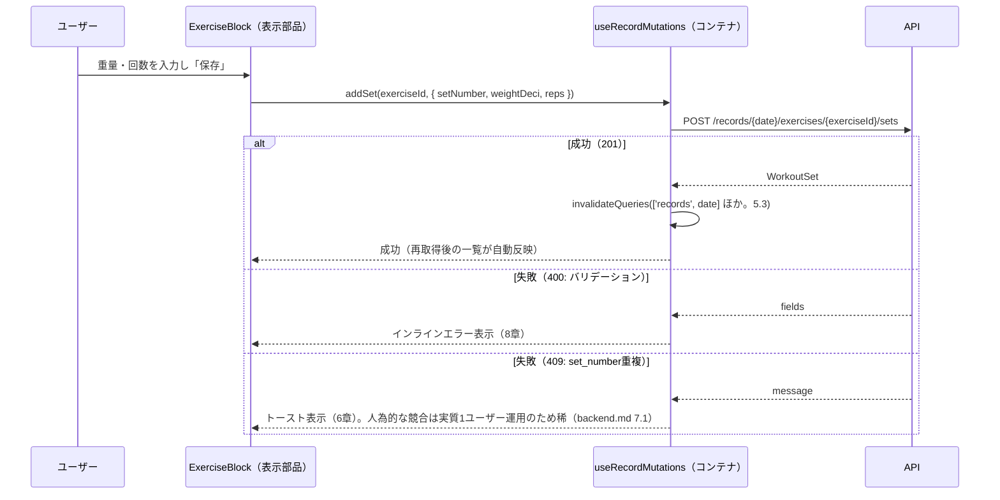

# GainLog フロントエンド詳細設計書

## 1. 概要・前提

本書は、詳細設計フェーズの第3文書として、`src/client`（React SPA）の内部構成・規約・主要フローを、実装に着手できる粒度で定める。基本設計・`project-structure.md`・`backend.md` で「詳細設計（`frontend.md`）で定める」とされた次の項目を回収する。

- `screens.md` 4章・8章「クライアントサイドルーティングライブラリの具体的な選定」「コンポーネント設計・状態管理（React の実装詳細）」
- `common-spec.md` 3章「UI側での即時バリデーションの実装詳細」・5章「ローディング・トーストの具体的なコンポーネント実装」
- `auth.md` 2章・7章・10章・11章「フロントエンド実装スコープ」（XSS対策・ログアウト後のクリア・401のグローバル検知）
- `project-structure.md` 1章（React Router・サーバー状態管理・Tailwind の版）・2.1（`src/client` 内部）・3.1/3.2（`client` 内部の依存方向）・4.5（RPC クライアントのラッパ・型のない共通エラーの扱い）・6.3（Storybook・Vitest から Cloudflare プラグインを除外する方法のうち Storybook 側）・10章（`storybook` scripts）・13章 未解決4・14
- `backend.md` 4章（`GET /api/auth/me` の 401 化）・8.10（種目ブロック重複の 409）

対象読者は開発者本人（実装者）である。粒度は「ディレクトリと責務・規約・主要フロー・選定理由」までとし、コンポーネントの中身・スタイルの微調整は実装（TDD）で詰める。対象は Phase 1 のみ。

### 前提（引き継ぐ確定事項）

| 項目 | 内容 | 出所 |
|---|---|---|
| バリデーション | Zod に統一。スキーマ・制約値・エラー文言・`fields` 変換・JST 日付ユーティリティは `src/shared` が正本 | ADR-0008、`project-structure.md` 4章 |
| フロントへの型 | Hono RPC（`hc<AppType>`）。ハンドラが `c.json()` で返すレスポンスにのみ型が付き、ミドルウェアの共通エラー（401 等）には型が付かない | `project-structure.md` 4.5 |
| 依存方向の強制 | tsconfig 3分割 ＋ ESLint `no-restricted-imports`。`client` → `api`（型のみ）は例外的に許可 | `project-structure.md` 3章 |
| SPA エントリ | `src/client/main.tsx`。`index.html` はリポジトリ直下 | `project-structure.md` 2.1 |
| ビルド・開発 | Vite ＋ `@cloudflare/vite-plugin`。開発サーバは workerd 上で Worker を実行し、SPA と `/api/*` が同一オリジンで動く | ADR-0009 |
| 画面一覧・入力制約 | `screens.md` 2章・7章 | `screens.md` |
| 共通エラー形式 | `{ code, message, fields? }`。`code` は HTTP ステータスと1対1 | ADR-0006、`common-spec.md` 2〜3章 |
| Cookie セッション | SPA は Google のトークン・クライアント ID を一切扱わない（BFF 方式） | `auth.md` 2章 |

### 本書で新たに確定する事項

- ルーティングは **React Router**、サーバー状態管理は **TanStack Query** を採用する（2章、ADR-0015）。
- 記録詳細・編集画面は **操作ごとの即時保存モデル**を採用する（7.5章、ADR-0016）。
- `src/client` の内部はディレクトリを**機能別（feature-based）**に分ける（2章）。
- UI 部品（ダイアログ・ドロワー・トースト）は外部ライブラリを使わず、ネイティブ `<dialog>` を用いて自前実装する（10章）。
- フォームは `react-hook-form` 等を使わず自前実装とし、`shared` の Zod スキーマを直接使う（8章）。
- Phase 1 で Content-Security-Policy を導入する（13章）。

### 導入するライブラリ・版（要件定義書 6章への追記対象）

`requirement.md` 6章に明記のないものは、本書の確定に合わせて 6章へ追記する（CLAUDE.md の合意ルール）。バージョンは 2026-09-27 時点の npm `latest` を一次情報（`npm view`）で確認したもので、実装時に再確認する。

| 区分 | ライブラリ | 確認したバージョン | 備考 |
|---|---|---|---|
| ルーティング | `react-router` | 8.4.0（peer: `react`/`react-dom` `>=19.2.7`） | `react-router-dom` ではなく `react-router` を使う。v7 でルーティング機能一式が本パッケージに統合され、`react-router-dom` は互換用の再エクスポートに位置づけが変わっている（一次情報：npm の package description「Declarative routing for React」、peer dependencies の内容から確認）。宣言型（`<BrowserRouter>`/`<Routes>`/`<Route>`）のみを使い、データルーター API（`createBrowserRouter` の loader/action）は使わない（2章前提のとおり、データ取得は TanStack Query に一本化するため） |
| React 本体 | `react` / `react-dom` | 19.3.0 | `react-router` 8.x の peer 要件（`>=19.2.7`）を満たす |
| Vite React 統合 | `@vitejs/plugin-react` | 6.1.1（peer: `vite ^8.0.0`） | `project-structure.md` の Vite 8.x と整合 |
| サーバー状態管理 | `@tanstack/react-query` | 5.104.0 | `QueryCache`/`MutationCache` の `onError` フックを使う（5章） |
| スタイリング | `tailwindcss` / `@tailwindcss/vite` | 4.3.3 / 4.3.3 | Vite プラグインとして導入（11章） |
| UI コンポーネントカタログ | `storybook` / `@storybook/react-vite` | 10.6.0 / 10.6.0 | `.storybook/main.ts` の `viteFinal` で Cloudflare プラグインを除外する（12章） |

- ID トークン検証等バックエンド専用ライブラリは対象外（`backend.md` で確定済み）。
- `react-hook-form`・Radix UI 等の UI/フォームライブラリは採用しない（10章・8章の判断）。

## 2. アーキテクチャとディレクトリ構成

### 2.1 ディレクトリ構成（確定）

`src/client` の内部は**機能別（feature-based）**に分ける。画面（`pages/`）は薄く保ち、データ取得・状態・ロジックは `features/` に閉じ込める。

```
src/client/
├── main.tsx              # SPA エントリ。ReactDOM.createRoot・QueryClientProvider・BrowserRouter を組み立てる
├── App.tsx                # ルート定義（3章）
├── pages/                  # ルート単位の画面（薄いコンテナ。features を組み合わせるのみ）
│   ├── LoginPage.tsx
│   ├── CalendarPage.tsx
│   ├── WeeklyPage.tsx
│   ├── RecordPage.tsx
│   ├── ExercisesPage.tsx
│   └── NotFoundPage.tsx
├── features/
│   ├── auth/               # 認証ガード、/auth/me クエリ、ログアウトミューテーション
│   │   ├── useMe.ts
│   │   ├── useLogout.ts
│   │   └── RequireAuth.tsx # 認証ガード（3章）
│   ├── calendar/           # 月間カレンダー・週間一覧（サマリ取得を共用）
│   │   ├── useRecordSummaries.ts
│   │   ├── MonthCalendar.tsx
│   │   └── WeeklyList.tsx
│   ├── records/            # 記録詳細・編集、自己ベスト表示
│   │   ├── useRecord.ts
│   │   ├── useBestSet.ts
│   │   ├── useRecordMutations.ts   # セット/種目ブロック/日単位の各ミューテーション（7.4章）
│   │   ├── RecordEditor.tsx
│   │   ├── ExerciseBlock.tsx
│   │   ├── SetRow.tsx
│   │   ├── BestSetPanel.tsx
│   │   └── AddExerciseDialog.tsx   # exercises/ の一覧・新規追加モーダルを利用
│   └── exercises/          # 種目一覧・追加・編集
│       ├── useExercises.ts
│       ├── useExerciseMutations.ts
│       ├── ExerciseList.tsx
│       └── ExerciseFormDialog.tsx  # records/ からも呼ばれる（種目のその場作成）
├── components/
│   ├── ui/                 # 共通 UI（10章）：Dialog, ConfirmDialog, Drawer, Toast, ToastProvider, Spinner, AppHeader
│   └── layout/
│       └── AuthenticatedLayout.tsx # ヘッダー・ドロワー・RequireAuth・NotFound の外枠
└── lib/
    ├── api.ts               # hc<AppType> の生成・ApiError 正規化（4章）
    ├── queryClient.ts        # QueryClient・QueryCache/MutationCache の 401 フック（5章）
    ├── queryKeys.ts           # クエリキー定義（5章）
    └── date.ts                # shared の JST 純関数を呼ぶ側（9章）
```

- `pages/*.tsx` は「どの `features` を使うか」の組み立てのみを行い、API 呼び出し・状態は持たない。
- `AddExerciseDialog`（records）と `ExerciseFormDialog`（exercises）は同一の入力項目・制約を持つため、`ExerciseFormDialog` を `records` から import して使い回す（`screens.md` 5.5・5.6 の「UI コンポーネントを共用する想定」に対応）。
- テストファイルは `project-structure.md` の暫定方針どおり対象の隣に `*.test.tsx` として置く（最終確定は `test.md`）。Storybook 用の `*.stories.tsx` も対象の隣に置く（12章）。

### 2.2 コンテナ部品・表示部品の分離規約

Storybook の対象をプレゼンテーション部品のみとする（12章）ため、次の規約を置く。

| 区分 | 責務 | 例 | Storybook |
|---|---|---|---|
| コンテナ（`features/*` の `use*.ts` フック・`pages/*`） | TanStack Query によるデータ取得・ミューテーション呼び出し | `useRecord`, `RecordPage` | 対象外 |
| 表示部品（`features/*` の `.tsx`・`components/ui/*`） | props で受け取ったデータ・コールバックのみに依存し、API を直接呼ばない | `RecordEditor`（`record`・`onAddSet` 等を props で受ける）, `Dialog`, `Toast` | 対象 |

`RecordEditor` 等の画面本体コンポーネントは、対応する `pages/*.tsx` がフックの戻り値（データ・ローディング・ミューテーション関数）を props として渡す形にし、コンポーネント自身が `useQuery`/`useMutation` を呼ばない。これにより、ローディング・空・エラーの各状態を Storybook 上で props の差し替えだけで再現できる。

### 2.3 依存方向ルールの具体化

`project-structure.md` 3.2 の表（`src/client/**` は `**/api/**` を型のみ許可、`hono`・`@hono/*`・`drizzle-orm*` を禁止）に、本書のディレクトリ構成を踏まえて次を追加する。

| 対象パス | 禁止する import |
|---|---|
| `src/client/components/ui/**` | `src/client/features/**`、`src/client/pages/**`（共通 UI は特定機能のドメインを知らない） |
| `src/client/lib/**` | `src/client/features/**`、`src/client/pages/**`（`lib` は最も内側で、機能に依存しない） |
| `src/client/features/**` | `src/client/pages/**` |
| `src/client/features/exercises/**` | `src/client/features/records/**`（依存の向きは records → exercises の一方向のみ。2.1 参照） |

- 強制方法は `project-structure.md` 3.2 と同じ ESLint `no-restricted-imports`（flat config でディレクトリ別に設定）。パッケージ境界がないため、tsconfig ではなく lint のみで強制する（`client` 内部は単一の `tsconfig.client.json` のまま）。

## 3. ルーティングと認証ガード

### 3.1 ルート定義

React Router の宣言型 API（`<BrowserRouter>`・`<Routes>`・`<Route>`）を用いる。History API（`pushState`/`popstate`）ベースであり、`screens.md` 4章の「ブラウザの戻る/進むボタン対応」要件を満たす。

| パス | コンポーネント | 認証 | 備考 |
|---|---|---|---|
| `/login` | `LoginPage` | 不要（`RequireAuth` の外側） | `screens.md` 5.1・5.2 |
| `/` | `CalendarPage` | 必要 | 月間カレンダー（トップ） |
| `/weekly` | `WeeklyPage` | 必要 | 週間一覧 |
| `/records/:date` | `RecordPage` | 必要 | `:date` は `shared` の日付スキーマで検証（3.3） |
| `/exercises` | `ExercisesPage` | 必要 | 種目管理 |
| `*`（catch-all） | `NotFoundPage` | 必要 | 3.4 |

```tsx
// App.tsx（方針）
<BrowserRouter>
  <Routes>
    <Route path="/login" element={<LoginPage />} />
    <Route element={<AuthenticatedLayout />}>
      <Route path="/" element={<CalendarPage />} />
      <Route path="/weekly" element={<WeeklyPage />} />
      <Route path="/records/:date" element={<RecordPage />} />
      <Route path="/exercises" element={<ExercisesPage />} />
      <Route path="*" element={<NotFoundPage />} />
    </Route>
  </Routes>
</BrowserRouter>
```

`AuthenticatedLayout`（`components/layout/`）が、共通ヘッダー・ドロワー（`screens.md` 3章）・`RequireAuth` による認証ガードをまとめて提供する。`*` を `AuthenticatedLayout` の子に含めることで、404 画面もヘッダー・ドロワーを持つ「認証後の画面」として表示される（3.4）。

### 3.2 認証ガード（`RequireAuth`）

- `features/auth/useMe.ts` が `GET /api/auth/me` を TanStack Query で取得する（クエリキー `['me']`）。
- `AuthenticatedLayout` が `useMe()` を呼び、次のように分岐する。

| `useMe()` の状態 | 表示 |
|---|---|
| ローディング中 | 全画面スピナー（6章） |
| 成功（200） | 子ルート（`<Outlet />`）を表示 |
| エラー（401） | `<Navigate to="/login" replace />` |

- `LoginPage` 側でも同じ `useMe()` を呼び、**成功（認証済み）なら `<Navigate to="/" replace />`** で二重ログインを防ぐ（`screens.md` 5.1 の「ログイン成功時はトップへ」と整合）。
- 401 以外のエラー（ネットワークエラー等）はガードとしては「未認証と同様にログイン画面へ」とし、詳細なエラー表示は行わない（`auth.md` 10章のとおり、失敗時は再ログインを促す運用のため複雑なリトライ UI は持たない）。
- `backend.md` 4章の確定どおり `GET /api/auth/me` は未認証時に他の JSON API と同じ 401 を返す仕様であるため、`useMe()` は「200 なら User、401 ならエラー」という通常の TanStack Query のエラーハンドリングだけで成立する（`authenticated: false` のような 200 レスポンスは存在しない）。

### 3.3 `:date` パラメータの検証

- `RecordPage` は `useParams()` で得た `date` 文字列を、`shared` の日付スキーマ（`YYYY-MM-DD` の形式チェック＋暦日としての妥当性チェック。`backend.md` 9章と同じスキーマを流用）で `safeParse` する。
- 検証に失敗した場合（例：`/records/2026-02-30`、`/records/abc`）は `<Navigate to="/404" replace />` せず、**その場で `NotFoundPage` の内容を描画する**（URL は変えない。3.4 の「定義外パス」と同じ表示にする）。
- 検証に成功した場合のみ `useRecord(date)`（`GET /api/records/{date}`）を呼ぶ。無効な日付文字列を API に送らないため。

### 3.4 404（定義外パス・不正な日付）

- 専用の URL は持たない。`<Route path="*">` の catch-all、および 3.3 の不正な `:date` の両方で同じ `NotFoundPage` を表示する。
- 表示位置は **`AuthenticatedLayout` の内側**（ヘッダー・ドロワーを表示する）。未認証の場合は 3.2 のとおり先に `/login` へ誘導される。
- 表示内容：「ページが見つかりません」＋「カレンダーへ戻る」リンク（`/` への `<Link>`）。
- `screens.md` へ画面一覧・遷移図として追記する（16章）。

## 4. API クライアント層

### 4.1 `hc<AppType>` の生成

`lib/api.ts` で `hc<AppType>` を1回だけ生成し、`features/*` の各フックがここから import する。

```ts
// lib/api.ts（方針）
import { hc } from 'hono/client'
import type { AppType } from '../../api'

export const api = hc<AppType>('/', {
  init: { credentials: 'same-origin' },
})
```

- ベース URL は相対パス（`'/'`）とする。同一オリジン構成（`architecture.md` 3章）のため、開発サーバ（`:5173`）・本番のいずれでも動作する。
- `credentials: 'same-origin'` を明示する（Cookie セッションを送るため。同一オリジンなら既定でも送られるが、意図を明示する）。
- Content-Type は `hc` が JSON ボディ指定時に自動付与するため、`auth.md` 9章の CSRF 対策前提（状態変更 API は `Content-Type: application/json` 必須）を追加コードなしで満たす。

### 4.2 非 2xx レスポンスの正規化（`ApiError`）

- `hc` の型は `c.json()` で返るレスポンスのみに付き、ミドルウェアの共通エラー（401 等）には型が付かない（`project-structure.md` 4.5）。加えて、共通エラー形式（`code`/`message`/`fields`）は本アプリ独自のものであり、Hono が提供する `parseResponse`/`DetailedError`（汎用的なエラー送出ヘルパー）はこの形状を解釈しないため使用しない。
- そのため `lib/api.ts` に、各エンドポイント呼び出しの戻り値（`Response`）を検査する薄いラッパ関数を用意する。

```ts
// lib/api.ts（方針、続き）
import type { ErrorResponse } from '@shared/schemas/error' // { code, message, fields? }

export class ApiError extends Error {
  constructor(
    public readonly status: number,
    public readonly code: ErrorResponse['code'] | 'network_error',
    message: string,
    public readonly fields?: ErrorResponse['fields'],
  ) {
    super(message)
  }
}

export async function unwrap<T>(resPromise: Promise<Response>): Promise<T> {
  let res: Response
  try {
    res = await resPromise
  } catch {
    // fetch 自体の失敗（ネットワーク不通等）
    throw new ApiError(0, 'network_error', '通信エラーが発生しました。もう一度お試しください。')
  }
  if (res.ok) {
    return res.status === 204 ? (undefined as T) : ((await res.json()) as T)
  }
  const body = (await res.json().catch(() => null)) as ErrorResponse | null
  throw new ApiError(
    res.status,
    body?.code ?? 'internal_error',
    body?.message ?? '通信エラーが発生しました。もう一度お試しください。',
    body?.fields,
  )
}
```

- 各 `use*.ts` フックは `unwrap<ExpectedType>(api.records[':date'].$get({ param: { date } }))` のように呼ぶ。`ExpectedType` は成功時の型を `hc` の型推論（`InferResponseType`）から取るか、`shared` の型を明示する（実装時にどちらが簡潔か確認。未解決事項）。
- 204 No Content（ログアウト・各種削除）は本文を持たないため、`res.json()` を呼ばずに `undefined` を返す。

## 5. サーバー状態管理（TanStack Query）

### 5.1 `QueryClient` と 401 の一括処理

```ts
// lib/queryClient.ts（方針）
import { QueryCache, MutationCache, QueryClient } from '@tanstack/react-query'
import { ApiError } from './api'

function handleAuthError(error: unknown) {
  if (error instanceof ApiError && error.status === 401) {
    queryClient.clear()
    if (location.pathname !== '/login') {
      location.assign('/login')
    }
  }
}

export const queryClient = new QueryClient({
  queryCache: new QueryCache({ onError: handleAuthError }),
  mutationCache: new MutationCache({ onError: handleAuthError }),
  defaultOptions: {
    queries: { retry: false }, // 4xx/5xx とも自動リトライしない（common-spec.md 7章の「自動リトライは行わない」方針と一致させる）
  },
})
```

- `QueryCache`/`MutationCache` の `onError` は TanStack Query v5 で提供されるコンストラクタオプションであり、キャッシュ全体を横断してエラーを検知できる（一次情報：`@tanstack/query-core` の型定義 `QueryCacheConfig.onError` / `MutationCacheConfig.onError` で確認）。個々の `useQuery`/`useMutation` 呼び出し側に 401 判定を書かずに済む。
- `location.assign('/login')` によるフルリロードを使う（React Router の `navigate()` はコンポーネント外から呼べないため）。フルリロードにより `queryClient` も実質的に再初期化されるが、明示的な `clear()` も保険として呼ぶ。
- `retry: false` とする理由：バリデーションエラー・認可エラーはリトライで解決しない一時的でないエラーであり、`common-spec.md` 7章「自動リトライを行わない」方針（Google API 呼び出しに関する記述だが、低頻度個人利用という前提は自社 API 呼び出しにも当てはまる）と合わせる。

### 5.2 クエリキー設計

```ts
// lib/queryKeys.ts（方針）
export const queryKeys = {
  me: ['me'] as const,
  exercises: ['exercises'] as const,
  recordSummaries: (from: string, to: string) => ['records', 'summary', from, to] as const,
  record: (date: string) => ['records', date] as const,
  bestSet: (exerciseId: string, excludeDate?: string) =>
    ['bestSet', exerciseId, excludeDate] as const,
}
```

### 5.3 ミューテーション → invalidate 対応表

| ミューテーション | 対応 API | invalidate するクエリ |
|---|---|---|
| セット追加・編集・削除 | `POST/PATCH/DELETE /records/{date}/.../sets/...` | `['records', date]`、`['records', 'summary']`（前方一致。カレンダー・週間一覧のセット数表示に影響）、`['bestSet', exerciseId]`（前方一致。自己ベストが変わりうる） |
| 種目ブロック追加・削除 | `POST /records/{date}/exercises`、`DELETE /records/{date}/exercises/{exerciseId}` | 上記と同じ3種 |
| 日単位の記録削除 | `DELETE /records/{date}` | `['records', date]`、`['records', 'summary']`（前方一致） |
| 種目の追加 | `POST /exercises` | `['exercises']` |
| 種目の編集・削除 | `PATCH/DELETE /exercises/{id}` | `['exercises']`、`['records']`（前方一致。記録内の種目名表示・自己ベスト表示に影響しうるため） |
| ログアウト | `POST /auth/logout` | 個別 invalidate ではなく `queryClient.clear()` の後 `/login` へ遷移（5.4） |

- 「前方一致」は `queryClient.invalidateQueries({ queryKey: [...], exact: false })`（TanStack Query の既定動作）で実現する。
- 自己ベストの invalidate は「重量が変わりうる操作全て」を対象にする単純なルールとし、`exerciseId` が変わらない編集（例：回数のみの変更）でも一律 invalidate する（過剰再取得を許容し、ロジックを単純に保つ）。

### 5.4 ログアウト

`features/auth/useLogout.ts` が `POST /api/auth/logout` を呼び、成功後（204。冪等なので実質常に成功）に `queryClient.clear()` を実行してから `navigate('/login', { replace: true })` する（`auth.md` 7章「ログアウト後、SPA側はローカルの状態をクリアしログイン画面へ遷移する」に対応）。`clear()` は 5.1 の 401 経路と共通の後始末であり、ここでは `ApiError` を経由しないため明示的に呼ぶ。

## 6. 共通エラー・ローディング表示

`common-spec.md` 5章の表を、`ApiError`（4.2）の `status`/`code` に基づく分岐として実装する。

| `ApiError.status` | 表示 |
|---|---|
| 400 | 個別の入力欄にインラインでエラー表示（`fields` を使用。8章）。トーストは出さない |
| 401 | 5.1 の一括処理でログイン画面へ遷移。トーストは出さない |
| 403 / 404 / 409 | トースト（10.4）で `message` をそのまま表示 |
| 500 / `network_error`（0） | トーストで汎用文言（`message` は `unwrap()` の時点で汎用文言に置き換え済み。4.2） |

- ローディング表示：一覧・詳細取得系は `useQuery` の `isPending` を見て、対象領域にスピナー（`components/ui/Spinner`）を表示する。個別のスケルトン UI は実装時に検討する（`common-spec.md` 5章のスコープ外事項どおり）。
- 更新系操作中：`useMutation` の `isPending` で操作対象のボタンを `disabled` にする（二重送信防止。`common-spec.md` 5章）。

## 7. 画面別設計

### 7.1 ログイン画面（`/login`）

- `LoginPage` は `useMe()`（3.2）のみを使う。認証済みなら `/` へリダイレクト。
- ログインボタンは `<a href="/api/auth/login">`（`<button onClick>` + `fetch` ではない）。`screens.md` 5.1 のとおり、ブラウザの通常ナビゲーションが OAuth フローの起点となるため、SPA 内の `fetch` では実装しない。
- `useSearchParams()` で `error` クエリを読み、`screens.md` 5.2 の対応表（`invalid_request`/`invalid_token`/`not_allowed`/なし）で固定文言にマッピングして表示する。**クエリ文字列の値をそのまま画面に描画しない**（13章のセキュリティ方針、マッピング表にない値は無視して「エラーメッセージ非表示」扱いにする）。

### 7.2 月間カレンダー画面（`/`）

- `useRecordSummaries(from, to)` が表示中の月の初日・末日を `from`/`to` として `GET /records` を呼ぶ（`screens.md` 5.3）。
- 月送りボタンで表示月を変更すると `from`/`to` が変わり、TanStack Query が新しいクエリキーとして自動的に再取得する。
- 各日付セルは `RecordSummary.exerciseCount > 0` でマーカー表示。当日は `lib/date.ts` の「今日」判定でハイライト。
- 日付タップで `/records/:date` へ `navigate`（`Link` コンポーネント）。

### 7.3 週間一覧画面（`/weekly`）

- 直近7日間（当日を含む過去7日間のローリングウィンドウ）を `lib/date.ts` の JST 純関数で計算し、同じ `useRecordSummaries(from, to)` をカレンダーと共用する。
- 記録がない日は「記録なし」を表示（`screens.md` 5.4）。

### 7.4 記録詳細・編集画面（`/records/:date`）

コンポーネントツリー：`RecordPage` → `RecordEditor`（表示/編集モードの切替、種目ブロックのリスト） → 各 `ExerciseBlock`（`BestSetPanel` ＋ `SetRow` の並び ＋ 「＋セット追加」） ＋ 画面下部の「＋種目追加」（`AddExerciseDialog`）。

- **表示/編集モードの切替**：画面右上のトグルで、`SetRow` の各値を「テキスト表示」と「入力欄」で出し分ける（7.5 の即時保存モデルにより、モードは入力欄の見た目の切替のみで、保存/キャンセルの状態は持たない）。記録が存在しない日は最初から編集モードで開始する（`GET /records/{date}` は `exercises: []` の 200 を返す。8.8 参照）。
- **自己ベスト表示**（`BestSetPanel`）：`ExerciseBlock` ごとに `useBestSet(exerciseId, date)` が `GET /exercises/{exerciseId}/best-set?excludeDate={date}` を呼ぶ。`found: true` なら `workoutDate` とセット一覧（重量/回数/セット番号の3列）を表示、`found: false` なら「この種目の記録はまだありません」のプレースホルダーを表示する（`screens.md` 5.5・6章）。
- **種目追加**（`AddExerciseDialog`）：`useExercises()`（`GET /exercises`）の一覧から、**当日の記録に既に含まれる種目を除外**して選択肢を作る（D14。`backend.md` 8.10 の 409 を UI 側で未然に防ぐ）。一覧内に「新規追加」の導線を設け、`ExerciseFormDialog`（`features/exercises`）を開いて種目名・カテゴリを登録する。登録成功後は `['exercises']` を invalidate し、選択肢に反映した上でそのまま選択状態にする（`screens.md` 5.5）。選択と初期セット（最低1セット、`setNumber` は 8.2 の自動採番）を確定すると `POST /records/{date}/exercises` を呼ぶ。
- **セットの追加・編集・削除**：`SetRow` の各操作ボタンが `useRecordMutations` の対応するミューテーションを即時呼び出す（7.5）。
- **削除（3粒度）**：日単位（画面上部の削除ボタン）・種目単位（`ExerciseBlock` の削除ボタン）・セット単位（`SetRow` の削除ボタン）のいずれも、`components/ui/ConfirmDialog`（10.2、既定フォーカスは「キャンセル」）を経由してから API を呼ぶ。文言は `screens.md` 6章のとおり。
- **セットが0件化した場合**：DB トリガー（`db.md` 7章）により `workout_records` 自体が削除される。UI 側は明示的な後処理を行わず、削除操作後に `['records', date]` を invalidate して再取得することで、レスポンスが自然に `exercises: []` の空編集状態へ収束する（`screens.md` 5.5「保存後の挙動」）。

**即時保存モデルのシーケンス（例：セット追加）**：



### 7.5 保存モデル（ADR-0016）

記録詳細・編集画面は、画面全体の「保存」「キャンセル」ボタンを持たず、**セット追加・セット編集・セット削除・種目ブロック追加・種目ブロック削除・日単位削除の各操作を、それぞれ独立して即座に API へ送信する**。

- API（`openapi.yaml`）がセット単位・種目ブロック単位の細かいエンドポイントしか持たず、「1日分をまとめて保存」するエンドポイントが存在しないため、API の粒度と UI の保存単位を一致させる。
- 画面全体の保存/キャンセルを持たないため、「一部の変更だけ保存に失敗する」という部分失敗状態が発生しない（各操作が成功か失敗かで完結する）。
- 「編集モード」は入力欄を表示するための見た目の切替に過ぎず、確定した値は既に保存済みである。「完了」ボタンは表示モードへ戻すだけで、追加の API 呼び出しは行わない。

### 7.6 種目管理画面（`/exercises`）

- `useExercises()` の一覧を `category`（8値）ごとにグルーピング表示する（`screens.md` 5.6）。
- 事前定義種目（`isPredefined: true`）は編集・削除ボタンを表示しない。
- ユーザー追加種目の削除で 409（使用中）を受けた場合、トーストで「この種目は使用中のため削除できません」を表示する（`screens.md` 5.6）。
- 追加・編集は `ExerciseFormDialog` を共用する（2.1）。

## 8. フォームと入力変換

### 8.1 方針（自前実装）

`react-hook-form` 等は採用せず、各フォームコンポーネントが `useState` でフィールド値（文字列）を保持し、送信時に `shared` の Zod スキーマで `safeParse` する。フォームの入力項目は「種目名＋カテゴリ」「セット番号＋重量＋回数」の2種類のみで、外部ライブラリを要するほどの複雑さがないため。

### 8.2 バリデーションのタイミング

- **送信（保存ボタン押下）時に検証する。** エラーが出たフィールドは、以降そのフィールドの値が変更されるたびに再検証し、解消され次第インラインエラーを消す。
- 未送信の入力欄・エラーが出ていない欄は、入力中に再検証しない（無用な赤字表示を避ける）。

### 8.3 重量（kg）入力欄

- `<input type="text" inputMode="decimal">` を使う（`type="number"` は採用しない。ブラウザ・ロケール差でのスクロール誤操作・不正値の扱いの揺れを避けるため）。
- 値は文字列のまま保持し、`shared` の変換関数（`src/shared` に新規追加）で `weightDeci` 整数へ変換する。**浮動小数点を経由しない**（整数部・小数部を文字列として分解し、`Number(integerPart) * 10 + Number(decimalPart)` の形で計算する）。

| 入力文字列 | 変換結果 | 判定 |
|---|---|---|
| `"0"` | `0` | OK（自重種目のため0を許容。`requirement.md` 5.1） |
| `"60"` | `600` | OK |
| `"60.5"` | `605` | OK |
| `"999.9"` | `9999` | OK（上限） |
| `"60."` | – | エラー（小数部欠落） |
| `"1.25"` | – | エラー（小数第2位以下） |
| `"-1"` | – | エラー（範囲外） |
| `"1000"` | – | エラー（範囲外） |
| `""` / 数値以外 | – | エラー（必須） |

- この変換関数は API 側では使わない（API は `weightDeci` 整数を直接やり取りする）が、UI 表示（`weightDeci` → kg 文字列の逆変換）でも使うため `src/shared` に置き、`project-structure.md` 4.1「制約値・文言は shared が単一の出所」の方針に合わせる。

### 8.4 回数（reps）入力欄

- `<input type="text" inputMode="numeric">`。1以上の整数（上限なし）。小数・負数・0はエラー。

### 8.5 サーバー側バリデーションとの関係

- クライアント側の検証は UX 向上のためであり、最終防御線は常に API 側（`backend.md` 9章）である。API から返る 400 の `fields` も、同じインラインエラー表示の仕組みに流し込む（`common-spec.md` 3章の「API・UI で同一の文言」を、フィールド単位のエラーメッセージ定数を `shared` で共有することで担保する）。

## 9. JST 日付の扱い

- `src/shared` の JST 日付ユーティリティ（`project-structure.md` 4.1）は「現在時刻を引数で受け取る純関数」である。`lib/date.ts` がこれらを呼び出す側として、`new Date()`（実行時の現在時刻）を渡す一点に集約する。
- 月送り（カレンダー）・直近7日間（週間一覧）の範囲計算は、`lib/date.ts` の関数（`shared` の純関数をラップしたもの）として実装し、コンポーネントからは「今月」「今週」を直接計算させない。
- テスト時は `lib/date.ts` のこの一点だけを固定時刻に差し替えれば足りる（`test.md` へ引き継ぐ）。
- 日付の表示形式は `YYYY-MM-DD`（`requirement.md` 非機能要件）を基本とし、カレンダーの月表示等の人が読みやすい形式は表示専用の整形関数で変換する（DB・API とのやり取りには使わない）。

## 10. 共通 UI コンポーネント

### 10.1 方針（ネイティブ `<dialog>` ＋自前実装）

外部の UI コンポーネントライブラリ（Radix UI・Headless UI 等）は採用せず、HTML標準の `<dialog>` 要素と `showModal()`/`close()` を用いて自前実装する。

- 一次情報で確認：`<dialog>` 要素・`showModal()`・`::backdrop`・`close`/`cancel` イベントは 2022年3月に Baseline widely available となっており、`requirement.md` 6章の対応ブラウザ（Chrome/Edge/Safari の直近2版、iOS Safari・Android Chrome）を含め広くサポートされている（Safari は 15.4 以降）。ポリフィルなしで使用できる。
- `showModal()` は背景を `inert` にし、`Escape` キーでの閉じる動作・フォーカストラップをブラウザが標準で提供するため、これらを自前実装する必要がない（アクセシビリティの土台をブラウザに委ねられる）。

### 10.2 `ConfirmDialog`

- `<dialog>` ベース。「削除する」「キャンセル」の2択、**既定フォーカスは「キャンセル」側**（`autofocus` 属性、`screens.md` 6章）。
- `dialog` の `close` イベント（`returnValue` に応じて確定/取消を判定）を使う、または各ボタンの `onClick` で明示的に `dialog.close()` を呼ぶ方式にするかは実装時に決める（いずれも標準 API の範囲内）。

### 10.3 `Drawer`

- ナビゲーション用ドロワー（`screens.md` 3章）も `<dialog>` をベースに、CSS でオフキャンバス（画面端からのスライドイン）表示にする。
- 閉じる操作：オーバーレイ（`::backdrop`）クリック・項目選択・明示的な閉じるボタンのいずれでも `dialog.close()` を呼ぶ（`screens.md` 3章のとおり）。
- 開閉時のフォーカス制御の細部（開いたときにどの要素にフォーカスするか等）は実装時に定める（`screens.md` 8章のとおり、`showModal()` の既定のフォーカス挙動をベースに、必要な範囲でのみ調整する）。

### 10.4 `Toast` / `ToastProvider`

- `<dialog>` は使わず、画面端に固定配置した領域に追加・自動消去する形で実装する（モーダルではないため）。
- `aria-live="polite"` を持たせ、スクリーンリーダーに通知内容が伝わるようにする。
- 表示時間・アニメーション・スタックの積み方の具体的な値は実装時に定める（`common-spec.md` 5章・8章のとおり、詳細設計の回収範囲外）。

### 10.5 `AppHeader`

- 全画面共通のヘッダー。ドロワーのトグルボタン（ハンバーガーメニュー等）を配置する（`screens.md` 3章）。

## 11. スタイリング（Tailwind CSS）

- `tailwindcss` ＋ `@tailwindcss/vite`（v4系）を `vite.config.ts` の `plugins` に追加する（CSS 側は `@import "tailwindcss";` を1箇所に書くのみで、`tailwind.config.js` の作成は必須ではない。v4 の CSS-first 設定に従う）。
- レスポンシブはモバイルファーストで組み立てる（`requirement.md` 6章「スマートフォン・タブレット・PC」）。ドロワー方式のナビゲーションは画面幅で分岐させない（`screens.md` 3章の既定方針どおり）。
- タップ領域は、モバイルでの誤操作を避けるため主要な操作ボタン（保存・削除・追加）を十分な大きさ（目安：一辺44px相当）で確保する方針とし、具体的なユーティリティクラスの割り当ては実装時に定める。

## 12. Storybook 運用

### 12.1 対象範囲

2.2 のとおり、**プレゼンテーション部品のみ**を Storybook の対象とする。API モック（MSW 等）は導入しない。データ取得を行うコンテナ部品（`pages/*`、`use*.ts`）は対象外。

### 12.2 Cloudflare プラグインの除外

`@storybook/react-vite` はプロジェクト直下の `vite.config.ts` をマージして利用するため、`@cloudflare/vite-plugin`（`vite.config.ts` に含まれる。`project-structure.md` 6.1）が Storybook のビルドにも読み込まれてしまう。これを避けるため、`.storybook/main.ts` の `viteFinal` フックでこのプラグインだけを除外する。

```ts
// .storybook/main.ts（方針）
const config: StorybookConfig = {
  framework: '@storybook/react-vite',
  stories: ['../src/client/**/*.stories.@(ts|tsx)'],
  async viteFinal(config) {
    return {
      ...config,
      plugins: config.plugins
        ?.flat()
        .filter((p) => !p || p.name !== 'vite-plugin-cloudflare'),
    }
  },
}
```

- 一次情報で確認：`@storybook/react-vite` は `viteFinal`（`StorybookConfig['viteFinal']`）フックを提供し、Storybook が使う Vite 設定を上書き・加工できる（型定義で確認）。`@cloudflare/vite-plugin` の Vite プラグインとしての内部 `name` は `"vite-plugin-cloudflare"` であることを、パッケージの配布物から直接確認した。Vite のプラグイン配列はプラグインオブジェクトの配列を要素に持てる（ネストしうる）ため `.flat()` してから `filter` する。
- Vitest（`client`・`shared` プロジェクト）から同プラグインを除外する具体的な方法は `test.md` で確定する（`project-structure.md` 未解決4 の残り）。

### 12.3 scripts

| script | 内容 |
|---|---|
| `storybook` | `storybook dev`（ポートは実装時に決定） |
| `storybook:build` | `storybook build` |

`project-structure.md` 10章の該当行（「`frontend.md` で確定」）はこの節への参照に更新する（16章）。CI での `storybook:build` の実行要否は `test.md`（CI でのテスト範囲）に委ねる。

## 13. セキュリティ

### 13.1 XSS 対策

- React のデフォルトエスケープ（JSX の子要素・属性値の自動エスケープ）を維持し、崩さない。
- `dangerouslySetInnerHTML` の使用を ESLint で禁止する。追加の依存パッケージ（`eslint-plugin-react` の `no-danger` ルール等）を導入せず、`no-restricted-syntax`（ESLint 標準ルール）で JSX 属性名 `dangerouslySetInnerHTML` を狙い撃ちして禁止する（`project-structure.md` 9.4 の許可リスト更新が不要になる）。

  ```js
  // eslint.config.js の client 向け設定に追加（方針）
  {
    selector: 'JSXAttribute[name.name="dangerouslySetInnerHTML"]',
    message: 'dangerouslySetInnerHTML は使用禁止（auth.md 2章・11章）。',
  }
  ```

- ログイン画面の `error` クエリパラメータは、7.1 のとおり固定文言へのマッピングのみに使い、値そのものを画面に描画しない。

### 13.2 Content-Security-Policy（Phase 1 で導入）

- Cloudflare Workers Static Assets の `_headers` ファイル（`public/_headers`。ビルド時に静的アセットの出力先へコピーされる）で、SPA のレスポンスに CSP を付与する。

  ```
  # public/_headers（方針）
  /*
    Content-Security-Policy: default-src 'self'; script-src 'self'; style-src 'self'; img-src 'self' data:; connect-src 'self'; frame-ancestors 'none'; base-uri 'self'; form-action 'self'
  ```

- 一次情報で確認：`_headers` による設定は**静的アセットのレスポンスにのみ適用され、Worker が生成したレスポンスには適用されない**（Cloudflare 公式ドキュメントで明記）。本アプリの `/api/*` は `run_worker_first` により常に Hono（Worker）が処理する JSON API であり、CSP はブラウザでの HTML/JS 実行を制御するヘッダのため JSON API には元々不要である。一方 SPA の `index.html`（`not_found_handling: single-page-application` によるフォールバックを含む）は Static Assets が直接応答する経路（`architecture.md` 3章）であるため、`_headers` の対象に含まれる。
- **未確認**：`_headers` の `/*` パターンが、実ファイルに一致しないパスへの SPA フォールバック応答（`index.html` への振り替え）にも適用されるか（Cloudflare のドキュメントはこの組み合わせを明示していない）。実装フェーズ最初のタスクで実機確認し、適用されない場合は `not_found_handling` のフォールバック専用の記法を追加調査する（17章 未解決事項）。
- Tailwind v4 ＋ `@tailwindcss/vite` はビルド時に単一の CSS ファイルへ出力する方式であり、インライン `style` 属性やインライン `<style>` タグの生成には依存しないため、`style-src 'unsafe-inline'` は付与しない方針とする（実装時に生成物を確認する）。
- 開発サーバ（Vite dev）には CSP を適用しない（`_headers` はビルド成果物にのみ効くため、自然とこの方針になる）。

## 14. パフォーマンス（FCP・Lighthouse 目標への対応）

- `requirement.md` 6章の目標（FCP 3秒以内、Lighthouse Performance 80以上）に対し、**初期実装ではコード分割を行わない**（単一バンドル）。画面数が5つと小規模であり、早期の複雑化を避ける。
- 実装完了後に Lighthouse で計測し、目標未達の場合に次を検討する（未解決事項）。
  - ルート単位の `React.lazy` ＋ `<Suspense>` によるコード分割（`pages/*` 単位）
  - `zod` のバンドルサイズが要因なら `zod/mini` への切り替え（`project-structure.md` 未解決6 と同一の論点）
- Tailwind CSS はビルド時に使用クラスのみを含む CSS を生成するため、追加のパージ設定は不要（v4 の既定動作）。

## 15. スコープ外

- Phase 2 の画面・機能（成長グラフ、目標設定、メニュー、allowlist 管理画面）
- ドロワー・トースト・モーダルの具体的な幅・アニメーション・表示時間（`screens.md` 8章・`common-spec.md` 8章のとおり実装時に定める）
- テストの配置・ダブル方針・コンポーネントテストの粒度・Storybook と Vitest の関係（`test.md`）
- Google Cloud Console 側の設定（`auth.md` 12章のスコープ）
- CSP の実機での最終確定（13.2 の未確認事項。実装フェーズ最初のタスク）

## 16. 既存設計書との整合性チェック結果

| 項目 | 既存記載 | 本書での扱い | 判定 |
|---|---|---|---|
| ルーティングライブラリ | `screens.md` 4章・8章（実装時に選定） | React Router（宣言型）に確定（3.1、ADR-0015） | **追従修正が必要**：`screens.md` 4章・8章を本書 3章への参照に更新 |
| 画面一覧 | `screens.md` 2章（Phase 1 の5画面） | 404 画面（専用 URL なし）を追加（3.4） | **追従修正が必要**：`screens.md` 2章に404画面の行を追加、4章の遷移図に404→カレンダーの遷移を追加 |
| コンポーネント設計・状態管理 | `screens.md` 8章（React の実装詳細はスコープ外） | 2章・5章で確定 | **追従修正が必要**：参照を本書へ更新 |
| UI 即時バリデーションの実装 | `common-spec.md` 3章（実装時に定める） | 8.2 で確定（送信時＋以降は変更時） | **追従修正が必要**：`common-spec.md` 3章の参照を更新 |
| ローディング・トーストの実装 | `common-spec.md` 5章（具体的なコンポーネント実装は実装時に定める） | 6章・10章で確定 | **追従修正が必要**：`common-spec.md` 5章の参照を更新 |
| XSS対策の詳細 | `auth.md` 2章・11章（フロントエンド実装スコープ） | 13.1 で確定 | **追従修正が必要**：参照を本書へ更新 |
| ログアウト後のクリア | `auth.md` 7章（フロントエンド実装のスコープ） | 5.4 で確定 | **追従修正が必要**：参照を本書へ更新 |
| 401のグローバル検知 | `auth.md` 10章（フロントエンド実装の詳細は別スコープ） | 5.1 で確定 | **追従修正が必要**：参照を本書へ更新 |
| React Router・TanStack Query・Tailwind の版 | `project-structure.md` 1章（`frontend.md` で選定） | 1章で確定 | **追従修正が必要**：`project-structure.md` 1章の当該行を確定済み参照に更新、`requirement.md` 6章へライブラリを追記 |
| `src/client` 内部構成 | `project-structure.md` 2.1・3.1（`frontend.md` で確定） | 2章で確定 | **追従修正が必要**：参照を本書へ更新 |
| client 内部の依存方向・lint | `project-structure.md` 3.2（`frontend.md` で確定と明記） | 2.3 で具体化 | **追従修正が必要**：`project-structure.md` 3.2 の client 行に参照を追加 |
| RPC ラッパ・型のない共通エラーの扱い | `project-structure.md` 4.5（`frontend.md` で確定） | 4章で確定 | **追従修正が必要**：参照を本書へ更新 |
| Storybook から Cloudflare プラグインを除外する方法 | `project-structure.md` 6.3・未解決4、ADR-0009（`frontend.md`・`test.md` で確定） | Storybook 側は 12.2 で確定（Vitest 側は `test.md`） | **追従修正が必要**：`project-structure.md` 6.3・13章 未解決4、ADR-0009 の参照を更新 |
| `storybook` scripts | `project-structure.md` 10章（`frontend.md` で確定） | 12.3 で確定 | **追従修正が必要**：参照を本書へ更新 |
| `/auth/me` の401化を前提にした認証ガード | `backend.md` 4章 | 3.2 で確定 | 整合。追加のADRは不要 |
| 種目ブロック重複（409）への対応 | `backend.md` 8.10（本書で確定なし。UI 側は本書の対象） | 7.4 で「選択肢から除外」に確定（D14） | **追従修正が必要**：`screens.md` 5.5 に一言追記 |

## 17. 未解決事項

1. **`hc` の型推論の利用方法**：各フックで成功時の型を `hc` の `InferResponseType` から取るか `shared` の型を明示するか（4.2）。実装フェーズ最初のタスクで決める。
2. **`_headers` が SPA フォールバック応答（`not_found_handling: single-page-application`）にも適用されるか**（13.2）。実装フェーズ最初のタスクで実機確認する。
3. **Tailwind v4 の生成物がインライン style を要するか**（13.2）。実装時に確認し、CSP の `style-src` を必要なら見直す。
4. **Storybook・Vitest（client・shared）から Cloudflare プラグインを除外する方法のうち、Vitest 側**（`test.md` で確定。Storybook 側は 12.2 で確定済み）。
5. **コード分割の要否**（14章）：実装後の Lighthouse 計測で判断する。
6. **`ConfirmDialog`・`Drawer` の `<dialog>` の閉じ方の実装詳細**（`close` イベント判定か明示的な `close()` 呼び出しか。10.2）。
7. **`test.md` へ引き継ぐ事項**：コンポーネントテストの方針（表示部品のみを対象にするか）、`lib/date.ts` の固定時刻への差し替え方法、Storybook と Vitest の関係、E2E テストの要否（本書では扱っていない）。
8. **Hono RPC の型推論コスト**（`project-structure.md` 未解決12 の残り。`backend.md` からの引き継ぎ）：ルート数が確定した段階で `client` 側の型チェック時間を計測する。
