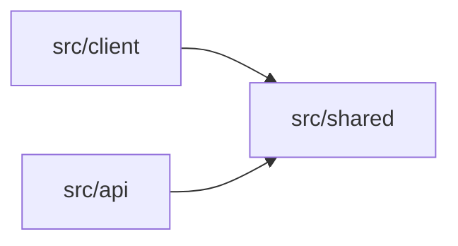
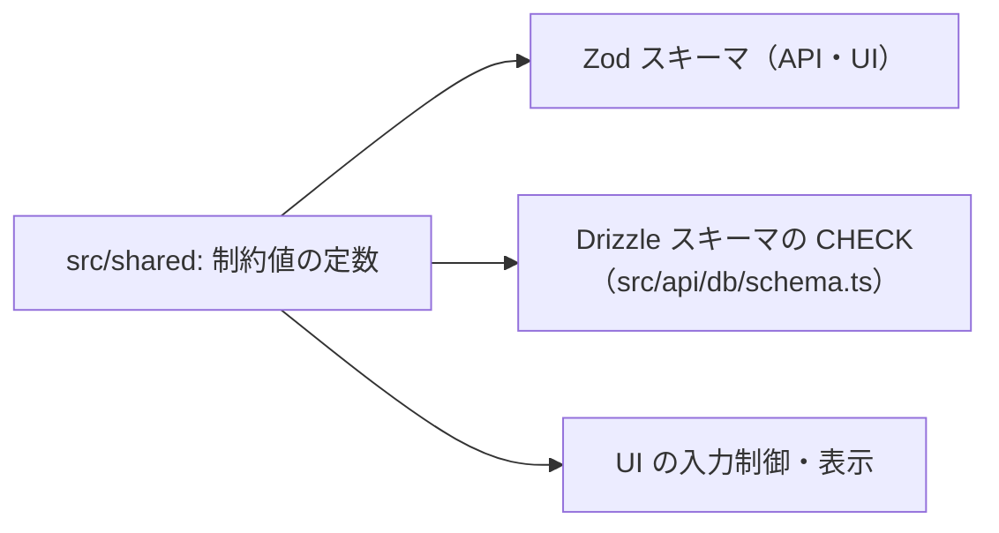

# GainLog プロジェクト構成・ツールチェーン設計書

## 1. 概要・前提

本書は、詳細設計フェーズの第1文書として、GainLog のリポジトリ構成・ビルド／開発構成・マイグレーション配置・品質ゲート（フック／CI）を、実装に着手できる粒度で定める。基本設計で「詳細設計で定める」とされた次の項目を回収する。

- `architecture.md` 3章（wrangler 設定の具体化）
- `db.md` 10章 未解決事項2（トリガー DDL のマイグレーション組み込み）、9章（シードの配置）
- ADR-0004（drizzle-kit の `out` と Wrangler の `migrations_dir` / `migrations_pattern` の整合）
- ADR-0007（単一パッケージ構成の具体的なレイアウト・Worker エントリポイントの配置）
- `auth.md` 13章（所有者チェック強制のための lint の要否。依存方向の強制と同じ仕組みで実現する。3章）

対象読者は開発者本人（実装者）である。粒度は「ディレクトリと責務・規約・主要フロー・選定理由」までとし、設定ファイルの全文や関数の中身は実装（TDD）で詰める。対象は Phase 1 のみ。

### 前提（確定済みの判断）

| 判断 | 内容 | 根拠 |
|---|---|---|
| 単一パッケージ | `package.json` は 1 つ。`src/api` / `src/client` / `src/shared` に分ける | ADR-0007 |
| モノリシック配置 | Worker 1 つに Hono API と Static Assets を同梱 | ADR-0001 |
| 環境は本番のみ | ローカルは本番相当のランタイム（workerd）＋ローカル D1 | ADR-0002 |
| Drizzle 採用 | マイグレーションはローカル生成・CI 適用 | ADR-0004 |
| バリデーションは Zod 統一 | 本書 4章。ADR-0008 | 本書で確定 |
| 開発構成は Vite ＋ `@cloudflare/vite-plugin` | 本書 6章。ADR-0009 | 本書で確定 |
| シードとトリガーは migration に含める | 本書 8章。ADR-0011 | 本書で確定 |
| 品質ゲートの方針 | 本書 9章。ADR-0010 | 本書で確定 |
| 開発は WSL 上、ビルド成果物の確認はコンテナ | 本書 6.4。ADR-0012 | 本書で確定 |

### 導入するツール・ライブラリ（要件定義書 6章への追記対象）

`requirement.md` 6章に明記のないものは、本書の確定に合わせて 6章へ追記する（CLAUDE.md の合意ルール）。バージョンは 2026-09-20 時点の npm `latest` を一次情報で確認したもので、実装時に再確認する。

| 区分 | ツール | 確認したバージョン・状態 | 備考 |
|---|---|---|---|
| ビルド | Vite | 8.x（Node `^20.19 \|\| >=22.12`） | |
| Workers 統合 | `@cloudflare/vite-plugin` | 1.56.0（GA）。peer: vite ^6〜^8、wrangler ^4.135.0 | |
| Workers CLI | Wrangler | 4.135.0（Node >=22） | |
| ルーティング定義 | `@hono/zod-openapi` | 1.6.3。peer: zod ^4、hono >=4.10 | |
| バリデーション | Zod | 4.x | Valibot は採用しない（4章） |
| ORM | Drizzle ORM / drizzle-kit | **0.45.2 / 0.31.10（安定版）** | 1.0 は rc のため採用しない |
| Lint / Format | ESLint（flat config）＋ typescript-eslint、Prettier | – | |
| Git フック | Lefthook | – | |
| シークレット検出 | gitleaks | – | pre-commit と CI |
| パッケージマネージャ | pnpm | – | |
| コンテナ | Podman ＋ podman-compose（Containerfile / Compose Spec） | 開発機で Podman 4.9.3・podman-compose を確認 | npm 依存ではない。ビルド成果物の確認用（6.4） |

React Router・サーバー状態管理・ID token 検証ライブラリ・Tailwind の版・テスト用ライブラリは、それぞれ `frontend.md` / `backend.md` / `test.md` で選定し、その PR で 6章へ追記する。

## 2. ディレクトリ構成と責務

### 2.1 トップレベル

```
GainLog/
├── src/
│   ├── api/                  # Worker（Hono）。/api/* の全処理
│   │   ├── index.ts          # Worker エントリポイント（wrangler の main）
│   │   └── db/
│   │       └── schema.ts     # Drizzle スキーマ（drizzle-kit の入力）
│   ├── client/               # React SPA
│   │   └── main.tsx          # SPA エントリ（index.html から読み込む）
│   └── shared/               # api / client 共有コード（4章）
├── migrations/               # drizzle-kit の生成先 ＝ Wrangler の migrations_dir（8章）
├── scripts/
│   └── hooks/                # Git フックから呼ぶ決定論チェック（Node 標準のみ。9章）
├── docs/                     # 要件・設計書・ADR
├── .github/workflows/        # CI/CD（9章。実体は実装フェーズ最初のタスク）
├── .storybook/               # Storybook 設定（frontend.md で確定）
├── index.html                # Vite のクライアントエントリ（リポジトリ直下）
├── wrangler.jsonc            # Worker・Static Assets・D1 の設定（5章）
├── vite.config.ts            # Vite ＋ Cloudflare プラグイン（6章）
├── vitest.config.ts          # Vitest の projects 定義（6章。詳細は test.md）
├── drizzle.config.ts         # drizzle-kit の設定（8章）
├── eslint.config.js          # ESLint flat config（3章）
├── tsconfig.json             # references のみ（3章）
├── tsconfig.api.json / tsconfig.client.json / tsconfig.shared.json
├── lefthook.yml              # Git フック定義（9章）
├── Containerfile             # ビルド成果物確認用のイメージ定義（6.4）
├── compose.yaml              # 同上の起動定義（Compose Spec。6.4）
├── .containerignore          # イメージに含めないもの（6.4）
├── .dev.vars.example         # ローカル用シークレットのキー一覧（値なし。7章）
├── .nvmrc / package.json / pnpm-lock.yaml
└── CLAUDE.md / README.md     # CONTRIBUTING.md は実装着手直前に追加（ADR-0003）
```

- 本書で固定するのはトップレベルと、他の章の契約に関わる次の箇所のみである。`src/api` の内部（ルート・ミドルウェア・サービス・リポジトリ等）は `backend.md`、`src/client` の内部は `frontend.md` で確定する。
  - `src/api/index.ts`（Worker エントリ）
  - `src/api/db/schema.ts`（Drizzle スキーマ。`drizzle.config.ts` が参照する）
  - `src/shared/`（4章）
- テストファイルは対象の隣に `*.test.ts(x)` として置く方針を暫定とし、`test.md` で確定する。
- `index.html` をリポジトリ直下に置くのは、`@cloudflare/vite-plugin` が「プロジェクト直下の `index.html`」をクライアント環境のビルド対象とみなすためである（公式ドキュメント）。

### 2.2 Git 管理しないもの

| 対象 | 理由 | 備考 |
|---|---|---|
| `.dev.vars` | ローカルのシークレット | `.dev.vars.example`（キーのみ）はコミットする |
| `.wrangler/`（`state` を含む） | ローカル D1 の実体・キャッシュ | 9章の禁止ファイルガードでも検査 |
| `dist/` | ビルド成果物（Vite が生成する `wrangler.json` を含む） | |
| `node_modules/` | 依存 | `pnpm-lock.yaml` はコミットする |
| `worker-configuration.d.ts` | `wrangler types` の生成物。7章参照 | `postinstall` と `typecheck` で生成 |
| `*.pem` ほか秘密鍵類・大容量ファイル | 9章の禁止ファイルガード | |

## 3. 依存方向ルールと強制方法

### 3.1 ルール



| 依存元 → 依存先 | 可否 | 理由 |
|---|---|---|
| `client` → `shared` | 可 | 型・スキーマ・制約値・JST 日付を共有 |
| `api` → `shared` | 可 | 同上 |
| `shared` → `api` / `client` | **不可** | 共有コードが片側に依存すると、もう片側のバンドル・型環境を汚染する |
| `api` ⇄ `client` | **不可**（例外は次の1点のみ） | 互いのバンドル・型環境を汚染しないため |
| `client` → `src/api/index.ts` の `AppType`（`import type` のみ） | **例外として可** | Hono RPC（`hc<AppType>`）で API の型を得るため（4.5）。型のみの import はビルド時に消えるためバンドルに影響しない |
| `shared` → `hono` / `@hono/*` / `drizzle-orm` / `react` / DOM・Workers 固有 API | **不可** | 純粋な TypeScript ＋ `zod` のみで書く（理由は下記） |

`shared` を純粋な TypeScript ＋ `zod` に限る理由は、api / client への依存を持たせないことに加えて次のとおりである。

| 理由 | 内容 |
|---|---|
| クライアントのバンドル肥大の防止 | `shared` はブラウザ側にも同梱される。`hono`・`drizzle-orm` を import すると SPA のバンドルに混入しうる（FCP 3 秒の目標。`requirement.md` 6章） |
| ランタイム非依存 | `shared` は workerd とブラウザの両方で動く必要がある。DOM・Workers 固有 API を使うと片側でしか動かない |
| テスト容易性 | Workers 環境・DOM 環境なしに Node 環境でテストできる（6.3 の Vitest プロジェクト分割の前提） |
| DB の形の漏れ防止 | Drizzle の型が `shared` に入ると、DB のカラム構造が UI の型に漏れ、API の形（camelCase）と DB の形が混ざる |

`api` 内部の層（ルート → サービス → リポジトリ）の依存方向は `backend.md`、`client` 内部の構造は `frontend.md` で定める。

### 3.2 強制方法

パッケージ境界を持たない構成（ADR-0007）のため、次の二重で機械的に強制する。

1. **tsconfig を3分割する**（型環境の分離）

   | ファイル | `lib` / `types` | 効果 |
   |---|---|---|
   | `tsconfig.api.json` | ES2022、Workers の型（`wrangler types` の出力）。DOM なし | api で `window` 等を使うとコンパイルエラー |
   | `tsconfig.client.json` | ES2022 ＋ DOM、`vite/client`。Workers 型なし | client で Workers 固有 API を使うとコンパイルエラー |
   | `tsconfig.shared.json` | ES2022 のみ。`types` は空 | shared で DOM・Workers のグローバルを使うとコンパイルエラー |

   ルートの `tsconfig.json` は `references` のみを持ち、型チェックは `tsc -b` で実行する。
2. **ESLint の `no-restricted-imports` をディレクトリ別に設定する**（import 方向の禁止）

   | 対象ファイル | 禁止する import |
   |---|---|
   | `src/shared/**` | `hono`、`@hono/*`、`drizzle-orm*`、`react*`、`**/api/**`、`**/client/**` |
   | `src/client/**` | `**/api/**`（`src/api/index.ts` からの型のみの import を除く）、`hono`（`hono/client` を除く）、`@hono/*`、`drizzle-orm*` |
   | `src/api/**` | `**/client/**`、`react*` |
   | `src/api/**` のうちリポジトリ層以外 | `drizzle-orm*` および DB クライアントモジュール（具体的なパスは `backend.md` で確定） |

   client の例外（3.1）は、`@typescript-eslint/no-restricted-imports` の `allowTypeImports` を `src/api/index.ts` のパスに限って有効にして実現する。値としての import（`import { app }` 等）は引き続き禁止される。
   表の最後の行が `auth.md` 13章の「ハンドラから直接 Drizzle を呼ぶことを禁止する Lint」に相当する。**現時点では専用のカスタム ESLint ルールは作らず、`no-restricted-imports` で足りる**という方針とする。実装中に静的に検出したい規約が出てきた場合は、flat config にローカルルール（リポジトリ内のプラグイン）として追加してよい。追加の依存は不要だが、外部の `eslint-plugin-*` を導入する場合は `requirement.md` 6章への追記と 9.4 の許可リストの更新が必要になる。ただし「WHERE 句の中身が正しいか」は静的解析では保証できず、最終防御線は統合テスト（`test.md`）である（`auth.md` 13章の留意と同じ）。
   ルールが実際に違反を検出することは、実装フェーズ最初のタスクで、違反コードを一時的に書いて確認する。

### 3.3 パスエイリアス

- `@shared/*` → `src/shared/*` のみを定義する（tsconfig の `paths` と Vite の `resolve.alias`）。同一領域内（`api` 内、`client` 内）は相対 import とする。
- **`src/api/db/schema.ts` から shared を参照するときは相対 import に限る。** drizzle-kit がスキーマを読み込む際にエイリアスを解決できるかは未検証のため、確認済みの相対 import（8章の実測）に揃える。

## 4. スキーマ・型の正本（`src/shared`）

### 4.1 shared に置くもの・置かないもの

| 置く | 内容 |
|---|---|
| 制約値の定数 | 重量（`weight_deci` の 0〜9999、表示は 0〜999.9kg）、`reps`・`set_number` の下限、種目カテゴリ8値、エラーコード6値と HTTP ステータスの対応（ADR-0006） |
| Zod スキーマ | リクエスト／レスポンスの入出力スキーマ（`openapi.yaml` の components に対応） |
| 型 | スキーマからの `z.infer`。API・UI の型は必ずここから得る |
| エラーメッセージ文言 | `common-spec.md` 3章の「API と UI で同一の文言」。制約違反メッセージ（日本語）を定数化 |
| `fields` 変換 | Zod のエラーを `common-spec.md` の `fields` 配列（`{ field, message }`）に変換する純関数。API のレスポンス生成と UI のインラインエラーで同じ関数を使う |
| JST 日付ユーティリティ | 今日・月の範囲・直近7日・`YYYY-MM-DD` の検証と整形。**現在時刻は引数で受け取る純関数**とし、時刻の取得は呼び出し側（テストで差し替え可能にするため） |

| 置かない | 理由 |
|---|---|
| Drizzle のテーブル定義 | DB の関心事。`src/api/db/schema.ts`（ただし制約値は shared から参照する） |
| Hono・React・DOM に依存するもの | 3.1 の依存ルール |

### 4.2 バリデーションは Zod に統一する（ADR-0008）

- `requirement.md` 6章・`openapi.yaml`・ADR-0007 で食い違っていたバリデーションライブラリ（Zod / Valibot）を **Zod に統一**する。API と UI の制約・文言を同一に保つ（`common-spec.md` 3章、`requirement.md` 5.1）ために、スキーマの定義元を shared の1か所にする。
- **shared のスキーマは素の `zod` で書く**（メタデータが必要な場合は Zod 4 の `.meta()`）。`@hono/zod-openapi` を shared から import しない。
  - 根拠（一次情報で確認できた範囲）: `@asteasolutions/zod-to-openapi` は v8 以降（Zod 4）で `.meta()` によるメタデータ指定に対応し、`.openapi()` の拡張（`extendZodWithOpenApi`）は Zod オブジェクト全体を拡張する。`@hono/zod-openapi` 1.6.3 は Zod ^4 を peer とする。
  - **未確認**: shared の素のスキーマを `@hono/zod-openapi` の `createRoute` にそのまま渡せること自体は、公式ドキュメントに明記がない（上記からの推論）。実装フェーズ最初のタスクで動作確認し、成立しない場合は Zod 統一の方針（ADR-0008）は維持したまま、api 側でのラップ方法を見直す（未解決事項）。
  - `.openapi()` が必要な箇所（コンポーネント名の付与等）は api 側で shared のスキーマをラップして付与する。
- `zod` は依存として **単一のインスタンス**に保つ（pnpm の peer 依存解決で `@hono/zod-openapi` と同じ `zod` が使われること。実装フェーズ最初のタスクで `pnpm why zod` により確認する）。
- ライブラリのバンドルサイズは Valibot より大きい。FCP 3 秒・Lighthouse 80 の目標（`requirement.md` 6章）に対しては、実装後に計測して判断する（未解決事項）。

### 4.3 制約値の単一ソース

制約値（重量の上限、カテゴリ8値 等）は `src/shared` の定数を唯一の出所とし、次の全てがそれを参照する。



- **実測で判明した注意（drizzle-kit 0.31.10）**: Drizzle の `text('category', { enum: [...] })` は TypeScript の型を絞るだけで、**DB の `CHECK` 制約を生成しない**。`db.md` 5.4 が求める `category` の `CHECK` は、`check()` で明示的に定義する。同様に、`db.md` 6章の制約一覧（CHECK・UNIQUE）は、スキーマ定義から生成された SQL に含まれていることをテストで突合する（`test.md`）。
- 同じく実測で、shared の定数を `check()` の中で参照しても、生成 SQL には値が展開されて出力されることを確認した（`BETWEEN 0 AND 9999` の形）。

### 4.4 OpenAPI（`openapi.yaml`）の扱い

- 実行時の正本は「shared の Zod スキーマ＋api のルート定義」とする。
- `openapi.yaml` は**基本設計時点のスナップショットとして凍結**し、実装後は追従させない。冒頭に「基本設計時点の設計であり、実装と異なりうる」旨を注記する。手動での追従は二重管理のコストが大きく、正本はコード側にあるため。
- 実装後の最新の API 仕様が必要な場合は、`@hono/zod-openapi` の生成機能（`getOpenAPI31Document` 等）でコードから生成する。生成の経路（npm script でファイルに出力するか、エンドポイントとして公開するか）と、公開する場合の認証の扱いは `backend.md` で確定する。
- 凍結により、`openapi.yaml` と生成仕様の差分検知は行わない。

### 4.5 フロントへの型の渡し方

- **API の呼び出しは Hono RPC（`hono/client` の `hc<AppType>`）で行う。** `src/api/index.ts` が Hono アプリの型を `export type AppType` として公開し、`client` はこれを `import type` で参照する（3.1 の唯一の例外）。パス・パラメータ・レスポンスの型がルート定義と自動で一致する。`hono/client` は `hono` パッケージに同梱されており、依存は増えない。
- **`shared` のスキーマは引き続き必要である。** RPC で得られるのは型のみであり、UI のフォーム入力検証（実行時の Zod スキーマ）、API と UI で同一のエラー文言（`common-spec.md` 3章）、`fields` 変換、JST 日付ユーティリティは提供されないため。役割は次のとおり分担する。

  | 用途 | 出所 |
  |---|---|
  | エンドポイントのパス・パラメータ・レスポンスの型 | Hono RPC（`AppType`） |
  | フォームの入力検証・エラー文言・制約値 | `shared`（4.1） |

- RPC の型が付くのは、ハンドラが `c.json()` で返すレスポンスである。middleware が返す共通エラー（401 等。`common-spec.md` 2章）には型が付かないため、`client` は `shared` のエラー型で扱う。ラッパの具体は `frontend.md` で確定する。
- **成立性は実装フェーズ最初のタスクで確認する**（未解決事項）。確認項目は、`OpenAPIHono` のルートを chain で書く必要があるか、ルート数に対する型推論のコスト（IDE・`tsc`）、`client` の型チェックで `AppType` が参照する Workers 型（`D1Database` 等）を解決できるか（tsconfig の `references` の張り方を含む）の3点。成立しない場合は「`shared` の型＋薄い fetch ラッパ」に戻す。
- `openapi-typescript` による型生成は採用しない。依存と生成手順が増え、`shared` の型と役割が重なるため。

## 5. Worker エントリポイントと wrangler 設定

### 5.1 エントリポイント

- `wrangler.jsonc` の `main` は `./src/api/index.ts` とする。ここで Hono アプリを `export default` する。
- **静的アセットと API の振り分けは Wrangler の設定で行い、Worker 内で `env.ASSETS.fetch()` を呼ぶコードは書かない。** `architecture.md` 3章で挙げられた 2 つの実現方式のうち、設定方式を採用する。
  - `run_worker_first: ["/api/*"]`: `/api/*` は静的アセットの有無に関わらず、常に Worker（Hono）が先に処理する。
  - `not_found_handling: "single-page-application"`: アセットに一致しないパスは `index.html`（200）にフォールバックする。
- `/api/*` 以外のリクエストは Worker を経由せず、Static Assets が直接応答する。存在しない `/api/*` パスへのリクエストは Hono 側が JSON の `not_found` エラー（`common-spec.md`）で返す（実装は `backend.md`）。

### 5.2 `wrangler.jsonc`（方針）

```jsonc
{
  "$schema": "node_modules/wrangler/config-schema.json",
  "name": "gainlog",
  "main": "./src/api/index.ts",
  "compatibility_date": "<実装時に確定>",
  "assets": {
    "not_found_handling": "single-page-application",
    "run_worker_first": ["/api/*"]
  },
  "d1_databases": [
    {
      "binding": "DB",
      "database_name": "gainlog",
      "database_id": "<実装時に確定>",
      "migrations_dir": "migrations"
    }
  ]
}
```

- `assets.directory` は書かない。`@cloudflare/vite-plugin` が `vite build` 時に生成する `wrangler.json` へ、クライアントのビルド出力先を自動で設定する（公式ドキュメント）。
- `migrations_pattern` は指定せず既定（`migrations/*.sql`）を使う。drizzle-kit 0.31 の出力が平置きの `NNNN_name.sql` であるため一致する（8章）。
- `compatibility_flags`（`nodejs_compat` の要否）は、ID token 検証ライブラリ等を選定する `backend.md` で確定する。
- `vars` に置く非機密の設定値（例：ログレベル）は 7章。

### 5.3 バインディング

| バインディング | 種別 | 用途 |
|---|---|---|
| `DB` | D1 | 唯一のデータストア |

KV・R2・Durable Objects・Cron Trigger は Phase 1 では使わない（`auth.md` 6章のとおり期限切れセッションは遅延削除）。

## 6. ビルド・開発サーバ・型チェック構成

### 6.1 Vite ＋ `@cloudflare/vite-plugin`（ADR-0009）

```ts
// vite.config.ts（方針）
import { cloudflare } from '@cloudflare/vite-plugin'
import react from '@vitejs/plugin-react'
import { defineConfig } from 'vite'

export default defineConfig({
  plugins: [react(), cloudflare()],
  resolve: { alias: { '@shared': '/src/shared' } },
})
```

- 開発時は Vite の開発サーバが、Worker を本番と同じ workerd 上で動かす。SPA（HMR）と `/api/*` が同一オリジンで動くため、プロキシ設定や CORS は不要で、`auth.md` の同一オリジン前提（`__Host-` Cookie 等）を開発時にも再現できる。
- これにより、`architecture.md` 1・4章の「ローカル開発は `wrangler dev` で本番相当を再現する」は「Vite の開発サーバ（workerd 上で Worker を実行）」に読み替える。本番相当という目的は変わらない（追従修正は12章）。
- ローカル D1 の状態は、Wrangler・Vite プラグインとも既定で `.wrangler/state` を共有する。したがって `wrangler d1 migrations apply gainlog --local` の結果を開発サーバがそのまま使う。
- **既知の懸念**: `@cloudflare/vite-plugin` 1.54.0 で「`migrations apply --local` 後に `vite dev` を起動すると D1 が古いスキーマを読む」不具合が報告されている（workers-sdk#15362、未 triage）。実装フェーズ最初のタスクで再現の有無を確認し、再現する場合は「Vite の開発サーバ ＋ `wrangler dev` の二段構成」を代替案として再検討する（ADR-0009 に代替案として記録）。

### 6.2 ビルドとデプロイ

- `vite build` が、クライアントのビルド出力・Worker のビルド出力・両者を結ぶ生成 `wrangler.json` を `dist/` 配下に出力する。`wrangler deploy` は生成された設定を使ってデプロイする（公式ドキュメント）。
- CI の実行順は「テスト → **ビルド** → マイグレーション適用 → `wrangler deploy`」とする。`architecture.md` 6章の順序にビルド工程を明示するもので、ビルドが失敗した場合はマイグレーションを適用しない。

### 6.3 型チェック・Vitest

- 型チェックは `tsc -b`（3.2 の tsconfig 分割）。`wrangler types` の生成物を含む。
- Vitest はルートの `vitest.config.ts` で **api／client／shared の 3 プロジェクトに分ける**（Workers 環境・DOM 環境・Node 環境）。使用するプールやライブラリは `test.md` で確定する。
- **規約**: `@cloudflare/vite-plugin` は `vite.config.ts` にのみ含め、Storybook と Vitest（client・shared）が Worker 用プラグインを読み込まない設定にする。具体的な分離方法は `frontend.md`（Storybook）・`test.md`（Vitest）で確定する。

### 6.4 開発環境とコンテナでのビルド成果物確認（ADR-0012）

**役割分担:**

| 用途 | 実行場所 | 内容 |
|---|---|---|
| 日常の開発（編集・`pnpm dev`・テスト・lint・型） | WSL 上に直接導入 | Node は `.nvmrc`、pnpm は `packageManager`（corepack）で版を固定する。Git フック（9章）・pre-push の `claude -p`・Claude Code からのコマンド実行もここで行う |
| ビルド成果物の確認 | Podman のコンテナ | クリーンな環境で lockfile から再現できることを確認する |

- 開発そのものをコンテナで行わないのは、Git フック・`claude -p`・Claude Code の実行経路をすべてコンテナ対応させる手間が、1 人・1 マシンの開発では恩恵を上回るためである（ADR-0012）。
- 本番は Workers でありコンテナではない。コンテナ内でも Worker は workerd で動くため、「本番相当」の度合いはホストで動かす場合と変わらない。コンテナで得られるのは「lockfile から再現できること」の確認である。

**コンテナの構成（方針）:**

| 項目 | 方針 |
|---|---|
| ベースイメージ | Debian 系の Node イメージ（例：`node:<.nvmrc の版>-bookworm-slim`）。workerd は musl（Alpine）に対応しないため Alpine は使わない |
| ビルド | 多段ビルド。依存段階で `pnpm install --frozen-lockfile`、ビルド段階で `vite build` |
| 起動 | ローカル D1 に migration を適用（`wrangler d1 migrations apply gainlog --local`）した後、`vite preview --host 0.0.0.0` で配信する |
| ソースのマウント | しない（イメージに焼き込んだ成果物のみを動かす） |
| ポート | `127.0.0.1:4173` にのみ公開する（外部から到達させない） |
| ローカル D1 の状態 | コンテナ内で使い捨て（ボリュームに永続化しない）。起動のたびに migration（シードを含む。8.4）から再構築される |
| シークレット | `.dev.vars` はイメージに焼き込まない（`.containerignore` で除外）。実行時に読み取り専用でマウントする |
| 定義 | `Containerfile` ＋ `compose.yaml`（Compose Spec のため Docker でも起動できる）。`.containerignore` で `node_modules`・`dist`・`.wrangler`・`.dev.vars`・`.git` を除外する |
| 起動コマンド | `podman-compose` を明示して使う（`podman compose` は環境によって Docker Desktop の `docker-compose` を外部プロバイダとして拾うことを確認したため）。npm scripts で包む（10章） |

- OAuth の redirect URI は完全一致が必要なため、`vite preview` の origin（`http://localhost:4173`）も Google Cloud Console への登録対象になる（7章）。
- `vite preview` が `.dev.vars` を読み込むか、rootless Podman の警告（`/` が shared mount でない）が読み取り専用マウントに影響するかは未確認である（未解決事項）。
- イメージが実際にビルドできることは PR の CI で検証する（9.5）。

## 7. 環境変数・シークレット・バインディング

| 名前 | 種別 | ローカル | 本番 | 用途 |
|---|---|---|---|---|
| `DB` | D1 バインディング | `.wrangler/state` 内のローカル D1 | Cloudflare D1 | 5.3 |
| `GOOGLE_CLIENT_ID` | シークレット | `.dev.vars` | `wrangler secret put` | OAuth クライアント ID（`architecture.md` 8章の方針どおりシークレットとして管理） |
| `GOOGLE_CLIENT_SECRET` | シークレット | `.dev.vars` | `wrangler secret put` | OAuth クライアントシークレット |
| `LOG_LEVEL` | 変数（`vars`） | `.dev.vars`（`debug` 可） | `wrangler.jsonc` の `vars`（`info`） | `common-spec.md` 4章の「本番では debug を出力しない」の制御。名前・値の意味は `backend.md`（ロギング）で確定 |

- OAuth の redirect URI は完全一致が必要（`architecture.md` 5章）で、ローカル（Vite 開発サーバの origin）と本番（`*.workers.dev`）で異なる。ローカル用の redirect URI も Google Cloud Console に登録する必要がある。**redirect URI をリクエストの origin から導出するか、変数で持つかは `backend.md`（認証実装）で確定する**。登録手順は運用手順書のスコープ（`auth.md` 12章）。
- `.dev.vars.example` にキー名のみを列挙してコミットし、`.dev.vars` は Git 管理しない（2.2）。
- **CI（GitHub Actions）**: Cloudflare API token を GitHub Secrets に置く（`architecture.md` 6・8章）。Wrangler が対象アカウントを特定するため、`CLOUDFLARE_ACCOUNT_ID` も必要になる見込みで、これは機密ではないため GitHub の Variables に置く（`architecture.md` 8章への追記事項。12章）。アプリのシークレットは CI に渡さない方針は変わらない。
- **型**: `Env` の型は `wrangler types` で生成し（Git 管理しない）、`postinstall` と `typecheck` で再生成する。シークレット（`wrangler.jsonc` に現れない値）の型付け方法は実装時に確定する（未解決事項）。
- ローカル開発で `__Host-` プレフィックスの Cookie（`Secure` 必須）が `http://localhost` で受理されるかはブラウザ依存の可能性があり、未確認である（未解決事項。`backend.md`（認証実装）・`CONTRIBUTING.md` で扱う）。

## 8. マイグレーション・シード配置

### 8.1 配置（ADR-0004 の契約の確定）

| 項目 | 値 |
|---|---|
| スキーマ定義 | `src/api/db/schema.ts` |
| drizzle-kit の生成先（`out`） | `./migrations` |
| Wrangler の `migrations_dir` | `migrations` |
| Wrangler の `migrations_pattern` | 既定（`migrations/*.sql`）。指定しない |
| drizzle-kit の dialect | `sqlite`（`driver` は指定しない。生成にのみ使い、適用は Wrangler が行う） |

**実測結果（drizzle-kit 0.31.10、`--custom` を含む。scratchpad で確認）:**

```
migrations/
├── 0000_init.sql
├── 0001_triggers.sql          # --custom で生成した空 SQL に手書き
└── meta/                      # スナップショットとジャーナル（*.sql ではないため Wrangler は走査しない）
    ├── 0000_snapshot.json
    ├── 0001_snapshot.json
    └── _journal.json
```

- 生成物は平置きの `NNNN_name.sql` で、Wrangler の既定パターン `migrations/*.sql` に一致する。`meta/` 配下の JSON は一致しない。
- drizzle-kit 1.0 系（現在 rc）はマイグレーションごとにサブディレクトリを作る構成に変わるため、GA 後に移行する際は `migrations_pattern` の指定が必要になる。移行時に本節と ADR-0004 を更新する。
- Wrangler は適用済みのマイグレーションを `migrations_dir` からの相対パスで記録するため、ファイル名（連番＋名前）は確定後に変更しない。

### 8.2 運用フロー

| 操作 | コマンド（npm scripts。10章） | 備考 |
|---|---|---|
| 差分の生成 | `pnpm db:generate` → `drizzle-kit generate --name=<説明的な名前>` | 生成 SQL を必ずレビューしてからコミットする（8.3） |
| 手書き SQL の追加 | `drizzle-kit generate --custom --name=<名前>` | トリガー・シード用。空の SQL がジャーナルに登録される |
| ローカル適用 | `pnpm db:migrate:local` → `wrangler d1 migrations apply gainlog --local` | |
| ローカルのリセット | `pnpm db:reset:local` → `.wrangler/state` を削除して上記を再実行 | シードも migration のため再投入される |
| 本番適用 | CI のみ：`wrangler d1 migrations apply gainlog --remote` | ADR-0004 |

- `drizzle-kit migrate` は使わない。適用経路を Wrangler に一本化し、二重管理を避ける。
- マイグレーション名は内容が分かるものにする（例：`0003_add_exercise_note`）。

### 8.3 トリガー DDL（`db.md` 10章 未解決事項2 の回収）

- `db.md` 7章のトリガー DDL は、`drizzle-kit generate --custom` で作成した空の SQL に貼り付けて、初期スキーマの直後のマイグレーション（例：`0001_triggers.sql`）として管理する。drizzle-kit はトリガーを扱わないため、生成 SQL とスナップショットには現れない。
- 追記型（append-only）のため、以降の `drizzle-kit generate` が手書きの migration を上書きすることはない（実測：`--custom` の後に別の `generate` を実行しても 0001 は保持された）。

**テーブル再作成のハザード（実測で判明）:**

drizzle-kit は、CHECK 制約の変更など SQLite の `ALTER TABLE` で表現できない変更に対し、次の形の SQL を生成する。

```sql
PRAGMA foreign_keys=OFF;
CREATE TABLE `__new_workout_sets` (...);
INSERT INTO `__new_workout_sets` ... SELECT ... FROM `workout_sets`;
DROP TABLE `workout_sets`;
ALTER TABLE `__new_workout_sets` RENAME TO `workout_sets`;
PRAGMA foreign_keys=ON;
```

これには 3 つのリスクがあり、ADR-0004 の「後方互換な変更に限定する」方針を、次の規約として具体化する。

| リスク | 内容 | 規約 |
|---|---|---|
| トリガーの消失 | `DROP TABLE` でそのテーブルのトリガーが削除される | 再作成を含む migration では、同じ migration の末尾でトリガー DDL を再作成する。マイグレーション適用後にトリガーが存在することを、テストで確認する（`test.md`） |
| FK の CASCADE | D1 では `PRAGMA foreign_keys` で FK を無効化できない（`db.md` 1章）。子から参照される親テーブル（`users` / `exercises` / `workout_records`）の再作成は、`DROP TABLE` 時の暗黙の削除により `ON DELETE CASCADE` の子行（記録・セット）を消す可能性がある（D1 での実挙動は未検証） | 親テーブルの再作成を伴う migration は原則行わない。必要な場合は、データ退避を含む手順を別途設計し、ローカルの実 D1 で回帰テストしてから適用する |
| 生成 SQL の見落とし | 意図せず再作成が生成されても気付きにくい | 9章の pre-commit で `migrations/*.sql` に再作成（`__new_` / `DROP TABLE`）を検出し、レビュー済みの印がなければコミットを止める |

### 8.4 シード（事前定義種目。ADR-0011）

**基本設計の穴の解消:** `architecture.md` 4章のシード手順はローカル用のみで、6章の CI にシード工程がなく、本番へ事前定義種目を入れる経路が定義されていなかった。次のとおり確定する。

- 事前定義種目の `INSERT`（`owner_user_id` は NULL、UUID は SQL リテラルの固定値）を、`--custom` の migration として管理する。本番・ローカル・テストが同一経路で投入され、CI の既存工程（`migrations apply`）だけで本番に反映される。
- 事前定義種目の名前重複は `db.md` 5.4 の `UNIQUE(owner_user_id, name)` では防げない（NULL 同士は区別されるため）。migration の内容で重複させないこと、および重複がないことをテストで確認する（`test.md`）。
- 種目を追加する場合は新しい custom migration を追加する。変更・削除は、使用中の種目が `ON DELETE RESTRICT` で削除できない点に注意する。
- 種目リストの内容（名称・カテゴリ・UUID）は `backend.md` 9章で確定する。
- `architecture.md` 4章の `wrangler d1 execute --local --file=./seed.sql` は廃止する（12章）。
- テストでは、migration の適用後に事前定義種目が入っている状態がベースになる（`test.md` に引き継ぐ）。

## 9. 品質ゲート・ツールチェーン方針（ADR-0010）

設計判断のみを本書で定める。ツールの実際の導入・設定は実装フェーズ最初のタスク（ローカル環境構築と同じ回）で行う。

### 9.1 全体像

| ゲート | タイミング | 実行主体 | 性質 | 役割 |
|---|---|---|---|---|
| pre-commit | `git commit` | Lefthook | 決定論的・ブロッキング・LLM なし | 機密・禁止ファイルの混入防止、lint・format・型、要件整合性、migration 再作成ガード |
| pre-push | `git push` | Lefthook ＋ `claude -p` | LLM レビュー・**Blocker 指摘のみブロック** | コーディング規約・セキュリティのレビュー |
| CI（PR） | PR 作成・更新 | GitHub Actions | 決定論的・ブロッキング | gitleaks を先頭で実行し、通過後に lint・型・テスト・ビルド |
| CI/CD（main） | `main` へのマージ | GitHub Actions | 決定論的 | テスト → ビルド → マイグレーション → デプロイ（6.2） |

「Git 管理すべきでないものの混入防止」は LLM エージェントではなく決定論的なスキャナの役割とし、pre-push の LLM レビューとは分ける。

### 9.2 pre-commit（Lefthook、ブロッキング）

| チェック | 内容 |
|---|---|
| シークレット検出 | gitleaks で staged の差分を検査 |
| 禁止ファイルガード | `.env*`、`.dev.vars`、`*.pem`、`.wrangler/`（`state` を含むローカル D1）、大容量ファイルの追加を拒否。`.gitignore` との二重防御 |
| lint・format・型 | ESLint、Prettier（`--check`）、`tsc -b`。staged のファイルを対象にする |
| migration 再作成ガード | `migrations/*.sql` の差分に `__new_` または `DROP TABLE` を含む場合、SQL 先頭に `-- reviewed-rebuild: <理由>` のコメントがなければ失敗させる（8.3） |
| 要件整合性チェック | 9.4 |

### 9.3 pre-push（LLM レビュー）

- `claude -p`（Claude Code のヘッドレス実行）に、push 対象の差分（`origin/main...HEAD`）を渡して、コーディング規約とセキュリティ（インジェクション・認可バイパス・危険な API の使用等）をレビューさせる。
- 指摘は重要度（Blocker / Major / Minor / Nit）で出力させ、**Blocker が含まれる場合のみ push を失敗させる**。Major 以下は表示するのみ。`--no-verify` での回避は可能とする。
- 対象は `src/**`・`migrations/**`・`.github/workflows/**`・`wrangler.jsonc` などの変更を含む push とし、ドキュメントのみの push は実行しない。
- `claude` コマンドの不在・API の失敗・タイムアウト時は、警告を表示して push を通す（フェイルオープン）。可用性の問題で開発を止めないため。
- レビューのプロンプト・出力形式・入力とする文書（CLAUDE.md・設計書）は実装フェーズで確定する。

### 9.4 要件整合性チェック（`project-requirement-hook-deferred` の確定）

Git 純正の pre-commit の一部として、LLM を呼ばないルールベースのチェックを行う（`scripts/hooks/` の Node スクリプト）。

**対象の判定方式は許可リスト方式**とする（提案。下記の代替と比較）。

| 方式 | 内容 | トレードオフ |
|---|---|---|
| **許可リスト（採用）** | `src/**`、`migrations/**`、`package.json`、`wrangler.jsonc`、`.github/workflows/**` の差分のみを検査 | 誤検知が少ない。新しい種類のディレクトリを追加した際に対象へ加え忘れる可能性がある（本書 2.1 の更新時に見直す） |
| 除外リスト | `docs/**`・`*.md` 以外の全ファイルを検査 | 検査漏れがない。lockfile・設定ファイル等で誤検知が増える |

| チェック | 内容 | 違反時 |
|---|---|---|
| 非目標キーワード | `requirement.md` 9章に対応するキーワード（`lb`／ポンド、SNS、ネイティブアプリ、SAML、SSO 等）の追加行を、`src/**` と `migrations/**` の差分から検出 | ブロック。誤検知は行末コメント `// requirement-check: ignore <理由>` で除外する |
| 技術スタック逸脱 | `package.json` に追加された依存が、リポジトリで管理する許可リスト（パッケージ名の一覧）にない場合に検出。許可リストの変更を含むコミットでは、同じコミットに `requirement.md` 6章の変更が含まれていることを要求する | ブロック |

- 「6章に書いていないライブラリを追加してはならない」という CLAUDE.md の合意ルールを、機械的に担保するための仕組みである。許可リストは 6章の技術名（Hono → `hono` など）とパッケージ名の対応表になる。
- 誤検知への運用は `--no-verify` ではなく、上記の行単位の除外コメントまたは許可リスト（＋6章）の更新とする。

### 9.5 CI（GitHub Actions）

- **PR**: 次の2段で実行する。`architecture.md` 6章が定める `main` マージ時のデプロイフローに加えて、PR 時にも検査を行う（追従は12章）。
  1. **gitleaks ジョブ**（先頭・独立）: 依存のインストールもビルドも不要なため最初に実行する。PR のコミット範囲を検査するため checkout は `fetch-depth: 0` とする。gitleaks はバイナリを直接実行する（`gitleaks-action` v2 は Organization のリポジトリでライセンスキーを要するため、将来の移管に備えて依存しない）。
  2. **検査ジョブ**（`needs: gitleaks`）: 依存インストール（`pnpm install --frozen-lockfile`）→ lint → 型チェック → テスト（Vitest）→ ビルド。gitleaks が検知した場合は実行されない。
  3. **コンテナビルドジョブ**（`needs: gitleaks`。検査ジョブと並列）: `Containerfile` からイメージをビルドし、定義が壊れていないことを確認する（6.4）。起動・動作確認までは行わない。ランナーの Podman を使う想定で、使えない場合は `docker build` で代替する（Containerfile は OCI 準拠のためどちらでもビルドできる）。
- **main**: テスト → ビルド → マイグレーション適用 → `wrangler deploy`（6.2）。テストが失敗した場合はデプロイを中断する。`wrangler deploy` が失敗した場合は、マイグレーションを再適用せずデプロイのみを再試行する（ADR-0004）。
- PR の必須チェック化（Branch protection）は GitHub の設定であり、`CONTRIBUTING.md`（実装着手直前）で手順化する。

## 10. パッケージマネージャ・npm scripts

| 項目 | 内容 |
|---|---|
| パッケージマネージャ | pnpm。依存を厳格に解決し、宣言していない依存の参照を防ぐ（3章の依存方向ルールと相性がよい） |
| バージョン固定 | `package.json` の `packageManager` と `engines.node`（`>=22.12`。Wrangler が Node 22 以上、Vite が `^20.19 \|\| >=22.12` を要求）。`.nvmrc` で開発環境と CI を揃える |
| ロックファイル | `pnpm-lock.yaml` をコミットし、CI は `--frozen-lockfile` |
| モジュール形式 | `"type": "module"` |

| script | 内容 |
|---|---|
| `dev` | `vite dev`（6.1） |
| `build` | `vite build`（6.2） |
| `preview` | `vite preview`（ビルド成果物を workerd で確認） |
| `typecheck` | `wrangler types` → `tsc -b` |
| `lint` / `format` / `format:check` | ESLint / Prettier |
| `test` | `vitest run`（詳細は `test.md`） |
| `db:generate` / `db:migrate:local` / `db:reset:local` | 8.2 |
| `storybook` / `storybook:build` | `frontend.md` で確定 |
| `container:up` / `container:down` | `podman-compose up --build` / `podman-compose down`（6.4） |

- 本番デプロイ用の script は設けない。正規経路は CI のみとする（`architecture.md` 6章。ローカルからの `wrangler deploy` は動作確認用途で常用しない）。

## 11. スコープ外

- `src/api`・`src/client` の内部構成、レイヤー構成、ミドルウェア、リポジトリ規約（`backend.md` / `frontend.md`）
- テストの方式・配置・ダブル方針・CI でのテスト範囲・受入条件との対応表（`test.md`）
- 各ツールの設定ファイルの全文、pre-push レビューのプロンプト、CI のワークフロー定義（実装フェーズ最初のタスク）
- 開発者向け操作手順（`CONTRIBUTING.md`。実装着手直前に作成）、preview URL の運用（ADR-0002）
- Skills の整備（本書確定後、ディレクトリ構成が固まった時点で再提起する）
- Phase 2 の機能

## 12. 既存設計書との整合性チェック結果

| 項目 | 既存記載 | 本書での扱い | 判定 |
|---|---|---|---|
| バリデーションライブラリ | `requirement.md` 6章（Zod・Valibot 併記）／`openapi.yaml`（`@hono/zod-openapi`）／ADR-0007（Valibot） | Zod に統一 | **追従修正が必要**：6章から Valibot を削除。ADR-0007 の「Valibot」を Zod に最小修正して ADR-0008 を参照。`openapi.yaml` 冒頭説明文に、基本設計時点のスナップショットとして凍結する旨（4.4）を追記 |
| ローカル開発コマンド | `architecture.md` 1・4章、CLAUDE.md、ADR-0002 の「`wrangler dev`」 | Vite の開発サーバ（workerd 上で Worker を実行） | **追従修正が必要**：該当表記を更新。6章に Vite・`@cloudflare/vite-plugin` 等を追記 |
| シード投入 | `architecture.md` 4章（`--local --file=./seed.sql`）／`db.md` 5.4・9章 | migration に含める（8.4） | **追従修正が必要**：`architecture.md` 4章の seed.sql 記述を更新。`db.md` 5.4・9章の参照を更新 |
| CI の実行順・PR 検査 | `architecture.md` 6章（`main` マージ時のみ、ビルド工程の記載なし） | テスト → ビルド → マイグレーション → デプロイ。PR でも検査（6.2・9.5） | **追従修正が必要**：6章のシーケンスにビルドを追記し、PR 検査を追記 |
| CI の Cloudflare 認証情報 | `architecture.md` 6・8章（API token のみ） | `CLOUDFLARE_ACCOUNT_ID` も必要（Variables）。7章 | **追従修正が必要**：8章に追記 |
| トリガー DDL の組み込み | `db.md` 10章 未解決事項2 | 8.3 で確定 | **追従修正が必要**：10章 未解決事項2 を「詳細設計（`project-structure.md` 8.3）で確定済み」に更新 |
| リポジトリ層の配置・lint | `auth.md` 13章（例示パスが `src/repositories`、lint は「検討」） | `src/api` 配下。`no-restricted-imports` で足りる（3.2） | **追従修正が必要**：例示パスを `src/api` 配下に更新。具体的な配置は `backend.md` で確定 |
| マイグレーション配置の契約 | ADR-0004（`out` と `migrations_dir` / `migrations_pattern` の整合を詳細設計で確定） | 8.1 で確定（drizzle-kit 0.31 の平置き・既定 pattern） | 整合。ADR-0004 に確定内容への参照を追記 |
| ディレクトリ構成・Worker エントリの配置 | ADR-0007（詳細設計で確定） | 2章で確定 | 整合。ADR-0007 に本書への参照を追記 |
| `wrangler.jsonc` の設定方針 | `architecture.md` 3章（`not_found_handling`・`run_worker_first`。設定方式か Worker 実装かは任意） | 設定方式を採用（5章） | 整合 |
| 統合ブランチの位置づけ | ADR-0003（`main` のみ） | 詳細設計フェーズ限定の一時的な統合ブランチ | **追従修正が必要**：ADR-0003 に注記 |
| 開発環境・コンテナ | 記載なし（ローカルに直接導入する前提） | 開発は WSL 上、ビルド成果物の確認は Podman のコンテナ（6.4） | **追従修正が必要**：`requirement.md` 6章に Podman を追記。ADR-0012 を追加 |
| ADR 一覧 | `docs/adr/README.md` | ADR-0008〜0012 を追加 | **追従修正が必要**：一覧を更新 |
| CLAUDE.md | 技術スタック節・開発の進め方 | 技術スタックの更新（Podman を含む）、品質ゲートの言及（コミット・push 前に走る検査）、ドキュメント地図の更新 | **追従修正が必要** |

## 13. 未解決事項

1. **`@cloudflare/vite-plugin` と D1 のスキーマ読み取り**（workers-sdk#15362）の再現確認。再現する場合は、Vite ＋ `wrangler dev` の二段構成を再検討する。実装フェーズ最初のタスク。
2. **D1 上でのテーブル再作成の実挙動**（`PRAGMA foreign_keys=OFF` を含む migration が Wrangler の適用でどう扱われるか、親テーブル再作成時に子行が消えるか）。実 D1（ローカル）での実測が必要。実装フェーズ初期。
3. **`.dev.vars` の Vite プラグインでの読み込み**と、シークレットの型付け方法（`wrangler types` の扱い）。実装フェーズ初期に確認する。
4. **Storybook・Vitest から Cloudflare プラグインを除外する具体的な方法**（`frontend.md`・`test.md`）。
5. **OAuth の redirect URI の導出方法**と、**`__Host-` Cookie の `http://localhost` での挙動**（`backend.md`・`CONTRIBUTING.md`）。
6. **Zod のバンドルサイズ**が FCP・Lighthouse の目標に与える影響（実装後に計測。必要なら `zod/mini` 等を検討）。
7. **`compatibility_date`・`compatibility_flags`（`nodejs_compat`）**（`backend.md`）。
8. **drizzle-kit 1.0 の GA 後の移行**（マイグレーションの配置形式が変わる。8.1）。
9. **pre-push の LLM レビュー**のプロンプト・出力形式・所要時間とコストの実測（実装フェーズ）。
10. **要件整合性チェックの許可リスト**の初期内容（6章の技術名とパッケージ名の対応表）。
11. **shared の素の Zod スキーマを `@hono/zod-openapi` の `createRoute` に渡せるか**（4.2）。実装フェーズ最初のタスクで確認する。
12. **Hono RPC の成立性**（4.5）：`OpenAPIHono` での chain の要否、型推論のコスト、`client` の型チェックでの Workers 型の解決。実装フェーズ最初のタスクで確認し、成立しない場合は「`shared` の型＋薄い fetch ラッパ」に戻す。
13. **コンテナでのビルド成果物確認**（6.4）：`vite preview` が `.dev.vars` を読み込むか、rootless Podman の警告（`/` が shared mount でない）の影響、GitHub Actions のランナーでの Podman の利用可否。実装フェーズ最初のタスクで確認する。
14. `backend.md`・`frontend.md`・`test.md` へ引き継ぐ事項：リポジトリ層の内部構成と `userId` の必須化（`backend.md`）、種目シードの内容（`backend.md`）、OpenAPI 仕様の生成経路（`backend.md`。4.4）、RPC クライアントのラッパと共通エラーの扱い（`frontend.md`。4.5）、統合テストの配置と CI での必須化・トリガー存在テスト・CHECK 制約の突合テスト・事前定義種目がある前提のテストデータ（`test.md`）。
