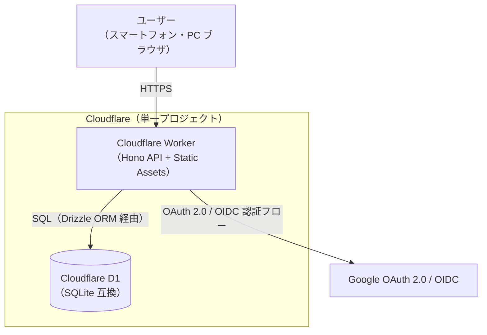
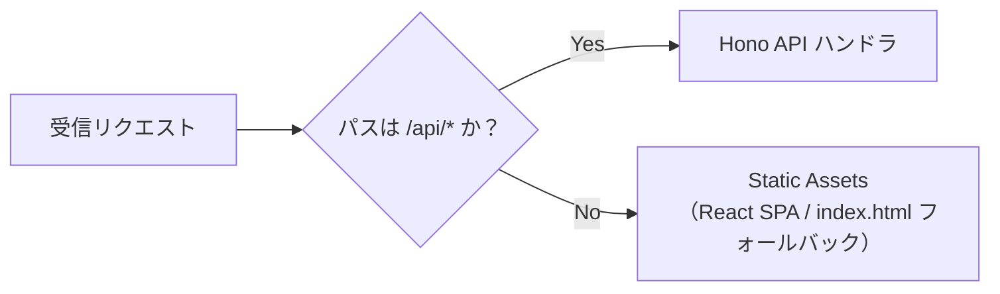
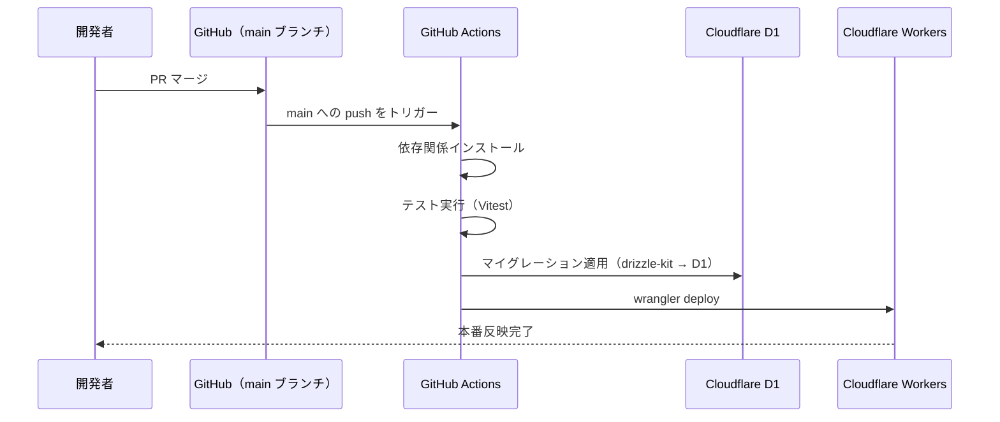

# GainLog システム構成・アーキテクチャ設計書

## 1. 概要

GainLog は、Cloudflare Workers 上にフロントエンド（React SPA）・バックエンド API（Hono）・DB（D1）を単一の Cloudflare プロジェクトとして同梱するモノリシック構成をとる。実質 1 ユーザー・低トラフィックの個人利用アプリであり、複雑な分散構成は取らない。

対象は本番環境のみとし、ローカル開発は `wrangler dev` によって本番相当の構成を再現する（ステージング環境は設計対象外）。

## 2. システム構成図

## 3. リクエストルーティング

単一の Worker 内で、パスベースにより API リクエストと静的アセット配信を振り分ける。

| パス | 振り分け先 | 備考 |
|---|---|---|
| `/api/*` | Hono API | JSON API。認証・記録・種目等の全エンドポイント |
| 上記以外 | Static Assets（React SPA） | SPA のため、存在しないパスは `index.html` にフォールバック |

## 4. 環境構成

- 本番環境（production）のみを設計対象とする。ステージング環境は用意しない。
- ローカル開発時は `wrangler dev` を用いて、本番同様の Worker + D1（ローカル SQLite）構成で動作確認する。

## 5. ドメイン構成

- 初期リリース時は Cloudflare が自動発行する `*.workers.dev` のデフォルトサブドメインを使用する。
- 将来的に独自ドメインへ切り替える場合は、Cloudflare の Custom Domains 機能で Worker にルートを追加するのみで、アプリケーションコードの変更は不要な構成とする。
- 独自ドメインの取得・設定手順の詳細は、必要になった時点で別途検討する（本設計書のスコープ外）。

## 6. デプロイ・CI/CD

GitHub Actions により、`main` ブランチへのマージをトリガーとして自動デプロイを行う。

- テスト（Vitest）が失敗した場合はデプロイを中断する。
- ローカルからの手動デプロイ（`wrangler deploy`）は開発時の動作確認用途として許容するが、正規のリリース経路は上記の CI/CD フローとする。

## 7. データベース（D1）とマイグレーション

- DB エンジンは Cloudflare D1（SQLite 互換）。
- ORM 兼マイグレーションツールとして Drizzle ORM / drizzle-kit を採用する（要件定義書 6 章 技術スタックに追記済み）。
- マイグレーションは CI/CD のデプロイフロー内で自動適用する（手動適用は行わない）。
- テーブルスキーマの詳細設計は `db.md` で定める。

## 8. シークレット管理

- Google OAuth の Client ID / Secret など機密情報は、Wrangler Secrets（`wrangler secret put`）で管理し、リポジトリにはコミットしない。
- GitHub Actions からのデプロイ時は、GitHub Secrets に登録した値を CI 上で Wrangler 経由で設定する。
- allowlist の具体的な保持形式や、認証フローの詳細設計は `auth.md` で定める（本設計書では触れない）。

## 9. スコープ外

以下は本設計書の対象外とする。

- 監視・アラート設計（個人アプリのため、稼働監視やアラート通知の仕組みは導入しない）
- ログの構造化方針（ログレベルの定義・使い分け・出力フォーマットは `non-functional.md` で定める）
- ステージング環境の構成（本番環境のみの運用のため）
- 独自ドメインの取得・具体的な設定手順（将来必要になった時点で別途検討）
- 認証フローの詳細（OAuth/OIDC のシーケンス、allowlist・`sub` の扱い等は `auth.md` で定める）
- テーブルスキーマの詳細（`db.md` で定める）
